# Enhanced claude-friends-templates Architecture

## System Overview

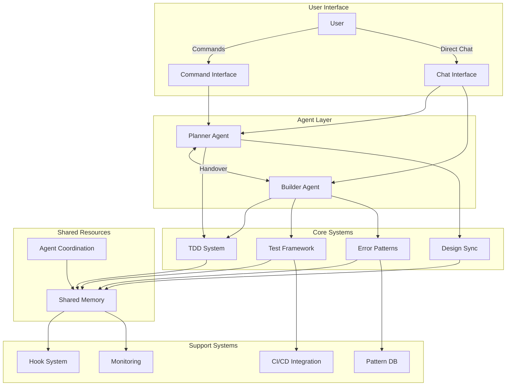

## Component Architecture

### 1. Agent Layer

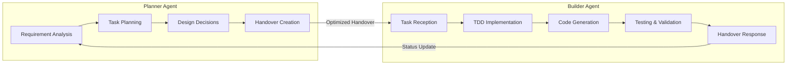

### 2. TDD System Architecture

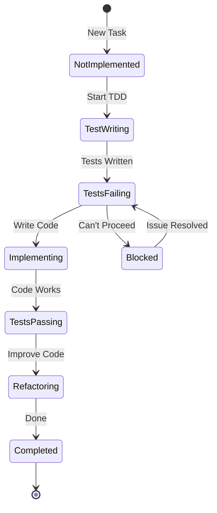

### 3. Test Framework Structure

```
test-framework/
├── templates/              # Test templates by type
│   ├── unit/              # Component isolation
│   ├── integration/       # Component interaction
│   ├── e2e/              # Full workflow
│   └── performance/       # Load testing
├── mocks/                 # Mock generation
│   ├── generators/        # Language-specific
│   └── schemas/           # Data schemas
├── scenarios/             # Reusable scenarios
└── ci-cd/                # CI/CD configs
```

### 4. Error Pattern System

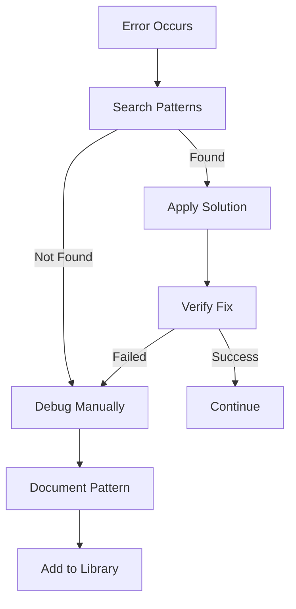

### 5. Agent Coordination Flow

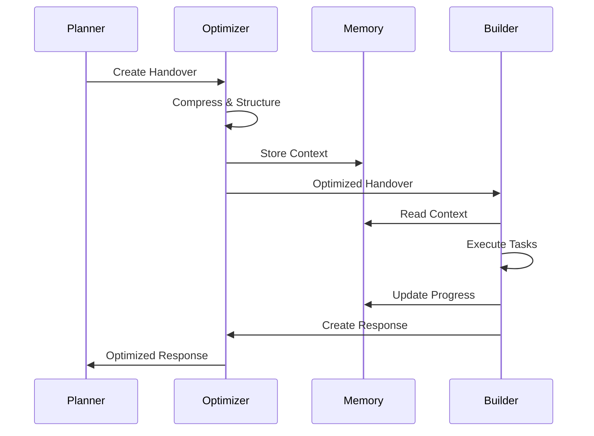

## Data Flow Architecture

### 1. Information Flow

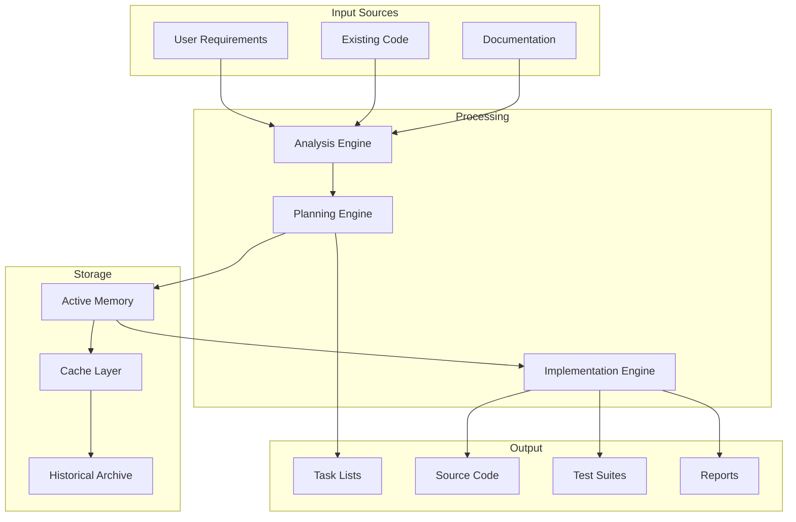

### 2. Memory Architecture

```yaml
memory_hierarchy:
  L1_hot:
    type: "In-memory"
    size: "10MB"
    ttl: "1 hour"
    content:
      - Active tasks
      - Current context
      - Recent decisions

  L2_warm:
    type: "File system"
    size: "100MB"
    ttl: "1 day"
    content:
      - Completed tasks
      - Patterns cache
      - Test results

  L3_cold:
    type: "Compressed archive"
    size: "Unlimited"
    ttl: "1 year"
    content:
      - Historical data
      - Old decisions
      - Audit logs
```

## Security Architecture

### 1. Access Control

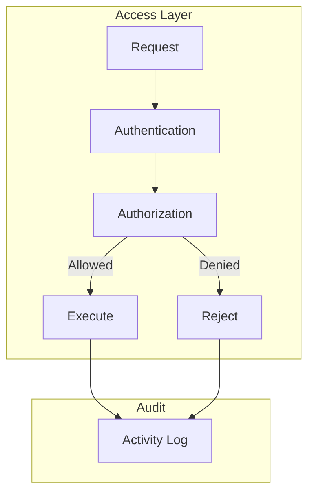

### 2. Data Protection

```yaml
security_layers:
  transport:
    - HTTPS only
    - Certificate validation
    - TLS 1.3 minimum

  storage:
    - Encryption at rest
    - Key rotation
    - Access logging

  processing:
    - Input validation
    - Output sanitization
    - Memory protection
```

## Performance Architecture

### 1. Optimization Points

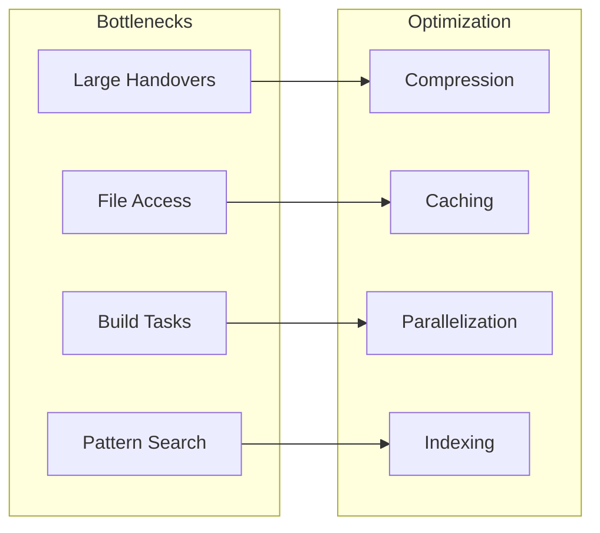

### 2. Scalability Design

```yaml
scalability:
  horizontal:
    - Multiple builder agents
    - Distributed task queue
    - Load balancing

  vertical:
    - Memory optimization
    - CPU utilization
    - I/O efficiency

  patterns:
    - Task batching
    - Lazy loading
    - Progressive enhancement
```

## Integration Architecture

### 1. External Systems

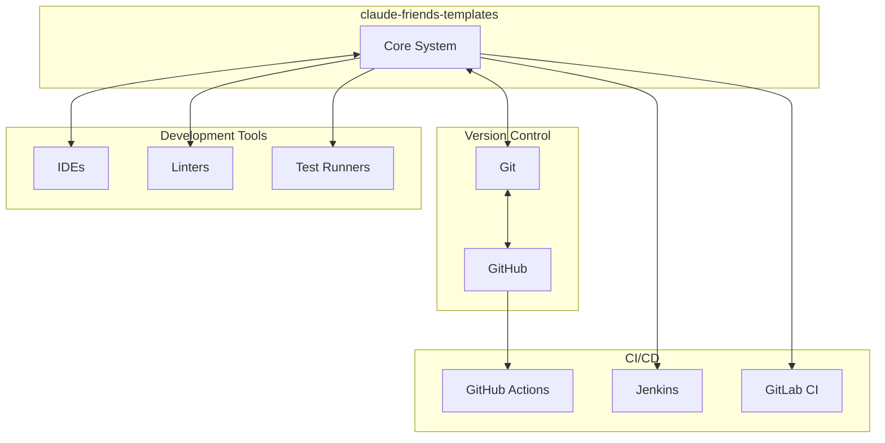

### 2. API Architecture

```yaml
api_layers:
  command_api:
    interface: "CLI"
    commands:
      - /agent:planner
      - /agent:builder
      - /tdd:start
      - /project:status

  file_api:
    interface: "FileSystem"
    operations:
      - read
      - write
      - watch
      - lock

  hook_api:
    interface: "Events"
    events:
      - pre-commit
      - post-test
      - on-error
      - on-complete
```

## Deployment Architecture

### 1. Local Development

```yaml
local_setup:
  structure:
    project_root:
      - .claude/          # Templates and config
      - src/             # Source code
      - tests/           # Test suites
      - docs/            # Documentation

  requirements:
    - Python 3.8+
    - Node.js 16+
    - Git
```

### 2. Team Deployment

```yaml
team_setup:
  shared_resources:
    - Central pattern library
    - Shared memory bank
    - Team templates

  synchronization:
    - Git for templates
    - Shared drive for memory
    - API for patterns
```

## Evolution Architecture

### 1. Extension Points

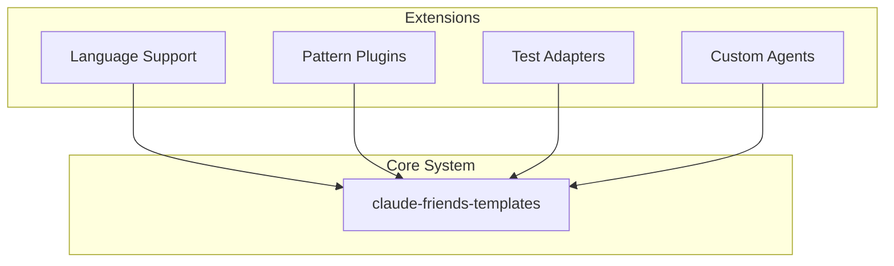

### 2. Future Enhancements

```yaml
roadmap:
  phase_1:
    - Multi-language support
    - Advanced error patterns
    - Visual debugging

  phase_2:
    - AI-powered optimization
    - Predictive planning
    - Auto-refactoring

  phase_3:
    - Multi-agent mesh
    - Distributed execution
    - Real-time collaboration
```

## Monitoring Architecture

### 1. Metrics Collection

```yaml
metrics:
  performance:
    - Task completion time
    - Test execution speed
    - Build performance

  quality:
    - Test coverage
    - Error frequency
    - Code complexity

  usage:
    - Feature adoption
    - Command frequency
    - Pattern hits
```

### 2. Observability

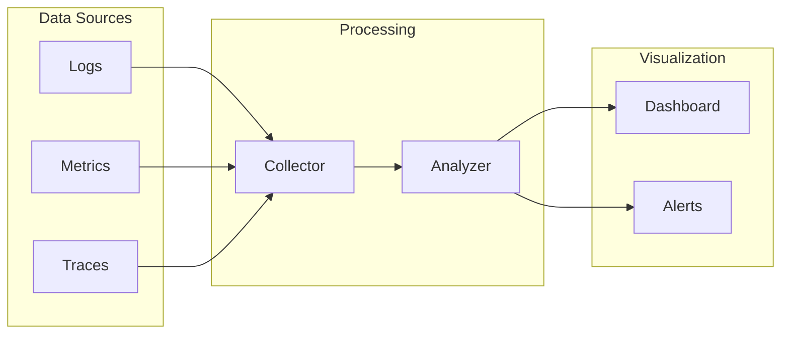

## Summary

The enhanced claude-friends-templates architecture provides:

1. **Modular Design**: Easy to extend and customize
2. **Performance Optimized**: Efficient resource usage
3. **Scalable**: Grows with project needs
4. **Secure**: Multiple protection layers
5. **Observable**: Built-in monitoring
6. **Future-Ready**: Clear evolution path

This architecture ensures that the system remains maintainable, efficient, and adaptable to changing requirements while providing a robust foundation for AI-assisted development.
