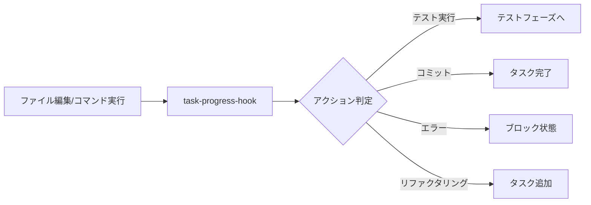

# 自動更新システム - Automatic Update System

## 概要
claude-friends-templatesに実装された、エージェント切り替えとタスク進展時の自動更新メカニズムです。
これにより、handover、ADR、phase-todo.mdなどのドキュメントが自動的に最新状態に保たれます。

## 主要機能

### 1. エージェント切り替え時の自動処理
`/agent:planner` または `/agent:builder` コマンド実行時に以下が自動実行されます：

- **自動handover作成**: Sync Specialistが現在の状態を収集してhandover.mdを生成
- **phase-todo.md更新**: タスク状態の自動更新
- **ADRドラフト作成**: 技術的決定が検出された場合に自動でドラフト作成
- **切り替え記録**: エージェント使用統計の更新
- **割り込み検出**: 頻繁な切り替えを検出して特別なhandoverを作成

### 2. タスク進展時の自動更新
ファイル編集やコマンド実行時に以下が自動実行されます：

- **タスク状態の追跡**: 🔴→🟡→🟢→✅ の進行状況を自動更新
- **テスト実行の検出**: テストコマンドを検出してタスク状態を更新
- **コミット時の完了マーク**: コミットメッセージから関連タスクを完了として記録
- **ブロック状態の検出**: エラーや問題を検出して⚠️状態に更新
- **Phase完了の通知**: 全タスクが完了したらPhase完了を自動記録

## ファイル構成

```
.claude/
├── scripts/
│   ├── agent-switch-hook.sh    # エージェント切り替えフック
│   ├── task-progress-hook.sh   # タスク進展フック
│   └── ...
├── sync-specialist/
│   ├── sync-monitor.sh         # Sync Specialist本体
│   └── enhanced-sync-monitor.sh # 拡張版（エラー処理強化）
└── settings.json               # フック設定
```

## 設定内容

### settings.json のフック設定
```json
{
  "hooks": {
    "UserPromptSubmit": [
      {
        "matcher": "/agent:",
        "hooks": [
          {
            "type": "command",
            "command": ".claude/scripts/agent-switch-hook.sh"
          }
        ]
      }
    ],
    "PostToolUse": [
      {
        "matcher": "Edit|Write|MultiEdit",
        "hooks": [
          {
            "type": "command",
            "command": ".claude/scripts/task-progress-hook.sh"
          }
        ]
      },
      {
        "matcher": "Bash",
        "hooks": [
          {
            "type": "command",
            "command": ".claude/scripts/task-progress-hook.sh"
          }
        ]
      }
    ]
  }
}
```

## 自動生成されるファイル

### エージェント切り替え時
- `memo/handover.md` - 引き継ぎドキュメント
- `memo/handover-interrupt-[datetime].md` - 割り込み時の特別なhandover
- `docs/adr/ADR-XXX-draft.md` - 技術的決定のドラフト
- `.claude/agent-switches.log` - 切り替え履歴
- `.claude/agent-stats.json` - 使用統計

### タスク進展時
- `.claude/task-status.log` - タスク状態変更履歴
- `.claude/task-stats.json` - タスク統計
- `.claude/blocked-tasks.md` - ブロックされたタスクの記録
- `.claude/phase-completions.log` - Phase完了記録

## 動作フロー

### エージェント切り替えフロー
```mermaid
graph LR
    A[/agent:コマンド] --> B[agent-switch-hook]
    B --> C[Sync Specialist呼び出し]
    C --> D[handover.md作成]
    D --> E[phase-todo.md更新]
    E --> F[ADRチェック]
    F --> G[統計更新]
```

### タスク進展フロー


## タスクステータスの意味

| 絵文字 | 状態 | 意味 |
|-------|------|------|
| 🔴 | Not Started | 未着手のタスク |
| 🟡 | In Progress | 実装中 |
| 🟢 | Testing | テスト実行中 |
| ✅ | Completed | 完了 |
| ⚠️ | Blocked | ブロック中（問題あり） |

## 使用例

### エージェント切り替え
```bash
# Plannerに切り替え（自動でhandover作成）
/agent:planner

# Builderに切り替え（タスク状態を自動更新）
/agent:builder
```

### タスク実装フロー
```bash
# 1. タスク開始（自動で🔴→🟡）
vim src/feature.js

# 2. テスト実行（自動で🟡→🟢）
npm test

# 3. コミット（自動で🟢→✅）
git commit -m "feat: implement new feature"
```

## トラブルシューティング

### handoverが作成されない
- Sync Specialistのスクリプトが実行可能か確認
- `chmod +x .claude/sync-specialist/*.sh`
- `memo/`ディレクトリが存在するか確認

### タスク状態が更新されない
- phase-todo.mdのフォーマットを確認
- タスク名に特殊文字が含まれていないか確認
- `.claude/task-status.log`でエラーを確認

### ADRドラフトが作成されない
- Builder notes.mdに"Decision:"などのキーワードがあるか確認
- `docs/adr/`ディレクトリが存在するか確認

## カスタマイズ

### タスクステータスのカスタマイズ
`task-progress-hook.sh`の`STATUS_EMOJI`配列を編集：
```bash
declare -A STATUS_EMOJI=(
    ["not_started"]="🔴"
    ["in_progress"]="🟡"
    ["testing"]="🟢"
    ["completed"]="✅"
    ["blocked"]="⚠️"
    ["reviewing"]="👀"  # カスタムステータス追加
)
```

### 検出パターンの追加
テスト実行パターンに新しいツールを追加：
```bash
if [[ "$command" =~ (test|spec|pytest|jest|mocha|vitest|cargo test) ]]; then
    # テスト実行として検出
fi
```

## ベストプラクティス

### 1. 明確なタスク名を使用
```markdown
## Phase 2: Implementation
- [ ] Implement user authentication API 🔴
- [ ] Add JWT token validation 🔴
```

### 2. コミットメッセージとタスクを関連付け
```bash
# タスク名と一致するコミットメッセージ
git commit -m "feat: implement user authentication API"
```

### 3. ブロック理由を明確に記録
```markdown
## 現在のタスク: External API integration ⚠️
ブロック理由: API仕様が不明確
```

## 今後の拡張予定

### Phase 2-3での機能追加
- [ ] AI分析による自動タスク優先度調整
- [ ] エラーパターンからの自動解決提案
- [ ] チーム間での同期機能
- [ ] ダッシュボードでの可視化

## 関連ドキュメント
- [Sync Specialist README](.claude/sync-specialist/README.md)
- [エージェント切り替えコマンド](.claude/commands/agent-planner.md)
- [タスク管理システム](.claude/shared/task-status.md)

---
*このシステムは、開発プロセスの自動化により、エンジニアがより創造的な作業に集中できるようサポートします。*