# Best Practices for Enhanced claude-friends-templates

## Table of Contents

1. [Test-Driven Development](#test-driven-development)
2. [Agent Collaboration](#agent-collaboration)
3. [Error Handling](#error-handling)
4. [Code Quality](#code-quality)
5. [Documentation](#documentation)
6. [Performance](#performance)
7. [Security](#security)
8. [Team Workflows](#team-workflows)

## Test-Driven Development

### The TDD Cycle

```mermaid
graph LR
    A[Write Failing Test 🔴] --> B[Write Minimal Code]
    B --> C[Test Passes 🟢]
    C --> D[Refactor Code]
    D --> E[Test Still Passes ✅]
    E --> A
```



### Best Practices

#### 1. Write Tests First

```python
# ❌ Bad: Writing code first
def calculate_discount(price, discount_percent):
    return price * (1 - discount_percent / 100)

# Then writing test...

# ✅ Good: Writing test first
def test_calculate_discount():
    assert calculate_discount(100, 20) == 80
    assert calculate_discount(50, 10) == 45
    assert calculate_discount(0, 50) == 0

# Then implementing to make tests pass
```

#### 2. One Test, One Assertion

```javascript
// ❌ Bad: Multiple assertions
test('user creation', () => {
  const user = createUser(data);
  expect(user.id).toBeDefined();
  expect(user.email).toBe(data.email);
  expect(user.createdAt).toBeInstanceOf(Date);
});

// ✅ Good: Separate tests
test('user creation generates id', () => {
  const user = createUser(data);
  expect(user.id).toBeDefined();
});

test('user creation preserves email', () => {
  const user = createUser(data);
  expect(user.email).toBe(data.email);
});
```

#### 3. Test Naming Convention

```python
# Pattern: test_{method}_{scenario}_{expected_outcome}

def test_login_with_valid_credentials_returns_success():
    pass

def test_login_with_invalid_password_raises_exception():
    pass

def test_calculate_total_with_empty_cart_returns_zero():
    pass
```

## Agent Collaboration

### Efficient Handovers

#### 1. Use Structured Data

```yaml
# ❌ Bad: Unstructured narrative
The user wants authentication with email and social login.
They mentioned using JWT tokens and wanting it to be secure.

# ✅ Good: Structured format
requirements:
  authentication:
    methods: [email, social]
    token_type: JWT
    security_requirements:
      - rate_limiting
      - secure_passwords
      - session_timeout
```

#### 2. Prioritize Information

```markdown
## Critical (Must Read)
- [ ] Breaking API change in auth endpoint
- [ ] Security vulnerability in user input

## Important (Should Read)
- [ ] New dependency added: redis
- [ ] Performance optimization opportunity

## FYI (Can Skip)
- [ ] Code formatting improvements
- [ ] Documentation updates
```

#### 3. Clear Task Ownership

```yaml
tasks:
  planner_owned:
    - Design API endpoints
    - Create architecture diagrams
    - Define data models
    
  builder_owned:
    - Implement endpoints
    - Write tests
    - Handle errors
    
  shared:
    - Review security implications
    - Optimize performance
```

## Error Handling

### Proactive Error Prevention

#### 1. Check Error Patterns First

```bash
# Before debugging a TypeError
python .claude/shared/error-patterns/search-patterns.py "TypeError"

# Before implementing error handling
python .claude/shared/error-patterns/search-patterns.py -c "runtime"
```

#### 2. Comprehensive Error Handling

```python
# ❌ Bad: Generic error handling
try:
    result = risky_operation()
except Exception:
    return None

# ✅ Good: Specific error handling
try:
    result = risky_operation()
except ValidationError as e:
    logger.warning(f"Validation failed: {e}")
    return {"error": "invalid_input", "details": str(e)}
except ConnectionError as e:
    logger.error(f"Connection failed: {e}")
    return {"error": "service_unavailable", "retry_after": 60}
except Exception as e:
    logger.exception(f"Unexpected error in risky_operation")
    raise OperationError(f"Operation failed: {e}") from e
```

#### 3. Error Documentation

```python
def process_payment(amount: float, currency: str) -> PaymentResult:
    """
    Process a payment transaction.
    
    Args:
        amount: Payment amount
        currency: ISO 4217 currency code
        
    Returns:
        PaymentResult with transaction details
        
    Raises:
        ValidationError: Invalid amount or currency
        PaymentError: Payment processing failed
        NetworkError: Connection to payment provider failed
        
    Error Codes:
        - PAY001: Invalid amount
        - PAY002: Unsupported currency
        - PAY003: Insufficient funds
        - PAY004: Network timeout
    """
```

## Code Quality

### Maintainable Code

#### 1. Clear Naming

```python
# ❌ Bad: Unclear names
def calc(x, y, z):
    return x * y * (1 - z/100)

# ✅ Good: Descriptive names
def calculate_discounted_total(quantity, unit_price, discount_percent):
    return quantity * unit_price * (1 - discount_percent/100)
```

#### 2. Single Responsibility

```javascript
// ❌ Bad: Multiple responsibilities
class UserManager {
  createUser(data) { /* ... */ }
  sendEmail(user, template) { /* ... */ }
  validatePassword(password) { /* ... */ }
  generateReport(users) { /* ... */ }
}

// ✅ Good: Single responsibility
class UserService {
  createUser(data) { /* ... */ }
  updateUser(id, data) { /* ... */ }
}

class EmailService {
  sendWelcomeEmail(user) { /* ... */ }
}

class ValidationService {
  validatePassword(password) { /* ... */ }
}
```

#### 3. Consistent Style

```yaml
# .claude/shared/coding-standards.yaml
style_guide:
  python:
    indentation: 4_spaces
    max_line_length: 88
    quotes: double
    
  javascript:
    indentation: 2_spaces
    semicolons: optional
    quotes: single
    
  naming:
    files: kebab-case
    classes: PascalCase
    functions: camelCase
    constants: UPPER_SNAKE_CASE
```

## Documentation

### Effective Documentation

#### 1. Document Why, Not What

```python
# ❌ Bad: Documenting the obvious
# Increment counter by 1
counter += 1

# ✅ Good: Documenting the reason
# Increment retry counter to track failed attempts for rate limiting
counter += 1
```

#### 2. Keep Docs in Sync

```markdown
# In code
def calculate_tax(amount, region):
    """
    Calculate tax based on region.
    See: docs/tax-calculation.md for rates
    """
    
# In docs/tax-calculation.md
Last updated: 2024-01-20
Sync with: src/finance/tax.py#calculate_tax
```

#### 3. Use Examples

```python
def parse_date_range(date_string: str) -> Tuple[date, date]:
    """
    Parse a date range string into start and end dates.
    
    Examples:
        >>> parse_date_range("2024-01-01 to 2024-01-31")
        (date(2024, 1, 1), date(2024, 1, 31))
        
        >>> parse_date_range("last week")
        (date(2024, 1, 14), date(2024, 1, 20))
        
        >>> parse_date_range("Q1 2024")
        (date(2024, 1, 1), date(2024, 3, 31))
    """
```

## Performance

### Optimization Strategies

#### 1. Measure First

```python
# ❌ Bad: Premature optimization
def get_users():
    # Complex caching logic without knowing if it's needed
    
# ✅ Good: Measure, then optimize
import time

def get_users():
    start = time.time()
    users = db.query("SELECT * FROM users")
    duration = time.time() - start
    
    if duration > 1.0:  # Slow query
        logger.warning(f"Slow query: get_users took {duration}s")
        # Now consider optimization
    
    return users
```

#### 2. Use Appropriate Data Structures

```python
# ❌ Bad: O(n) lookup
users = [{"id": 1, "name": "Alice"}, {"id": 2, "name": "Bob"}]
def find_user(user_id):
    for user in users:
        if user["id"] == user_id:
            return user

# ✅ Good: O(1) lookup
users = {1: {"name": "Alice"}, 2: {"name": "Bob"}}
def find_user(user_id):
    return users.get(user_id)
```

#### 3. Batch Operations

```javascript
// ❌ Bad: N database queries
for (const userId of userIds) {
  const user = await db.getUser(userId);
  users.push(user);
}

// ✅ Good: 1 database query
const users = await db.getUsers({ id: { $in: userIds } });
```

## Security

### Security Best Practices

#### 1. Input Validation

```python
# ❌ Bad: No validation
def create_user(email, password):
    return db.insert("users", {"email": email, "password": password})

# ✅ Good: Comprehensive validation
def create_user(email, password):
    # Validate email
    if not re.match(r'^[\w\.-]+@[\w\.-]+\.\w+$', email):
        raise ValidationError("Invalid email format")
    
    # Validate password strength
    if len(password) < 8:
        raise ValidationError("Password too short")
    
    # Hash password
    hashed = bcrypt.hashpw(password.encode(), bcrypt.gensalt())
    
    # Sanitize and insert
    return db.insert("users", {
        "email": email.lower().strip(),
        "password": hashed
    })
```

#### 2. Principle of Least Privilege

```yaml
# ❌ Bad: Overly permissive
database_user:
  permissions: ["SELECT", "INSERT", "UPDATE", "DELETE", "CREATE", "DROP"]

# ✅ Good: Minimal required permissions
database_users:
  app_read:
    permissions: ["SELECT"]
    tables: ["users", "products", "orders"]
    
  app_write:
    permissions: ["SELECT", "INSERT", "UPDATE"]
    tables: ["users", "orders"]
    exclude: ["users.role", "users.permissions"]
```

#### 3. Secure Defaults

```python
# Configuration with secure defaults
class Config:
    # Security
    SESSION_TIMEOUT = 3600  # 1 hour
    MAX_LOGIN_ATTEMPTS = 5
    PASSWORD_MIN_LENGTH = 8
    REQUIRE_HTTPS = True
    
    # Features
    ENABLE_REGISTRATION = False  # Opt-in
    ENABLE_API = False  # Opt-in
    DEBUG_MODE = False  # Opt-in
```

## Team Workflows

### Effective Collaboration

#### 1. Clear Communication

```markdown
# Task assignment format
## Task: Implement User Authentication
**Assigned to**: Builder
**Priority**: High
**Deadline**: 2024-01-25
**Dependencies**: Database schema (completed)

**Definition of Done**:
- [ ] Login endpoint working
- [ ] Registration endpoint working
- [ ] Tests passing (80% coverage)
- [ ] Documentation updated
- [ ] Security review completed
```

#### 2. Code Review Process

```yaml
code_review_checklist:
  functionality:
    - Does it solve the problem?
    - Are edge cases handled?
    - Is error handling appropriate?
    
  quality:
    - Is the code readable?
    - Are names descriptive?
    - Is it properly documented?
    
  testing:
    - Are there sufficient tests?
    - Do tests cover edge cases?
    - Is coverage adequate?
    
  security:
    - Is input validated?
    - Are secrets secure?
    - Are permissions appropriate?
```

#### 3. Knowledge Sharing

```markdown
# Weekly patterns review
## New Patterns Discovered

### Error Pattern: Async Iterator Timeout
- **Problem**: Async iterators hanging on network issues
- **Solution**: Implement timeout wrapper
- **Added to**: error-patterns/languages/javascript/

### Design Pattern: Repository Pattern
- **Use case**: Database abstraction
- **Benefits**: Easier testing, flexibility
- **Example**: src/repositories/user-repository.ts
```

## Summary

### Golden Rules

1. **Test First**: Write tests before implementation
2. **Fail Fast**: Catch errors early and clearly
3. **Document Why**: Explain decisions, not syntax
4. **Measure Impact**: Profile before optimizing
5. **Secure by Default**: Start with restrictive settings
6. **Communicate Clearly**: Over-communicate in async work
7. **Learn Continuously**: Share patterns and learnings
8. **Refactor Regularly**: Improve code when tests pass
9. **Automate Repetition**: Script common tasks
10. **Review Thoroughly**: Quality over speed

### Continuous Improvement

- Review these practices monthly
- Adapt to team needs
- Share successful patterns
- Learn from failures
- Contribute improvements back

Remember: Best practices are guidelines, not rules. Adapt them to your context while maintaining their intent.