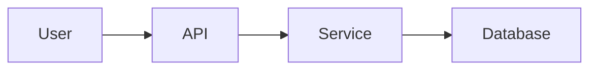

# AI-Friendly Development Guidelines

🌐 **English** | **[日本語](ai-friendly-development_ja.md)**

## Overview
This document defines best practices for AI-driven development. By writing code and documentation that AI can easily understand, we maximize development efficiency.

## AI-Friendly Comments

### Basic Principles
**"Code explains How, Comments explain Why"**

### Recommended Comments ✅

1. **Why Explanations**
   ```javascript
   // Using exponential backoff to avoid overwhelming the API
   // Retry delays: 1s, 2s, 4s, 8s (max 4 retries)
   const delay = Math.pow(2, attemptNumber) * 1000;
   ```

2. **Business Rules**
   ```python
   def calculate_discount(user, cart_total):
       """
       Calculate user discount based on loyalty status

       Business rules:
       - Gold members: 20% off on orders over $100
       - Silver members: 10% off on orders over $150
       - New users: 5% off on first order only
       """
   ```

3. **Performance Considerations**
   ```go
   // Using sync.Pool to reduce GC pressure
   // Benchmarks showed 40% reduction in allocations
   var bufferPool = sync.Pool{
       New: func() interface{} {
           return new(bytes.Buffer)
       },
   }
   ```

### Comments to Avoid ❌

1. **Obvious Explanations**
   ```javascript
   // ❌ Bad
   i++; // Increment i by 1

   // ❌ Bad
   const users = []; // Array of users
   ```

2. **Code Translation**
   ```python
   # ❌ Bad
   if user.age > 18:  # If user age is greater than 18
   ```

## Project Structure for AI

### Clear Directory Names
```
project/
├── .claude/          # AI assistant configuration
├── docs/             # Human & AI readable documentation
├── src/              # Source code with clear module names
├── tests/            # Test files following naming conventions
└── scripts/          # Automation scripts with descriptive names
```

### File Naming Conventions
- Use descriptive names: `user-authentication.js` not `auth.js`
- Include purpose in name: `data-validation-utils.js`
- Consistent patterns: `test-*.js` or `*.test.js`

## Documentation Best Practices

### README Structure
```markdown
# Project Name

## Quick Start (AI-Friendly)
```bash
# Clone and setup
git clone <repo>
cd <project>
npm install

# Run tests
npm test

# Start development
npm run dev
```

## Key Commands
- `npm test` - Run all tests
- `npm run build` - Build for production
- `npm run lint` - Check code quality

## Architecture Overview
[Clear explanation of system architecture]
```

### Design Documents
Include visual diagrams using Mermaid:


## Error Handling for AI Debugging

### Structured Error Messages
```typescript
class ValidationError extends Error {
  constructor(field: string, value: any, rule: string) {
    super(`Validation failed for ${field}: ${rule}`);
    this.name = 'ValidationError';
    this.details = {
      field,
      value,
      rule,
      timestamp: new Date().toISOString()
    };
  }
}
```

### Comprehensive Logging
```javascript
logger.error('Payment processing failed', {
  userId: user.id,
  orderId: order.id,
  amount: order.total,
  error: error.message,
  stack: error.stack,
  context: 'checkout-flow'
});
```

## Test Writing for AI Understanding

### Descriptive Test Names
```javascript
describe('UserAuthentication', () => {
  it('should reject login with invalid email format', () => {
    // Test implementation
  });

  it('should lock account after 5 failed attempts', () => {
    // Test implementation
  });
});
```

### Test Documentation
```python
def test_payment_retry_logic():
    """
    Test that payment system retries failed transactions

    Scenario:
    1. First attempt fails with network error
    2. System waits 1 second
    3. Second attempt succeeds
    4. Order is marked as paid
    """
```

## Code Organization Principles

### Single Responsibility
Each function/class should have one clear purpose:
```javascript
// Good: Clear, single purpose
function validateEmail(email) {
  const emailRegex = /^[^\s@]+@[^\s@]+\.[^\s@]+$/;
  return emailRegex.test(email);
}

// Bad: Multiple responsibilities
function processUser(userData) {
  // Validation, transformation, saving all in one
}
```

### Consistent Patterns
Use the same patterns throughout the codebase:
```python
# If using repository pattern, use it everywhere
class UserRepository:
    def find_by_id(self, user_id: int) -> User:
        pass

    def save(self, user: User) -> None:
        pass

class OrderRepository:
    def find_by_id(self, order_id: int) -> Order:
        pass

    def save(self, order: Order) -> None:
        pass
```

## AI Tool Integration

### Copilot/Codeium Friendly
- Write clear function signatures
- Add JSDoc/docstring before implementation
- Use consistent naming patterns

### AI Review Preparation
Before asking AI to review code:
1. Ensure code runs without errors
2. Include relevant context files
3. Specify what kind of review you need

## Best Practices Summary

### Do's ✅
- Write WHY in comments
- Use descriptive names
- Include business context
- Document complex algorithms
- Provide clear examples

### Don'ts ❌
- Don't state the obvious
- Don't use cryptic abbreviations
- Don't skip error context
- Don't assume AI knows project specifics

## Related Documents
- [AI-Friendly Comments Guide](../shared/ai-friendly-comments.md)
- [Testing Guidelines](testing-quality.md)
- [Development Rules](development.md)

---
*AI-driven development is the future. Make your code AI-friendly today.*
