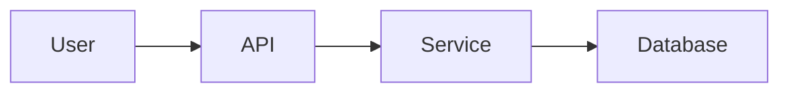

# AI-Friendly 開発ガイドライン

🌐 **[English](ai-friendly-development.md)** | **日本語**

## 概要
このドキュメントは、AI駆動開発のベストプラクティスを定義します。AIが理解しやすいコードとドキュメントを書くことで、開発効率を最大化します。

## AI-Friendlyなコメント

### 基本原則
**「コードは How を語り、コメントは Why を語る」**

### 推奨するコメント ✅

1. **理由の説明**
   ```javascript
   // APIに負荷をかけないよう指数バックオフを使用
   // リトライ間隔: 1秒, 2秒, 4秒, 8秒（最大4回）
   const delay = Math.pow(2, attemptNumber) * 1000;
   ```

2. **ビジネスルール**
   ```python
   def calculate_discount(user, cart_total):
       """
       ロイヤリティステータスに基づいてユーザー割引を計算
       
       ビジネスルール:
       - ゴールド会員: 100ドル以上の注文で20%オフ
       - シルバー会員: 150ドル以上の注文で10%オフ
       - 新規ユーザー: 初回注文のみ5%オフ
       """
   ```

3. **パフォーマンスの考慮事項**
   ```go
   // GC負荷を軽減するためsync.Poolを使用
   // ベンチマークでアロケーションが40%削減されることを確認
   var bufferPool = sync.Pool{
       New: func() interface{} {
           return new(bytes.Buffer)
       },
   }
   ```

### 避けるべきコメント ❌

1. **自明な説明**
   ```javascript
   // ❌ 悪い例
   i++; // iを1増やす
   
   // ❌ 悪い例
   const users = []; // ユーザーの配列
   ```

2. **コードの翻訳**
   ```python
   # ❌ 悪い例
   if user.age > 18:  # ユーザーの年齢が18より大きい場合
   ```

## AI向けのプロジェクト構造

### 明確なディレクトリ名
```
project/
├── .claude/          # AIアシスタント設定
├── docs/             # 人間とAIが読めるドキュメント
├── src/              # 明確なモジュール名のソースコード
├── tests/            # 命名規則に従ったテストファイル
└── scripts/          # 説明的な名前の自動化スクリプト
```

### ファイル命名規則
- 説明的な名前を使用: `auth.js`ではなく`user-authentication.js`
- 目的を名前に含める: `data-validation-utils.js`
- 一貫したパターン: `test-*.js`または`*.test.js`

## ドキュメントのベストプラクティス

### README構造
```markdown
# プロジェクト名

## クイックスタート（AI-Friendly）
```bash
# クローンとセットアップ
git clone <repo>
cd <project>
npm install

# テスト実行
npm test

# 開発開始
npm run dev
```

## 主要コマンド
- `npm test` - 全テスト実行
- `npm run build` - 本番ビルド
- `npm run lint` - コード品質チェック

## アーキテクチャ概要
[システムアーキテクチャの明確な説明]
```

### 設計ドキュメント
Mermaidを使った視覚的な図を含める：


## AIデバッグのためのエラーハンドリング

### 構造化されたエラーメッセージ
```typescript
class ValidationError extends Error {
  constructor(field: string, value: any, rule: string) {
    super(`${field}の検証に失敗: ${rule}`);
    this.name = 'ValidationError';
    this.details = {
      field,
      value,
      rule,
      timestamp: new Date().toISOString()
    };
  }
}
```

### 包括的なロギング
```javascript
logger.error('決済処理に失敗', {
  userId: user.id,
  orderId: order.id,
  amount: order.total,
  error: error.message,
  stack: error.stack,
  context: 'checkout-flow'
});
```

## AI理解のためのテスト記述

### 説明的なテスト名
```javascript
describe('ユーザー認証', () => {
  it('無効なメールフォーマットでログインを拒否すべき', () => {
    // テスト実装
  });
  
  it('5回失敗後にアカウントをロックすべき', () => {
    // テスト実装
  });
});
```

### テストドキュメント
```python
def test_payment_retry_logic():
    """
    決済システムが失敗したトランザクションをリトライすることをテスト
    
    シナリオ:
    1. 最初の試行がネットワークエラーで失敗
    2. システムが1秒待機
    3. 2回目の試行が成功
    4. 注文が支払済みとしてマークされる
    """
```

## コード整理の原則

### 単一責任
各関数/クラスは1つの明確な目的を持つべき：
```javascript
// 良い例: 明確で単一の目的
function validateEmail(email) {
  const emailRegex = /^[^\s@]+@[^\s@]+\.[^\s@]+$/;
  return emailRegex.test(email);
}

// 悪い例: 複数の責任
function processUser(userData) {
  // 検証、変換、保存がすべて1つに
}
```

### 一貫したパターン
コードベース全体で同じパターンを使用：
```python
# リポジトリパターンを使うなら、どこでも使う
class UserRepository:
    def find_by_id(self, user_id: int) -> User:
        pass
    
    def save(self, user: User) -> None:
        pass

class OrderRepository:
    def find_by_id(self, order_id: int) -> Order:
        pass
    
    def save(self, order: Order) -> None:
        pass
```

## AIツール統合

### Copilot/Codeium対応
- 明確な関数シグネチャを書く
- 実装前にJSDoc/docstringを追加
- 一貫した命名パターンを使用

### AIレビュー準備
AIにコードレビューを依頼する前に：
1. エラーなく実行できることを確認
2. 関連するコンテキストファイルを含める
3. どんなレビューが必要か明記

## ベストプラクティスまとめ

### やるべきこと ✅
- コメントでWHYを書く
- 説明的な名前を使う
- ビジネスコンテキストを含める
- 複雑なアルゴリズムを文書化
- 明確な例を提供

### やってはいけないこと ❌
- 自明なことを述べない
- 暗号的な略語を使わない
- エラーコンテキストを省略しない
- AIがプロジェクト固有の知識を知っていると仮定しない

## 関連ドキュメント
- [AI-Friendlyコメントガイド](../shared/ai-friendly-comments.md)
- [テストガイドライン](testing-quality_ja.md)
- [開発ルール](development_ja.md)

---
*AI駆動開発は未来です。今日からコードをAI-Friendlyにしましょう。*