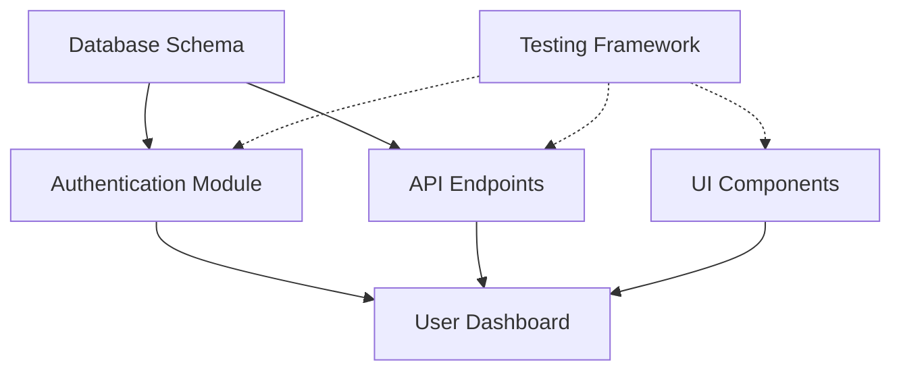

# Agent Coordination Optimization

## Overview

This module optimizes coordination between Planner and Builder agents, ensuring efficient handovers, context sharing, and parallel work capabilities.

## Key Features

### 1. Optimized Handover Documents

Automatically optimize handover documents to:
- Minimize redundant information
- Preserve critical context
- Structure data for quick parsing
- Include only relevant details

### 2. Context Sharing

Efficient mechanisms for sharing context between agents:
- Shared memory bank
- Context compression
- Priority-based information filtering
- State synchronization

### 3. Parallel Work Support

Enable agents to work on independent tasks simultaneously:
- Task dependency analysis
- Parallel execution planning
- Conflict resolution
- Progress synchronization

## Structure

```
agent-coordination/
├── README.md                    # This file
├── templates/                   # Handover document templates
│   ├── planner-to-builder.md  # Planner → Builder template
│   ├── builder-to-planner.md  # Builder → Planner template
│   └── context-summary.md     # Context summary template
├── optimizers/                 # Optimization utilities
│   ├── handover-optimizer.py  # Handover document optimizer
│   ├── context-filter.py      # Context filtering utility
│   └── parallel-analyzer.py   # Parallel task analyzer
└── context/                    # Context management
    ├── shared-memory.md       # Shared memory structure
    ├── priority-rules.yaml    # Priority rules for info
    └── sync-protocol.md       # Synchronization protocol
```

## Handover Optimization

### Current Process

1. Planner creates detailed plan
2. Handover document is generated
3. Builder receives and parses document
4. Builder executes tasks

### Optimized Process

1. Planner creates plan with metadata
2. **Optimizer analyzes and compresses handover**
3. **Critical context is prioritized**
4. Builder receives optimized document
5. **Parallel tasks are identified**
6. Builder executes with efficiency

## Context Sharing Strategies

### 1. Shared Memory Bank

```yaml
shared_context:
  project:
    name: "Project Name"
    tech_stack: ["Python", "React", "PostgreSQL"]
    constraints: ["No external APIs", "Mobile-first"]
  
  current_state:
    completed_tasks: ["task-1", "task-2"]
    active_branches: ["feature/auth", "feature/ui"]
    blockers: []
  
  decisions:
    - id: "arch-001"
      decision: "Use microservices"
      rationale: "Scalability requirements"
      date: "2024-01-15"
```

### 2. Context Compression

Before optimization:
```markdown
The user wants to implement a authentication system. They mentioned they prefer JWT tokens. 
The system should support email and OAuth login. We discussed using bcrypt for password 
hashing. The user also wants rate limiting on login attempts. They mentioned they want 
the system to be scalable...
```

After optimization:
```yaml
auth_requirements:
  type: JWT
  methods: [email, OAuth]
  security:
    password: bcrypt
    rate_limit: true
  constraints: [scalable]
```

### 3. Priority-Based Filtering

```yaml
priority_levels:
  critical:
    - Current task requirements
    - Blocking issues
    - Security constraints
  
  high:
    - Architecture decisions
    - Technology choices
    - User preferences
  
  medium:
    - Performance goals
    - Future considerations
    - Nice-to-have features
  
  low:
    - Historical context
    - Resolved issues
    - Alternative approaches
```

## Parallel Work Analysis

### Task Dependency Graph



### Parallel Execution Plan

```yaml
execution_phases:
  phase_1:
    parallel:
      - task: "Database Schema"
        agent: builder_1
        estimated_time: 30m
      
      - task: "UI Components"
        agent: builder_2
        estimated_time: 45m
      
      - task: "Testing Framework"
        agent: builder_3
        estimated_time: 20m
  
  phase_2:
    depends_on: ["Database Schema"]
    parallel:
      - task: "Authentication Module"
        agent: builder_1
        estimated_time: 60m
      
      - task: "API Endpoints"
        agent: builder_2
        estimated_time: 40m
  
  phase_3:
    depends_on: ["Authentication Module", "API Endpoints", "UI Components"]
    task: "User Dashboard"
    agent: any_available
    estimated_time: 50m
```

## Usage Examples

### 1. Optimizing a Handover Document

```bash
python .claude/shared/agent-coordination/optimizers/handover-optimizer.py \
  --input handover-raw.md \
  --output handover-optimized.md \
  --compression-level high
```

### 2. Analyzing Task Dependencies

```bash
python .claude/shared/agent-coordination/optimizers/parallel-analyzer.py \
  --tasks tasks.yaml \
  --output execution-plan.yaml
```

### 3. Filtering Context by Priority

```bash
python .claude/shared/agent-coordination/optimizers/context-filter.py \
  --context full-context.yaml \
  --priority high \
  --output filtered-context.yaml
```

## Best Practices

### 1. Handover Documents

- **Be Concise**: Remove redundant information
- **Use Structure**: YAML/JSON for data, Markdown for instructions
- **Include Metadata**: Add timestamps, priorities, dependencies
- **Version Control**: Track handover document changes

### 2. Context Management

- **Update Regularly**: Keep shared context current
- **Compress History**: Archive old decisions
- **Tag Information**: Use priority and category tags
- **Validate Sync**: Ensure all agents have latest context

### 3. Parallel Execution

- **Identify Independence**: Find truly independent tasks
- **Plan Phases**: Group dependent tasks
- **Handle Conflicts**: Define merge strategies
- **Monitor Progress**: Track parallel execution status

## Integration with Agents

### Planner Agent Enhancement

```yaml
# In planner/instructions.md
handover_optimization:
  enabled: true
  compression_level: high
  include_metadata: true
  parallel_analysis: true
```

### Builder Agent Enhancement

```yaml
# In builder/instructions.md
coordination:
  accept_optimized_handovers: true
  parallel_execution: true
  context_sync_interval: 5m
  conflict_resolution: automatic
```

## Metrics and Monitoring

Track coordination efficiency:

- **Handover Size**: Measure compression ratio
- **Context Relevance**: Track used vs unused context
- **Parallel Efficiency**: Monitor task completion times
- **Sync Overhead**: Measure coordination costs

## Future Enhancements

1. **AI-Powered Optimization**: Use ML to predict optimal handover content
2. **Dynamic Re-planning**: Adjust execution based on progress
3. **Multi-Agent Orchestration**: Support more than 2 agents
4. **Visual Coordination**: Real-time visualization of agent work