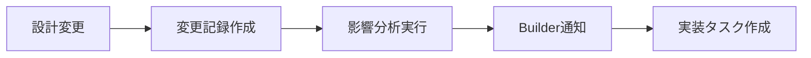
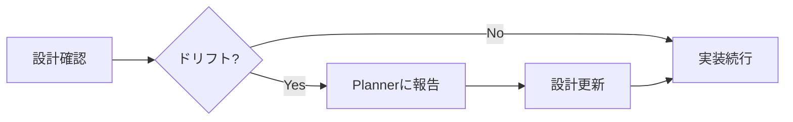
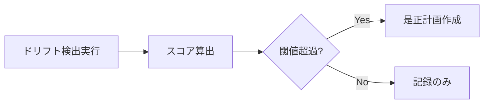

# 設計変更トラッキングシステム

## 概要
設計と実装の乖離を防ぎ、設計変更の履歴を体系的に記録・追跡するシステムです。
設計ドキュメントの変更を自動的に検出し、影響分析と履歴管理を行います。

## システム構成

### 1. 設計変更記録（Design Change Log）
すべての設計変更を時系列で記録し、変更の理由と影響を追跡します。

### 2. 影響分析ツール（Impact Analyzer）
設計変更がコードベースに与える影響を自動的に分析します。

### 3. 設計ドリフト検出（Design Drift Detector）
設計と実装の乖離を定期的にチェックし、不整合を検出します。

## 設計変更の記録フォーマット

### 変更記録テンプレート
```markdown
## 変更ID: DC-YYYY-MM-DD-NNN
日時: YYYY-MM-DD HH:MM:SS
変更者: [エージェント名/ユーザー名]
カテゴリ: [Architecture | API | Database | UI/UX | Other]
重要度: [Critical | High | Medium | Low]

### 変更内容
[具体的な変更内容]

### 変更理由
[なぜこの変更が必要になったか]

### 影響範囲
- 影響を受けるコンポーネント: [リスト]
- 影響を受けるファイル: [リスト]
- 必要な実装変更: [リスト]

### 関連情報
- Issue: #[番号]
- PR: #[番号]
- ADR: [ADR-番号]
```

## 自動検出ルール

### 監視対象ファイル
```yaml
watchFiles:
  - "docs/requirements.md"
  - "docs/design/**/*.md"
  - ".claude/shared/templates/design/*.md"
  - "**/*.puml"  # PlantUMLファイル
  - "**/architecture.md"
  - "**/api-spec.md"
```

### 変更検出パターン
```yaml
patterns:
  breaking:
    - "BREAKING CHANGE:"
    - "非互換変更:"
    - "削除:"
  major:
    - "新機能:"
    - "追加:"
    - "変更:"
  minor:
    - "改善:"
    - "修正:"
    - "更新:"
```

## 設計ドリフト検出

### ドリフトの種類

#### 1. インターフェースドリフト
設計で定義されたインターフェースと実装の不一致
```javascript
// 設計: getUserById(id: string): User
// 実装: getUserById(id: number): UserDTO  // ドリフト検出！
```

#### 2. 構造ドリフト
設計されたアーキテクチャと実際のコード構造の乖離
```
設計: Controller → Service → Repository
実装: Controller → Repository  // サービス層スキップのドリフト！
```

#### 3. データモデルドリフト
設計されたデータモデルと実際のデータベーススキーマの不一致

### ドリフト検出スコア
```
ドリフトスコア = (検出数 × 重要度) / 全体要素数 × 100
```

- 0-10: 健全な状態 🟢
- 11-30: 軽微なドリフト 🟡
- 31-50: 要注意 🟠
- 51+: 深刻なドリフト 🔴

## 影響分析

### 影響マトリックス
| 変更種別 | コード影響 | テスト影響 | ドキュメント影響 |
|---------|----------|----------|---------------|
| API変更 | High | High | Medium |
| DB変更 | High | Medium | Low |
| UI変更 | Medium | Low | High |
| 内部構造 | Medium | Medium | Low |

### 自動影響分析の実行
```bash
python .claude/scripts/design-impact-analyzer.py --change-id DC-2025-07-21-001
```

出力例：
```
影響分析レポート: DC-2025-07-21-001
================================
変更: APIエンドポイントの追加
影響を受けるファイル: 12個
- src/api/routes.js
- src/controllers/userController.js
- tests/api/user.test.js
...

推奨アクション:
1. 新しいエンドポイントのテスト作成
2. APIドキュメントの更新
3. クライアント側の対応
```

## 運用フロー

### 1. 設計変更時（Planner）


### 2. 実装時（Builder）


### 3. 定期チェック（週次）


## 設計変更履歴の管理

### ディレクトリ構造
```
.claude/shared/design-tracker/
├── design-tracker.md          # このファイル
├── change-log/                # 変更履歴
│   ├── 2025-07/              # 月別
│   │   ├── DC-2025-07-21-001.md
│   │   └── DC-2025-07-21-002.md
│   └── index.md              # 変更一覧
├── drift-reports/            # ドリフトレポート
│   └── 2025-07-21-weekly.md
└── impact-analysis/          # 影響分析結果
    └── DC-2025-07-21-001-impact.md
```

### アーカイブポリシー
- 3ヶ月経過した変更記録は圧縮
- 1年経過した記録は別ストレージへ
- 重要度Criticalは永続保存

## ツールとスクリプト

### 1. 設計変更記録ツール
```bash
# 新しい設計変更を記録
.claude/scripts/record-design-change.sh
```

### 2. ドリフト検出ツール
```bash
# 設計と実装の乖離をチェック
python .claude/scripts/design-drift-detector.py
```

### 3. 影響分析ツール
```bash
# 変更の影響を分析
python .claude/scripts/design-impact-analyzer.py
```

## ベストプラクティス

### Do's ✅
- すべての設計変更を即座に記録
- 変更前に影響分析を実行
- 定期的なドリフトチェック
- 設計と実装の同期を維持

### Don'ts ❌
- 設計変更を後回しにしない
- 影響分析なしの大規模変更
- ドリフトの放置
- 変更理由の省略

## 統合と連携

### CI/CD統合
```yaml
# .github/workflows/design-check.yml
name: Design Drift Check
on: [push, pull_request]
jobs:
  drift-check:
    runs-on: ubuntu-latest
    steps:
      - uses: actions/checkout@v2
      - name: Check design drift
        run: |
          python .claude/scripts/design-drift-detector.py
          if [ $? -ne 0 ]; then
            echo "設計ドリフトが検出されました"
            exit 1
          fi
```

### フック統合
設計ファイル変更時に自動的に変更記録を作成

## まとめ
設計変更トラッキングシステムは、設計の一貫性を保ち、技術的負債の蓄積を防ぐための重要なツールです。
定期的な監視と迅速な対応により、健全なコードベースを維持できます。

---
*設計は生き物。変化を恐れず、しかし無秩序な変化は許さない。*