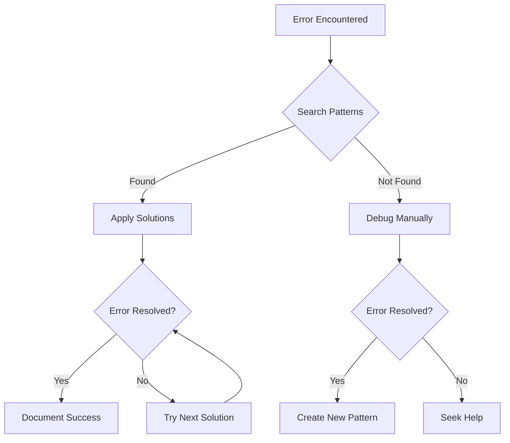

# Error Patterns Library Usage Guide

## For AI Agents

### Quick Reference

1. **When encountering an error:**
   ```bash
   # Search by error message
   python .claude/shared/error-patterns/search-patterns.py "TypeError"
   
   # Search with filters
   python .claude/shared/error-patterns/search-patterns.py -c runtime -l python
   ```

2. **Check specific pattern:**
   ```bash
   python .claude/shared/error-patterns/search-patterns.py -i "runtime-null-reference" -v
   ```

3. **List available categories:**
   ```bash
   python .claude/shared/error-patterns/search-patterns.py --list-categories
   ```

### Integration with Development Workflow

1. **During Error Analysis:**
   - Extract key error message
   - Search patterns library for similar symptoms
   - Apply recommended solutions in order
   - Document if new pattern discovered

2. **Preventive Measures:**
   - Review patterns for current language/framework
   - Apply preventive solutions during implementation
   - Add checks based on common error patterns

3. **Code Review:**
   - Check for patterns marked as "common"
   - Verify preventive measures are in place
   - Update patterns if new variations found

### Pattern Application Process



## For Developers

### Adding New Patterns

1. **Identify Pattern Category:**
   - `syntax` - Parsing and syntax errors
   - `runtime` - Execution time errors
   - `logic` - Behavioral issues
   - `integration` - External system issues
   - `performance` - Speed/resource issues

2. **Create Pattern File:**
   ```bash
   # Navigate to appropriate directory
   cd .claude/shared/error-patterns/categories/[category]/
   # or
   cd .claude/shared/error-patterns/languages/[language]/
   
   # Create new pattern file
   touch new-error-pattern.json
   ```

3. **Follow Pattern Schema:**
   - Use unique, descriptive ID
   - Include real error messages in symptoms
   - Provide multiple solutions when possible
   - Mark preventive solutions
   - Tag appropriately

### Best Practices

1. **Pattern Quality:**
   - Test all solutions before adding
   - Include code examples that work
   - Reference official documentation
   - Keep solutions language-idiomatic

2. **Pattern Maintenance:**
   - Review patterns during version updates
   - Update deprecated solutions
   - Add new symptoms as discovered
   - Link related patterns

3. **Pattern Discovery:**
   - Monitor error logs
   - Track support issues
   - Review code review comments
   - Learn from debugging sessions

### Command Examples

```bash
# Search for null/undefined errors
python search-patterns.py null

# Find all Python high-severity errors
python search-patterns.py -l python -s high

# Get detailed solution for specific error
python search-patterns.py -i "python-mutable-default-argument" -v

# Show statistics
python search-patterns.py --stats

# Find all async-related patterns
python search-patterns.py async

# List patterns by category
python search-patterns.py -c performance
```

### Automation Integration

1. **Git Hooks:**
   ```bash
   # In pre-commit hook, check for common patterns
   python .claude/shared/error-patterns/search-patterns.py -c syntax -s high
   ```

2. **CI/CD Pipeline:**
   ```yaml
   # In CI configuration
   - name: Check Error Patterns
     run: |
       # Run pattern analysis on test failures
       python .claude/shared/error-patterns/analyze-test-errors.py
   ```

3. **IDE Integration:**
   - Configure IDE to search patterns on error
   - Create snippets from solution code
   - Add pattern tags to code comments

### Pattern Contribution Workflow

1. **Identify** - Encounter new error pattern
2. **Document** - Create pattern JSON file
3. **Test** - Verify all solutions work
4. **Review** - Check against existing patterns
5. **Submit** - Add to appropriate directory
6. **Update** - Modify index.json if needed

### Error Pattern Analysis

Use patterns to:
- Predict common issues in new code
- Create targeted test cases
- Build better error messages
- Improve documentation
- Train new team members

Remember: The goal is to transform every debugging session into reusable knowledge for the entire team.