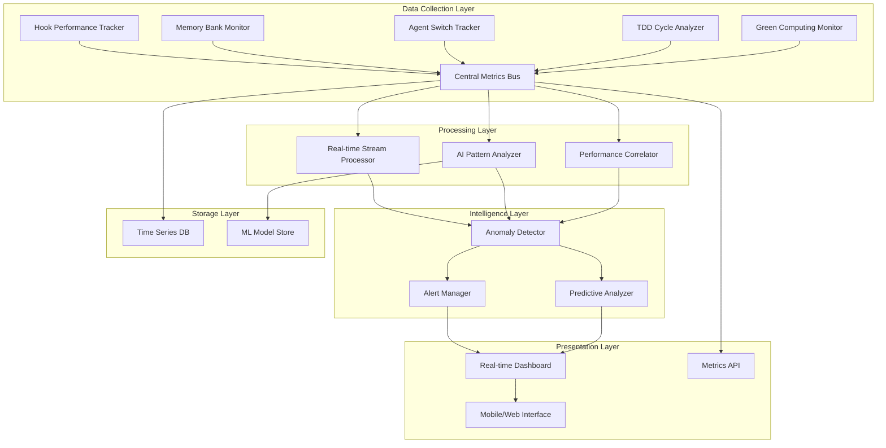

# Claude Friends Templates - Enhanced Performance Monitoring System

## 🚀 2025年最先端のパフォーマンス監視システム

本システムは2025年のオブザーバビリティベストプラクティスに基づき、AI支援分析とGreen Computing観点を統合したclaude-friends-templates専用の高度なパフォーマンス監視システムです。

## 📋 システム概要

### 主要機能

#### 🔍 **AI支援インテリジェント監視**
- **異常検出**: 機械学習による自動異常検出とルートコーズ分析
- **予測分析**: パフォーマンス劣化の事前予測と予防的対策提案
- **パターン認識**: 相関分析、季節性パターン、劣化トレンドの自動検出
- **インテリジェントアラート**: コンテキスト豊富で実行可能な推奨事項付きアラート

#### 🌱 **Green Computing監視**
- **エネルギー消費追跡**: 操作レベルでのエネルギー使用量測定
- **カーボンフットプリント**: CO2排出量の可視化と削減提案
- **効率性スコア**: 持続可能性指標による開発効率の最適化
- **環境配慮型最適化**: 省エネルギー開発プラクティスの推奨

#### ⚡ **リアルタイム監視**
- **Hook実行追跡**: 詳細なパフォーマンスメトリクスと最適化提案
- **Memory Bank監視**: ファイル操作効率性とキャッシュヒット率分析
- **エージェント切り替え品質**: コンテキスト保持率とハンドオーバー最適化
- **TDDサイクル効率性**: Red-Green-Refactorフェーズの詳細分析

#### 📊 **高度なダッシュボード**
- **リアルタイム可視化**: WebSocketベースのライブ更新
- **インタラクティブチャート**: 時系列、相関分析、効率性レーダーチャート
- **モバイル対応**: レスポンシブデザインによる多デバイス対応
- **カスタマイズ可能**: メトリクス表示とアラート設定の柔軟な調整

## 🏗️ アーキテクチャ



## 🚀 クイックスタート

### 1. 必要な依存関係のインストール

```bash
# Python AI分析ライブラリ（推奨）
pip install numpy pandas scikit-learn joblib

# または基本監視のみの場合（AIライブラリなし）
# 基本機能は依存関係なしで動作します
```

### 2. 監視システムの初期化

```bash
# メトリクスディレクトリの作成
mkdir -p ~/.claude/metrics ~/.claude/metrics/ml_models

# 既存設定のバックアップ
cp .claude/hooks.yaml .claude/hooks.yaml.backup

# システムヘルスの確認
bash .claude/shared/monitoring/hook-performance-tracker.sh analyze
```

### 3. ダッシュボードの起動

```bash
# リアルタイムダッシュボードを開く
open .claude/shared/monitoring/realtime-dashboard.html

# または簡易HTTPサーバーで提供
python -m http.server 8080 --directory .claude/shared/monitoring/
```

## 📚 使用方法

### Hook実行パフォーマンス追跡

```bash
#!/bin/bash
# 既存のHookにパフォーマンス追跡を追加

source .claude/shared/monitoring/hook-performance-tracker.sh

# Hook実行の追跡
track_hook_execution "pre-commit" "quality-check" "npm run lint"

# パフォーマンス分析レポート生成
analyze_hook_performance_trends "pre-commit"
```

### Memory Bank操作監視

```python
from claude.shared.monitoring.metrics_collector import track_memory_bank_operation

# Memory Bank操作の自動追跡
with track_memory_bank_operation('read', '/path/to/document.md') as ctx:
    content = read_file('/path/to/document.md')
    # 持続時間、メモリ使用量、効率性を自動測定

# 操作効率性の分析
print(f"Operation efficiency: {ctx['efficiency_score']}")
```

### エージェント切り替え品質監視

```python
from claude.shared.monitoring.metrics_collector import track_agent_switch

# エージェント切り替えの品質追跡
with track_agent_switch('planner', 'builder') as switch_ctx:
    # エージェント切り替え実行
    perform_agent_switch('planner', 'builder')
    # コンテキスト保持率とハンドオーバー品質を自動測定

print(f"Context preservation: {switch_ctx['context_preservation_score']:.2%}")
```

### TDDサイクル効率性分析

```python
from claude.shared.monitoring.tdd_cycle_analyzer import track_tdd_cycle

# 完全なTDDサイクルの追跡
with track_tdd_cycle(['test_user.py'], ['user.py']) as cycle:
    # Red フェーズ（失敗するテストの作成）
    with cycle.track_red_phase():
        write_failing_tests()

    # Green フェーズ（テストを通すための実装）
    with cycle.track_green_phase():
        implement_functionality()

    # Refactor フェーズ（コード品質の改善）
    with cycle.track_refactor_phase():
        refactor_code()

# 効率性スコアと改善提案を自動生成
print(f"Cycle efficiency: {cycle.efficiency_score:.2%}")
```

### AI支援パフォーマンス分析

```python
from claude.shared.monitoring.ai_performance_analyzer import create_ai_analyzer

# AI分析器の作成
analyzer = create_ai_analyzer()

# 包括的なパフォーマンスレポート生成
report = analyzer.generate_performance_report(days=7)

print(f"システム健康状態: {report['executive_summary']['health_status']}")
print(f"検出された異常: {len(report['analysis_results']['anomalies'])}")

# AI推奨事項の表示
for recommendation in report['analysis_results']['recommendations']:
    print(f"📝 {recommendation}")
```

## 📊 メトリクス分類

### Hook実行メトリクス
- `execution_duration_ms`: Hook実行時間（ミリ秒）
- `memory_delta_mb`: Hook実行中のメモリ変化量（MB）
- `cpu_usage_percent`: CPU使用率
- `energy_consumption_wh`: エネルギー消費量（Wh）
- `efficiency_score`: 総合効率性スコア（0-1）

### Memory Bank メトリクス
- `operation_duration_ms`: Memory Bank操作時間
- `file_size_category`: ファイルサイズカテゴリ（tiny/small/medium/large）
- `cache_hit_rate`: キャッシュヒット率
- `memory_efficiency`: メモリ使用効率性

### エージェント切り替えメトリクス
- `switch_duration_ms`: 切り替え時間
- `context_preservation_score`: コンテキスト保持率（0-1）
- `handover_quality_score`: ハンドオーバー品質（0-1）
- `optimization_score`: 最適化効果

### TDDサイクルメトリクス
- `cycle_duration_minutes`: 総サイクル時間
- `phase_balance_score`: フェーズバランス（0-1）
- `test_coverage_delta`: テストカバレッジ変化
- `code_quality_delta`: コード品質変化

### Green Computing メトリクス
- `carbon_footprint_g`: カーボンフットプリント（g CO2）
- `sustainability_score`: 持続可能性スコア（0-10）
- `optimization_potential`: 最適化ポテンシャル

## 🔔 アラート設定

### 重要度レベル

#### 🔴 Critical（緊急）
- Hook実行時間 > 15秒
- メモリ使用量 > 500MB
- エージェント切り替え失敗率 > 20%
- 自動エスカレーション有効

#### 🟡 Warning（警告）
- Hook実行時間 > 5秒
- メモリ使用量 > 100MB
- TDD効率性 < 70%
- ダッシュボードとログに通知

#### 🔵 Info（情報）
- パフォーマンス改善の検出
- 新しいパターンの発見
- 最適化機会の特定

### アラートルールのカスタマイズ

```json
{
  "alert_rules": {
    "hook_performance": {
      "duration_warning_ms": 5000,
      "duration_critical_ms": 15000,
      "memory_warning_mb": 100,
      "efficiency_threshold": 0.7
    },
    "green_computing": {
      "energy_efficiency_threshold": 0.6,
      "carbon_footprint_warning_g": 50,
      "sustainability_score_threshold": 7.0
    }
  }
}
```

## 🧠 AI分析機能

### 異常検出
- **統計的異常検出**: ベースライン比較による逸脱検出
- **機械学習異常検出**: Isolation Forestによる多次元異常検出
- **ルートコーズ分析**: 相関分析による根本原因の特定

### 予測分析
- **パフォーマンス予測**: 12時間先までのメトリクス予測
- **劣化検出**: パフォーマンス劣化の早期警告
- **トレンド分析**: 長期的なパフォーマンス傾向の分析

### パターン認識
- **相関分析**: メトリクス間の関係性発見
- **季節性検出**: 時間パターンによる最適化機会の特定
- **効率性パターン**: 高効率な作業パターンの学習

## 🌱 Green Computing の実装

### エネルギー効率最適化

```python
from claude.shared.monitoring.metrics_collector import GreenComputingMonitor

monitor = GreenComputingMonitor()

# 操作の環境影響度追跡
monitor.track_operation_sustainability(
    operation_type="hook_execution",
    duration=3.5,           # 秒
    cpu_usage=65.0,         # %
    memory_usage=1024       # MB
)

# 持続可能性レポート生成
report = monitor.generate_sustainability_report(time_period='24h')
print(f"総エネルギー消費: {report['total_energy_consumption_kwh']:.3f} kWh")
print(f"CO2フットプリント: {report['total_carbon_footprint_kg']:.3f} kg")
```

### 効率性最適化提案

システムは以下の観点から最適化提案を自動生成：

1. **エネルギー効率**: 高消費電力操作の特定と最適化
2. **リソース使用量**: メモリとCPU使用量の最適化
3. **作業パターン**: 効率的な開発パターンの推奨
4. **タイミング最適化**: 低負荷時間帯での重い処理の推奨

## 📈 ダッシュボード機能

### リアルタイム監視
- **ライブメトリクス**: WebSocketによる3秒更新
- **パフォーマンストレンド**: 時系列チャートによる傾向表示
- **効率性レーダー**: TDDサイクル効率性の多角分析
- **Green Computing指標**: 持続可能性スコアのリアルタイム表示

### インタラクティブ機能
- **時間範囲選択**: 1時間〜1週間のデータ表示
- **メトリクスフィルタ**: Hook種別、操作タイプ別の絞り込み
- **アラート管理**: 重要度別のアラート表示と管理
- **エクスポート**: メトリクスデータのCSV/JSON出力

### カスタマイズ
- **しきい値設定**: パフォーマンスアラートの調整
- **表示項目**: 表示メトリクスの選択
- **色テーマ**: ライト/ダークモードの切り替え
- **通知設定**: アラート通知方法の設定

## 🔧 設定とカスタマイズ

### 基本設定

設定ファイル: `.claude/shared/monitoring/integration-config.json`

```json
{
  "monitoring_integration": {
    "data_flow": {
      "collection_layer": {
        "buffer_size": 100,
        "flush_interval_seconds": 5
      },
      "processing_layer": {
        "ai_analyzer": true,
        "real_time_processing": true,
        "anomaly_detection": true
      },
      "storage_layer": {
        "retention_days": 30,
        "compression": true
      }
    }
  }
}
```

### パフォーマンス調整

#### 高スループット環境
```json
{
  "batch_size": 500,
  "flush_interval_seconds": 2,
  "parallel_processing": true,
  "compression": true
}
```

#### リソース制約環境
```json
{
  "batch_size": 50,
  "flush_interval_seconds": 10,
  "disable_ai_analysis": true,
  "reduce_retention_days": 7
}
```

## 🔍 トラブルシューティング

### よくある問題

#### AI機能が利用できない
```bash
# 解決方法: 必要なライブラリをインストール
pip install numpy pandas scikit-learn joblib

# フォールバック: AI機能なしでの基本監視
export CLAUDE_MONITORING_MODE=basic
```

#### メモリ使用量が多い
```bash
# 設定調整
echo '{"batch_size": 50, "compression": true}' > ~/.claude/metrics/config.json

# プロセス監視
ps aux | grep "metrics-collector"
```

#### ダッシュボードが表示されない
```bash
# WebSocketサーバーの確認
netstat -an | grep 8080

# フォールバック: デモモードでの表示
open .claude/shared/monitoring/realtime-dashboard.html
```

### パフォーマンス最適化

#### データ収集の最適化
- バッチサイズの調整（デフォルト: 100）
- フラッシュ間隔の調整（デフォルト: 5秒）
- 圧縮の有効化（推奨）

#### AI分析の最適化
- モデル再訓練頻度の調整（デフォルト: 24時間）
- 予測精度vs処理速度のバランス
- メモリ使用量制限の設定

## 🔗 統合とAPI

### 既存システムとの統合

本監視システムは以下の既存機能と完全互換：

- **AIロガーV2**: 既存のログ形式との完全互換性
- **Vibeロガー**: JSONL形式での seamless統合
- **Hook システム**: 既存のHook設定への非侵入的な拡張
- **エージェント調整**: 既存の調整機能の強化

### API エンドポイント

```javascript
// メトリクス取得
fetch('/api/metrics?timeRange=24h&metric=hook_performance')

// リアルタイムストリーム
const ws = new WebSocket('ws://localhost:8080/metrics');

// AI インサイト
fetch('/api/insights/anomalies')

// 設定更新
fetch('/api/config', {
  method: 'POST',
  body: JSON.stringify(newConfig)
});
```

### Webhook統合

```json
{
  "webhook_config": {
    "alert_webhook": "https://your-system.com/alerts",
    "insight_webhook": "https://your-system.com/insights",
    "authentication": {
      "type": "bearer_token",
      "token": "your-api-token"
    }
  }
}
```

## 📖 詳細ドキュメント

### コンポーネント別ドキュメント

- 📊 [メトリクス収集システム](./metrics-collector.py) - 包括的なメトリクス収集と処理
- ⚡ [Hook パフォーマンストラッカー](./hook-performance-tracker.sh) - Hook実行の詳細分析
- 🔴🟢🔵 [TDD サイクルアナライザー](./tdd-cycle-analyzer.py) - TDD効率性の科学的測定
- 🤖 [AI パフォーマンスアナライザー](./ai-performance-analyzer.py) - 機械学習による高度分析
- 📊 [リアルタイムダッシュボード](./realtime-dashboard.html) - インタラクティブ可視化
- ⚙️ [統合設定](./integration-config.json) - システム統合とカスタマイズ

### 開発者向けガイド

#### カスタムメトリクスの追加

```python
from claude.shared.monitoring.metrics_collector import get_metrics_client

client = get_metrics_client()

# カスタムメトリクス送信
client.emit_metric(
    'custom.operation.duration_ms',
    duration_ms,
    tags={'operation_type': 'custom', 'user': 'developer'}
)
```

#### カスタムアナライザーの作成

```python
from claude.shared.monitoring.ai_performance_analyzer import AIPerformanceAnalyzer

class CustomAnalyzer(AIPerformanceAnalyzer):
    def custom_analysis(self, data):
        # カスタム分析ロジック
        insights = self.analyze_custom_patterns(data)
        return insights
```

## 🎯 ベストプラクティス

### 開発効率最大化

1. **プロアクティブ監視**: 問題発生前の早期検出
2. **データ駆動最適化**: メトリクスに基づく改善
3. **継続的学習**: AI分析による改善パターンの発見
4. **環境配慮**: Green Computing指標による持続可能な開発

### メトリクス活用

1. **定期的レビュー**: 週次パフォーマンスレポートの確認
2. **しきい値調整**: プロジェクト特性に合わせたアラート調整
3. **トレンド分析**: 長期的なパフォーマンス傾向の把握
4. **チーム共有**: パフォーマンス insights のチーム内共有

### システム健康維持

1. **定期メンテナンス**: ログローテーションとクリーンアップ
2. **バックアップ**: 重要なメトリクスデータの保護
3. **更新管理**: 監視システムの定期更新
4. **セキュリティ**: 個人情報の適切な処理

## 🚀 今後の拡張計画

### 近期実装予定
- **プレディクティブスケーリング**: リソース需要の予測
- **自動最適化**: AI による自動パフォーマンス調整
- **高度な可視化**: 3D メトリクス表示とVR対応
- **マルチプロジェクト対応**: 複数プロジェクトの統合監視

### 長期ビジョン
- **量子コンピューティング対応**: 次世代計算環境での監視
- **エッジAI統合**: ローカルでの高速AI分析
- **予測的問題解決**: 問題発生前の自動修復
- **カーボンニュートラル開発**: 完全持続可能な開発環境

## 📞 サポート

### コミュニティ
- **GitHub Issues**: バグ報告と機能要求
- **ディスカッション**: 最適化のアイデア交換
- **コントリビューション**: プルリクエスト歓迎

### 技術サポート
- **ドキュメント**: 包括的な技術ドキュメント
- **サンプルコード**: 実装例とベストプラクティス
- **トラブルシューティング**: よくある問題の解決方法

---

**🌟 claude-friends-templatesで、2025年最先端のパフォーマンス監視を体験してください！**

*本システムは持続可能な開発を支援し、AI支援により開発者の生産性を最大化します。*