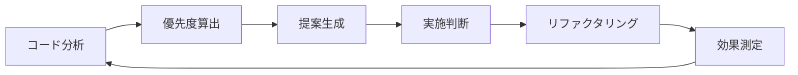

# リファクタリングスケジューラー

## 概要
技術負債を計画的に解消し、コード品質を継続的に向上させるための自動提案システムです。
定期的にコードベースを分析し、リファクタリングが必要な箇所を優先度付きで提案します。

## リファクタリング指標

### 複雑度指標
- **循環的複雑度**: McCabe複雑度が10を超える関数
- **認知的複雑度**: ネストが深い、条件分岐が多い
- **行数**: 単一関数が100行を超える
- **パラメータ数**: 5個以上のパラメータ

### 重複指標
- **コード重複**: 20行以上の類似コード
- **パターン重複**: 同じ処理パターンの繰り返し
- **マジックナンバー**: ハードコードされた値

### 保守性指標
- **命名規則違反**: 不明瞭な変数名・関数名
- **コメント不足**: 複雑なロジックの説明不足
- **テストカバレッジ**: 80%未満の箇所

## 優先度算出アルゴリズム

### 優先度スコア計算
```
優先度スコア = (影響度 × 頻度 × 複雑度) / 工数見積もり
```

- **影響度** (1-5): 他のコードへの影響範囲
- **頻度** (1-5): 変更頻度・アクセス頻度
- **複雑度** (1-5): 現在のコードの複雑さ
- **工数見積もり** (時間): リファクタリングに必要な時間

### 優先度レベル
- **🔴 Critical** (スコア > 15): 即座に対応すべき
- **🟠 High** (スコア 10-15): 今スプリント内で対応
- **🟡 Medium** (スコア 5-10): 次スプリントで計画
- **🟢 Low** (スコア < 5): 時間があるときに対応

## 定期的なリファクタリング提案

### 日次チェック（軽量）
```markdown
## 本日のリファクタリング提案

### 🔴 Critical
- [ ] `src/utils/dataProcessor.js` - 循環的複雑度: 15
  - 推奨: 関数分割とearly return導入
  - 見積もり: 1時間

### 🟠 High
- [ ] `src/api/userService.js` - 重複コード: 3箇所
  - 推奨: 共通処理の抽出
  - 見積もり: 30分
```

### 週次レポート（詳細）
```markdown
## 週次リファクタリングレポート

### サマリー
- Critical: 2件
- High: 5件
- Medium: 12件
- Low: 23件

### 技術負債の傾向
- 増加中: API層の複雑度
- 改善中: UIコンポーネントの重複
- 安定: データモデル層

### 推奨アクション
1. API層のリファクタリングを優先
2. 共通コンポーネントライブラリの拡充
3. テストカバレッジの向上（現在: 75%）
```

## 自動検出ルール

### コード品質ルール
```yaml
rules:
  complexity:
    cyclomatic: 10
    cognitive: 15
    maxLines: 100
    maxParams: 5

  duplication:
    minLines: 20
    threshold: 0.8

  naming:
    minLength: 3
    maxLength: 50
    pattern: "camelCase"

  testing:
    coverageThreshold: 80
    requireTestFile: true
```

### 検出対象外
```yaml
exclude:
  - vendor/
  - node_modules/
  - build/
  - dist/
  - "*.min.js"
  - "*.generated.*"
```

## 実装例

### リファクタリング前
```javascript
// 複雑度が高く、重複が多いコード
function processUserData(users, config, options) {
    let result = [];
    for (let i = 0; i < users.length; i++) {
        if (users[i].age > 18 && users[i].status === 'active') {
            if (config.includeEmail && users[i].email) {
                result.push({
                    id: users[i].id,
                    name: users[i].name,
                    email: users[i].email,
                    age: users[i].age
                });
            } else if (!config.includeEmail) {
                result.push({
                    id: users[i].id,
                    name: users[i].name,
                    age: users[i].age
                });
            }
        }
    }
    return result;
}
```

### リファクタリング後
```javascript
// 単一責任、早期リターン、関数分割
const isValidUser = (user) => user.age > 18 && user.status === 'active';

const createUserObject = (user, includeEmail) => {
    const baseObject = {
        id: user.id,
        name: user.name,
        age: user.age
    };

    if (includeEmail && user.email) {
        return { ...baseObject, email: user.email };
    }

    return baseObject;
};

function processUserData(users, config) {
    return users
        .filter(isValidUser)
        .map(user => createUserObject(user, config.includeEmail));
}
```

## 運用ガイドライン

### Builderエージェントの活用
1. **Critical案件**: 即座に `/tdd:start` で対応開始
2. **High案件**: タスク完了後に着手
3. **Medium/Low**: スプリント計画時に検討

### Plannerエージェントとの連携
1. 週次レポートを基にスプリント計画
2. 技術負債の可視化と優先順位付け
3. リファクタリングタスクのPhase化

### 継続的改善サイクル


## 効果測定

### 定量的指標
- 平均複雑度の推移
- コード重複率の変化
- テストカバレッジの向上
- バグ発生率の低下

### 定性的指標
- コードレビュー時間の短縮
- 新機能追加の容易さ
- チームメンバーの理解度
- 保守作業の効率

## 設定とカスタマイズ

### プロジェクト固有の設定
```json
// .claude/refactoring-config.json
{
  "schedule": {
    "daily": true,
    "weekly": true,
    "beforeCommit": false
  },
  "thresholds": {
    "complexity": {
      "cyclomatic": 8,
      "cognitive": 12
    },
    "coverage": 85
  },
  "priorities": {
    "performance": "high",
    "readability": "medium",
    "testability": "high"
  }
}
```

### チーム運用ルール例
- 各スプリントで技術負債20%削減
- Criticalは48時間以内に対応
- リファクタリング工数は全体の15%確保

## 関連ツール統合

### 静的解析ツール
- ESLint / Prettier (JavaScript/TypeScript)
- Pylint / Black (Python)
- RuboCop (Ruby)
- golangci-lint (Go)

### メトリクス収集
- SonarQube
- CodeClimate
- GitHub Code Scanning

### CI/CD統合
```yaml
# .github/workflows/refactoring-check.yml
name: Refactoring Check
on: [push, pull_request]
jobs:
  analyze:
    runs-on: ubuntu-latest
    steps:
      - uses: actions/checkout@v2
      - name: Run complexity analysis
        run: |
          npx eslint . --format json > complexity-report.json
          python analyze-refactoring-needs.py
```

## まとめ
リファクタリングスケジューラーは、技術負債を可視化し、計画的に解消するための強力なツールです。
定期的な分析と優先度付けにより、コード品質を継続的に向上させることができます。

---
*良いコードは書かれるものではなく、育てられるもの。継続的なリファクタリングで、持続可能なコードベースを実現しましょう。*
