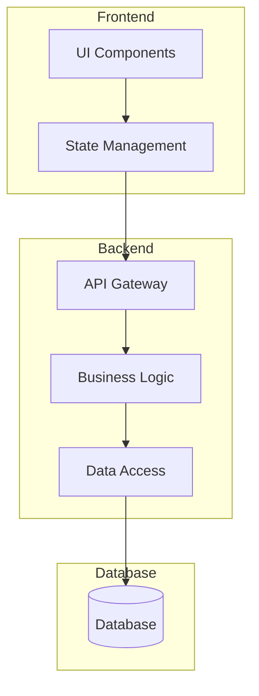
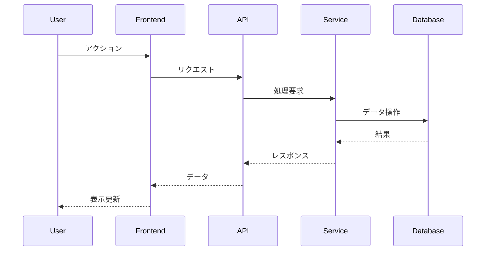
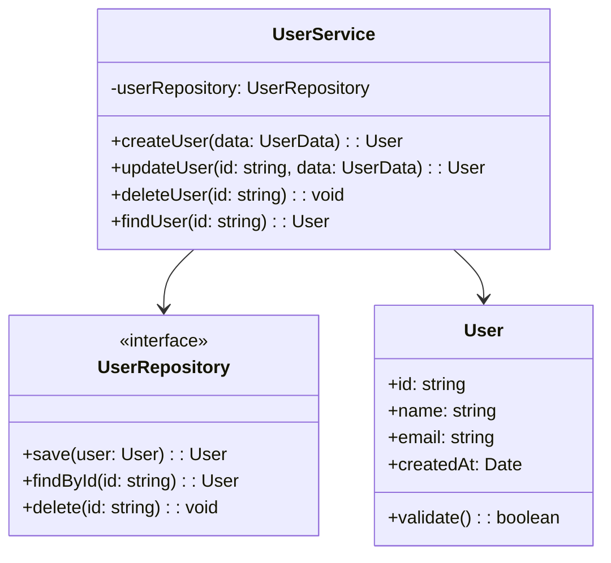
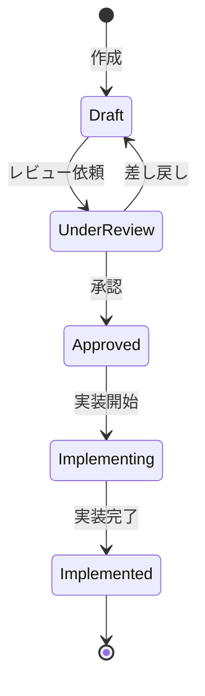

# [Project/Feature Name] 設計書

作成日: [YYYY-MM-DD]
作成者: Planner Agent
バージョン: [1.0]
ステータス: [Draft | Review | Approved | Implemented]

## 1. 設計概要

### 1.1 目的
[この設計が解決する問題と実現する価値]

### 1.2 スコープ
[この設計でカバーする範囲と、カバーしない範囲]

### 1.3 前提条件
- [技術的前提]
- [ビジネス的前提]
- [既存システムとの関係]

### 1.4 設計原則
- [ ] **シンプルさ優先**: 複雑さを避け、理解しやすい設計
- [ ] **テスタビリティ**: TDDを実践しやすい構造
- [ ] **拡張性**: 将来の変更に対応しやすい
- [ ] **パフォーマンス**: 要件を満たす性能
- [ ] **セキュリティ**: セキュアバイデザイン

## 2. アーキテクチャ設計

### 2.1 全体構成図


### 2.2 コンポーネント設計
#### Component A: [コンポーネント名]
- **責務**: [単一責任の原則に基づく責務]
- **インターフェース**:
  ```typescript
  interface ComponentA {
    method1(param: Type): ReturnType;
    method2(param: Type): ReturnType;
  }
  ```
- **依存関係**: [依存するコンポーネント]
- **テスト戦略**: [単体テスト、統合テストの方針]

#### Component B: [コンポーネント名]
[同様の形式で記述]

### 2.3 データフロー


## 3. 詳細設計

### 3.1 クラス設計


### 3.2 API設計
#### Endpoint: `POST /api/users`
- **説明**: 新規ユーザー作成
- **リクエスト**:
  ```json
  {
    "name": "string",
    "email": "string",
    "password": "string"
  }
  ```
- **レスポンス**:
  ```json
  {
    "id": "string",
    "name": "string",
    "email": "string",
    "createdAt": "datetime"
  }
  ```
- **エラーケース**:
  - 400: バリデーションエラー
  - 409: 既存ユーザー
  - 500: サーバーエラー

### 3.3 データベース設計
```sql
-- Users table
CREATE TABLE users (
    id UUID PRIMARY KEY DEFAULT uuid_generate_v4(),
    name VARCHAR(255) NOT NULL,
    email VARCHAR(255) UNIQUE NOT NULL,
    password_hash VARCHAR(255) NOT NULL,
    created_at TIMESTAMP DEFAULT CURRENT_TIMESTAMP,
    updated_at TIMESTAMP DEFAULT CURRENT_TIMESTAMP
);

-- Indexes
CREATE INDEX idx_users_email ON users(email);
```

### 3.4 状態遷移


## 4. 非機能設計

### 4.1 パフォーマンス設計
- **目標応答時間**: 95%tile < 200ms
- **キャッシュ戦略**:
  - Redis for session data
  - CDN for static assets
- **最適化ポイント**:
  - Database query optimization
  - Connection pooling
  - Lazy loading

### 4.2 セキュリティ設計
- **認証**: JWT with refresh token
- **認可**: Role-based access control (RBAC)
- **暗号化**:
  - Data at rest: AES-256
  - Data in transit: TLS 1.3
- **入力検証**: すべての入力をサニタイズ

### 4.3 エラーハンドリング
```typescript
class ErrorHandler {
  static handle(error: Error): ErrorResponse {
    if (error instanceof ValidationError) {
      return { status: 400, message: error.message };
    } else if (error instanceof NotFoundError) {
      return { status: 404, message: "Resource not found" };
    } else {
      logger.error(error);
      return { status: 500, message: "Internal server error" };
    }
  }
}
```

### 4.4 ログ設計
- **ログレベル**: DEBUG, INFO, WARN, ERROR
- **ログ項目**:
  - Timestamp
  - Request ID
  - User ID
  - Action
  - Duration
  - Result
- **保持期間**: 30日（エラーログは90日）

## 5. テスト設計（TDD）

### 5.1 テスト戦略
```
テストピラミッド:
         /\
        /E2E\      (10%)
       /------\
      /統合テスト\   (30%)
     /----------\
    /  単体テスト  \  (60%)
   /--------------\
```

### 5.2 テストケース設計
#### UserService.createUser
```typescript
describe('UserService.createUser', () => {
  it('正常系: 有効なデータでユーザーを作成できる', () => {
    // Given
    const userData = { name: 'Test', email: 'test@example.com' };

    // When
    const user = userService.createUser(userData);

    // Then
    expect(user.id).toBeDefined();
    expect(user.name).toBe('Test');
  });

  it('異常系: 無効なメールアドレスでエラー', () => {
    // Given
    const userData = { name: 'Test', email: 'invalid' };

    // When/Then
    expect(() => userService.createUser(userData))
      .toThrow(ValidationError);
  });
});
```

### 5.3 テストデータ
- **Fixtures**: テスト用の固定データセット
- **Factories**: 動的なテストデータ生成
- **Mocks**: 外部依存のモック化

## 6. 実装ガイドライン

### 6.1 コーディング規約
- **命名規則**: camelCase for variables, PascalCase for classes
- **ファイル構成**: feature-based structure
- **コメント**: JSDoc for public APIs

### 6.2 実装順序（TDD）
1. [ ] インターフェース定義
2. [ ] テストケース作成（Red）
3. [ ] 最小実装（Green）
4. [ ] リファクタリング（Refactor）
5. [ ] 統合テスト追加
6. [ ] ドキュメント更新

### 6.3 レビューポイント
- [ ] 設計原則に従っているか
- [ ] テストカバレッジは十分か（80%以上）
- [ ] エラーハンドリングは適切か
- [ ] パフォーマンスへの影響は考慮されているか
- [ ] セキュリティリスクはないか

## 7. 移行計画

### 7.1 移行戦略
[既存システムからの移行が必要な場合の戦略]

### 7.2 ロールバック計画
[問題発生時の切り戻し手順]

## 8. 設計決定記録

### 8.1 主要な決定事項
| 決定事項 | 理由 | ADR参照 |
|----------|------|---------|
| [決定1] | [理由] | ADR-XXX |
| [決定2] | [理由] | ADR-YYY |

### 8.2 代替案
[検討したが採用しなかった設計案とその理由]

## 9. リスクと対策

| リスク | 影響 | 確率 | 対策 |
|--------|------|------|------|
| [リスク1] | High | Low | [対策] |
| [リスク2] | Medium | Medium | [対策] |

## 10. 関連ドキュメント

- 要件定義書: [リンク]
- ADR: [リンク]
- API仕様書: [リンク]
- テスト仕様書: [リンク]

## 変更履歴

| バージョン | 日付 | 変更内容 | 変更者 |
|------------|------|----------|--------|
| 1.0 | YYYY-MM-DD | 初版作成 | Planner |

---

## 📋 Next Step: Task Generation Phase

### Design is complete! Time to create implementation tasks.

1. **Use the Task Generation Template**
   - Location: `.claude/shared/templates/tasks/`
   - Purpose: Transform this design into executable tasks with strict TDD

2. **What to expect in Task Generation**
   - Phased implementation plan (MVP → Advanced)
   - TDD cycle for each task (Red-Green-Refactor)
   - Clear traceability to requirements and design
   - Time estimates and dependencies

3. **Key Documents to Use**
   - [Task Generation Introduction](../tasks/task-generation-intro.md)
   - [Task Generation Template](../tasks/task-generation-template.md)
   - [TDD Strict Guide](../tasks/tdd-strict-guide.md)
   - [Phase Review Template](../tasks/phase-review-template.md)

4. **Handover to Task Generation**
   ```
   /agent:planner
   "Design is complete. Please generate implementation tasks using:
   - Requirements: [path to requirements.md]
   - Design: [path to this design document]
   - Apply strict TDD methodology"
   ```

### Pre-Task Generation Checklist
- [ ] All components are designed
- [ ] Interfaces are clearly defined
- [ ] Data models are complete
- [ ] Non-functional requirements are addressed
- [ ] Design has been reviewed and approved

---
*Good design deserves good implementation. TDD ensures quality from the start.*
**注記**: この設計書はDesign Syncメカニズムに従って管理されます。実装中に設計変更が必要な場合は、必ず設計書を更新してから実装を変更してください。
