# Mermaid図解ガイド（Planner用）

## 概要
このガイドは、Plannerエージェントが設計書で効果的な図を作成するためのMermaid記法の実践的な使い方をまとめています。

## Mermaidとは
- テキストベースの図表作成ツール
- Markdownに埋め込み可能
- バージョン管理しやすい
- 多様な図表タイプをサポート

## 基本的な使い方

### Markdownへの埋め込み
````markdown
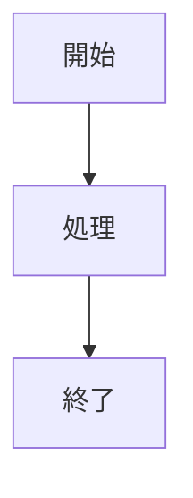
````

## 図表タイプ別ガイド

### 1. フローチャート（処理の流れ）

#### 基本構文
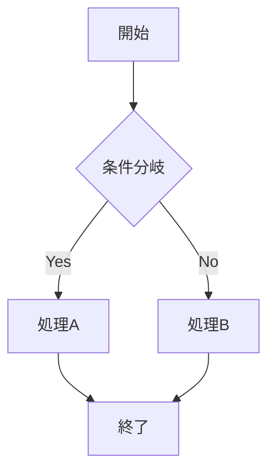

#### 実践例：ユーザー登録フロー
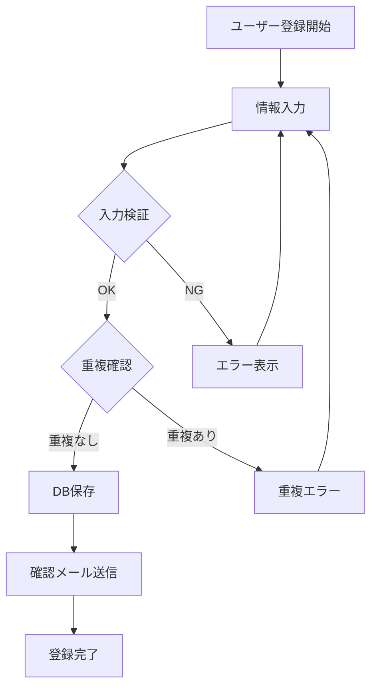

### 2. シーケンス図（処理の順序）

#### 基本構文
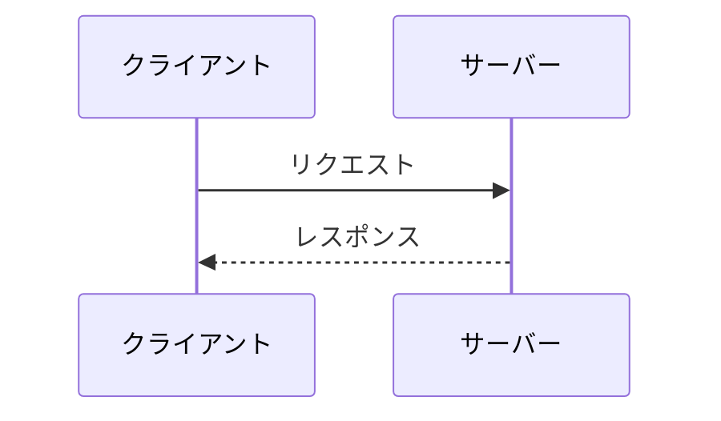

#### 実践例：API認証フロー
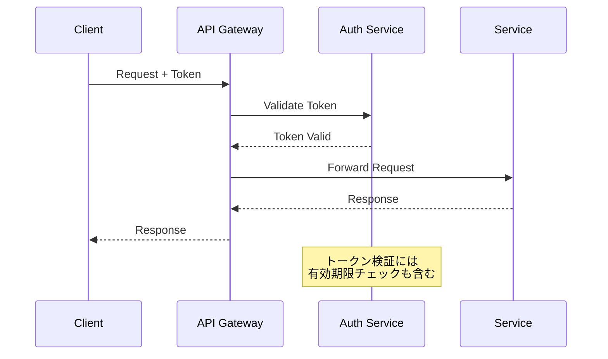

### 3. クラス図（構造）

#### 基本構文
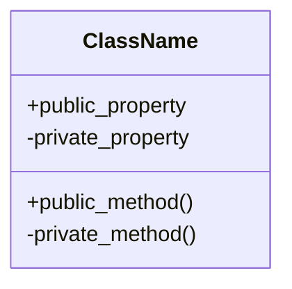

#### 実践例：ユーザー管理システム
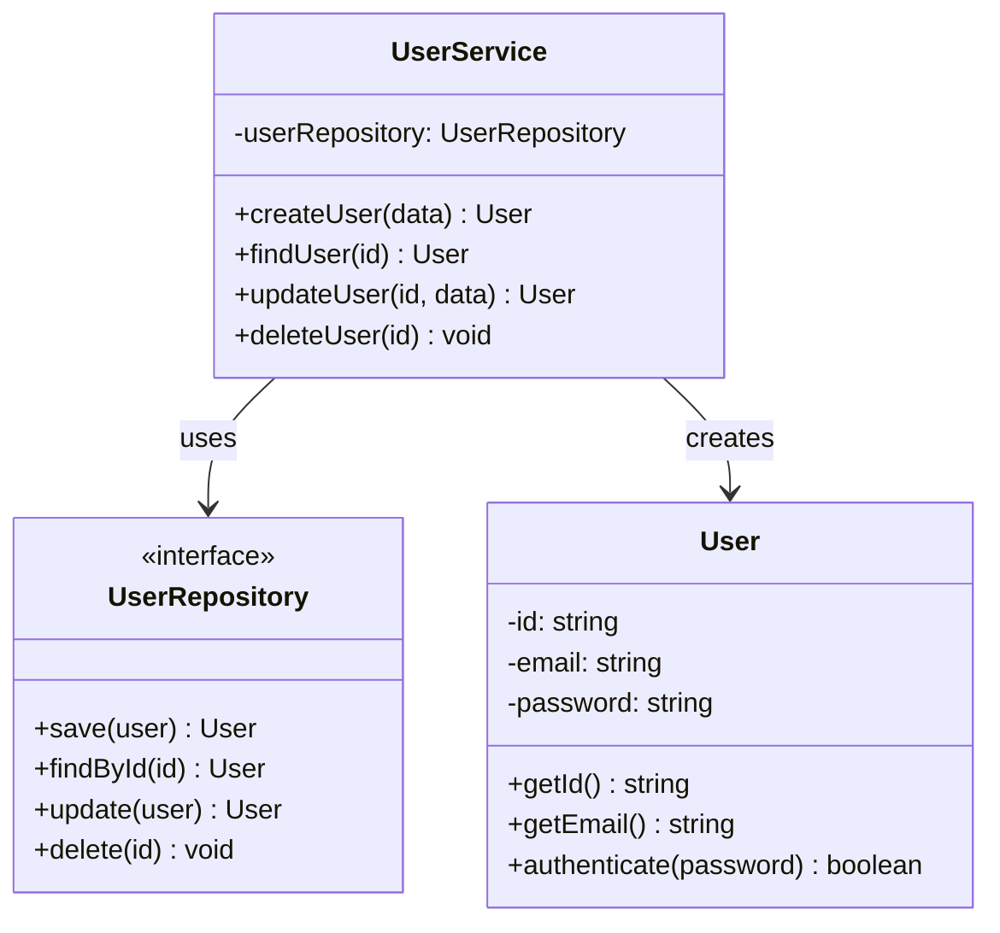

### 4. ER図（データベース設計）

#### 基本構文
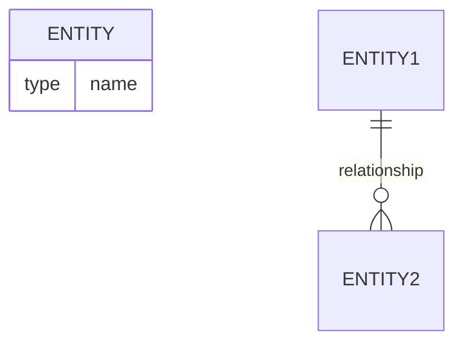

#### 実践例：ECサイトのDB設計
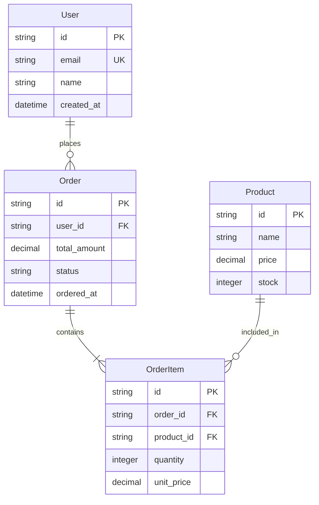

### 5. 状態遷移図

#### 基本構文
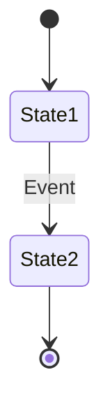

#### 実践例：注文ステータス
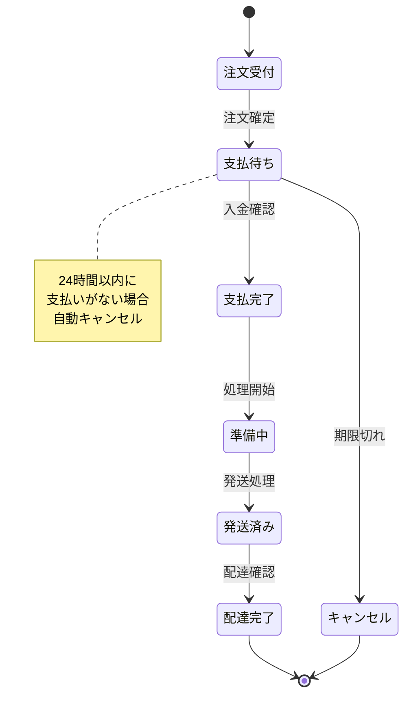

### 6. ガントチャート（スケジュール）

#### 基本構文
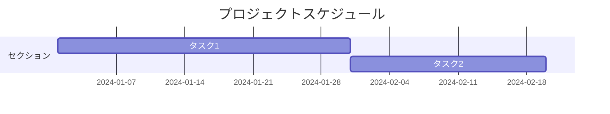

#### 実践例：開発スケジュール
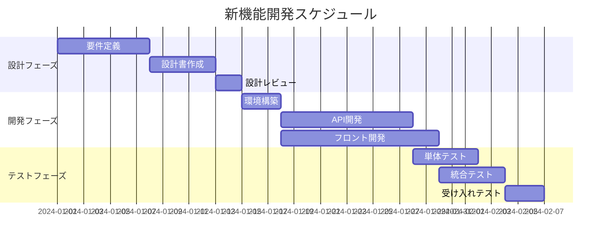

### 7. 円グラフ（割合表示）

#### 基本構文
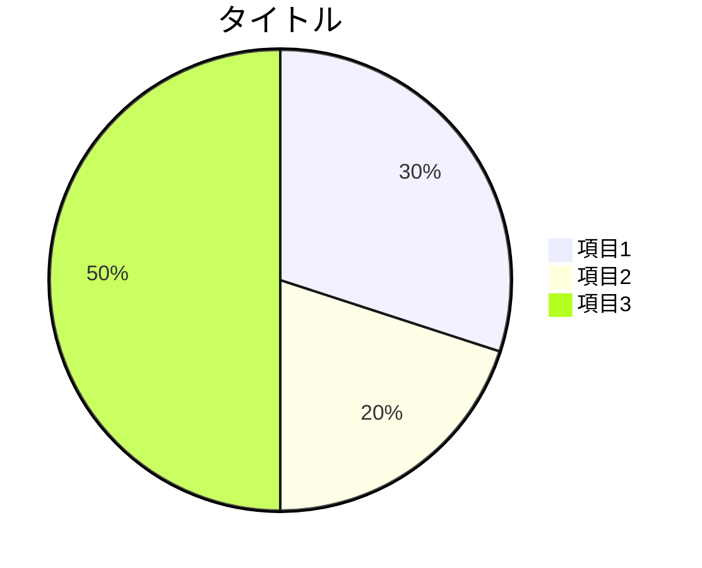

#### 実践例：工数配分
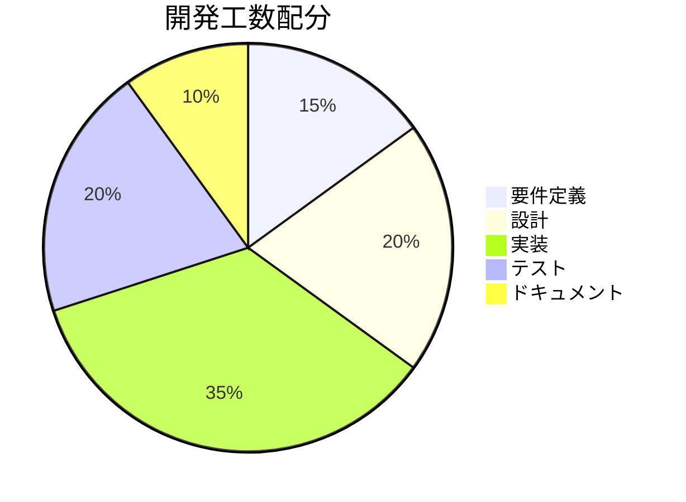

## 設計書での効果的な使い方

### 1. 図の選び方
- **処理の流れ** → フローチャート
- **時系列の処理** → シーケンス図
- **システム構造** → クラス図
- **データ構造** → ER図
- **状態の変化** → 状態遷移図
- **スケジュール** → ガントチャート

### 2. 図を使うべき場面
- 複雑な処理ロジックの説明
- システム間の連携
- データの関係性
- 時間的な流れ
- 全体像の把握

### 3. 良い図の特徴
- **シンプル**: 一目で理解できる
- **完結**: 必要な情報が含まれている
- **一貫性**: 記号や色の使い方が統一
- **適切な粒度**: 詳細すぎず、粗すぎず

## よく使うパターン集

### システム構成図
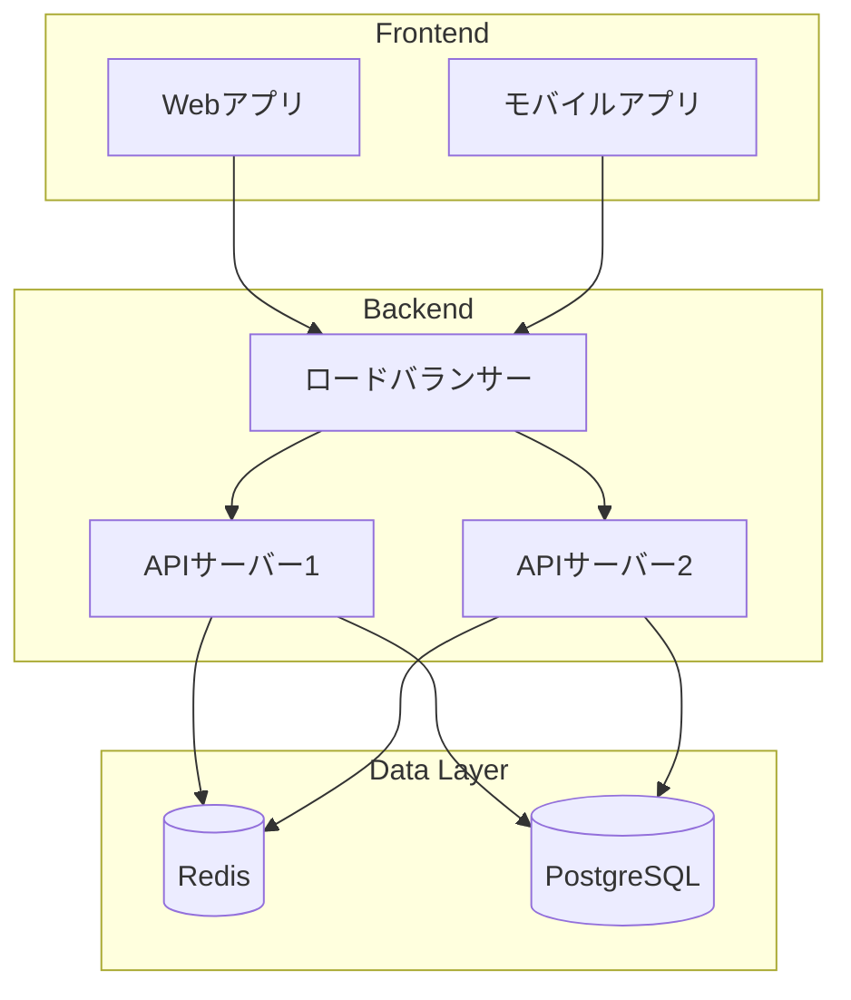

### 認証フロー
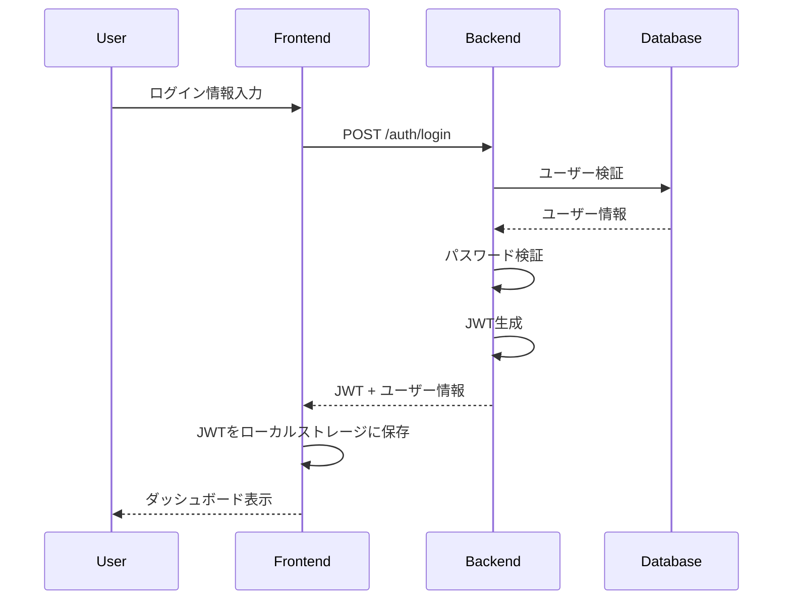

### エラーハンドリングフロー
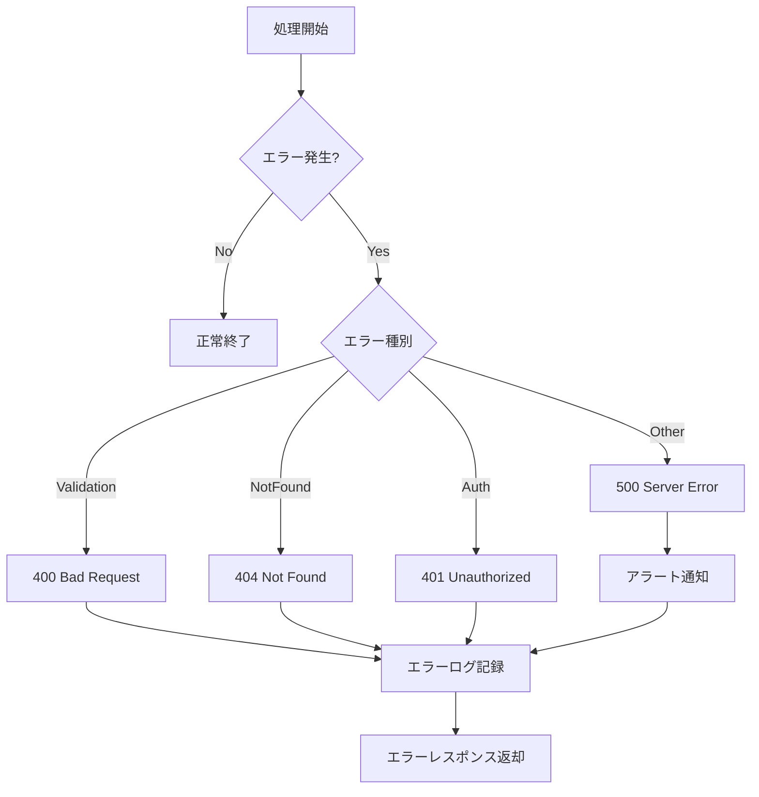

## Tips & トラブルシューティング

### よくある問題と解決法
1. **矢印が表示されない**: `-->` の前後にスペースを入れない
2. **日本語が文字化け**: エンコーディングをUTF-8に
3. **図が大きすぎる**: 図を分割するか、詳細度を下げる

### パフォーマンスの考慮
- 大きな図は描画に時間がかかる
- ノード数は50個程度まで
- 必要に応じて複数の図に分割

### メンテナンスしやすい図
- ノードにはIDを付ける
- 色は控えめに使用
- コメントを活用する

---
*図は千の言葉に勝る。Mermaidで設計意図を視覚的に伝えましょう。*
