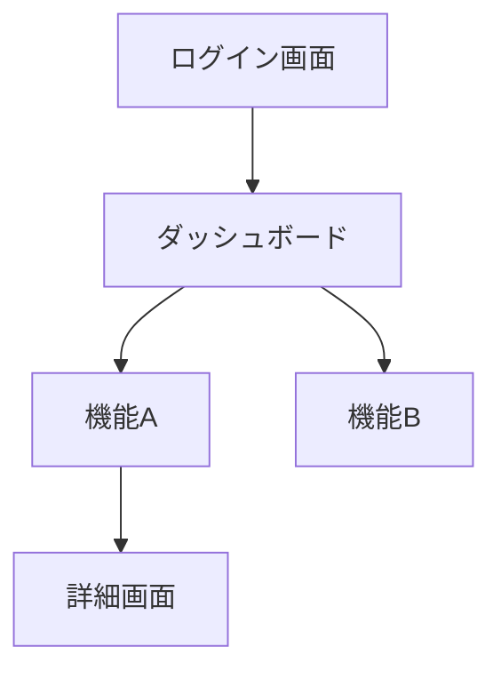
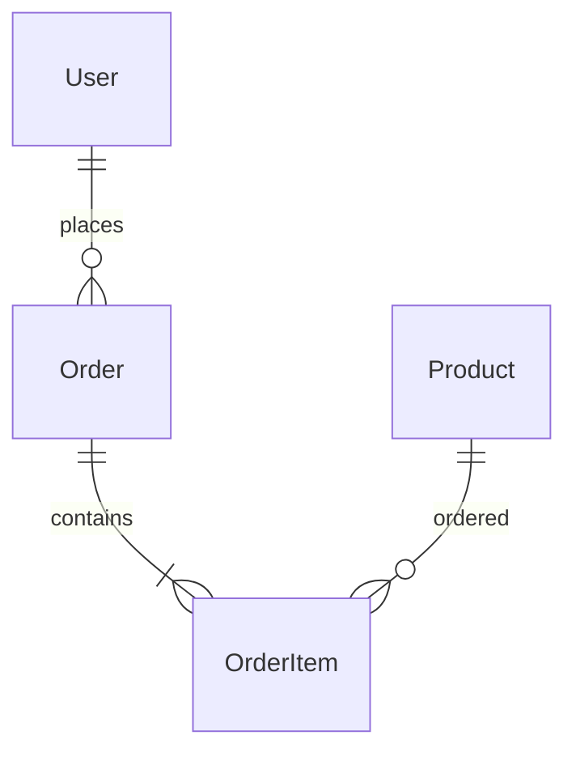
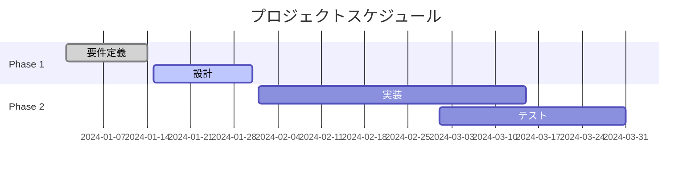

# [Project Name] 要件定義書

作成日: [YYYY-MM-DD]
作成者: [Planner/User Name]
バージョン: [1.0]
ステータス: [Draft | Review | Approved]

## 1. プロジェクト概要

### 1.1 目的とビジョン
[このプロジェクトが解決する問題と、実現したい未来を明確に記述]

### 1.2 背景とコンテキスト
[なぜこのプロジェクトが必要なのか、現状の課題は何か]

### 1.3 ステークホルダー
| 役割 | 名前/部署 | 期待事項 | 関与度 |
|------|-----------|----------|--------|
| プロダクトオーナー | [名前] | [期待] | High |
| エンドユーザー | [対象] | [期待] | High |
| 開発チーム | [チーム] | [期待] | High |

### 1.4 スコープ
#### 含まれるもの ✅
- [機能/要素1]
- [機能/要素2]

#### 含まれないもの ❌
- [除外する機能/要素1]
- [除外する機能/要素2]

### 1.5 制約条件
- **技術的制約**: [使用可能な技術、禁止事項]
- **時間的制約**: [期限、マイルストーン]
- **予算的制約**: [予算上限、リソース制限]
- **法的制約**: [コンプライアンス要件]

## 2. 機能要件

### 2.1 ユーザーストーリー
#### US-001: [ユーザーストーリー名]
```
As a [ユーザータイプ]
I want to [実現したいこと]
So that [価値・理由]
```

**受け入れ基準**:
- [ ] [具体的な条件1]
- [ ] [具体的な条件2]
- [ ] [具体的な条件3]

**テストシナリオ** (TDD用):
1. **正常系**: [期待される動作]
2. **異常系**: [エラー時の動作]
3. **境界値**: [境界条件での動作]

#### US-002: [ユーザーストーリー名]
[同様の形式で記述]

### 2.2 機能一覧
| ID | 機能名 | 説明 | 優先度 | 依存関係 |
|----|--------|------|--------|----------|
| F001 | [機能名] | [説明] | High | - |
| F002 | [機能名] | [説明] | Medium | F001 |

### 2.3 画面/インターフェース要件
#### 画面遷移図


#### 主要画面の説明
- **画面名**: [説明と主要な要素]
- **画面名**: [説明と主要な要素]

## 3. 非機能要件

### 3.1 パフォーマンス要件
| 項目 | 要件 | 測定方法 | 目標値 |
|------|------|----------|--------|
| レスポンス時間 | 画面表示 | 95パーセンタイル | 2秒以内 |
| スループット | API処理 | 秒間リクエスト数 | 1000 req/s |
| 同時接続数 | アクティブユーザー | ピーク時 | 10,000 |

### 3.2 可用性要件
- **稼働率**: 99.9%（年間ダウンタイム: 8.76時間以内）
- **計画メンテナンス**: 月1回、深夜2時間以内
- **障害復旧時間**: 1時間以内

### 3.3 セキュリティ要件
#### 認証・認可
- [ ] 多要素認証（MFA）対応
- [ ] ロールベースアクセス制御（RBAC）
- [ ] セッション管理（タイムアウト: 30分）

#### データ保護
- [ ] 保存時の暗号化（AES-256）
- [ ] 通信時の暗号化（TLS 1.3）
- [ ] 個人情報のマスキング

#### 監査・ログ
- [ ] アクセスログの記録
- [ ] 変更履歴の保持（最低1年）
- [ ] 異常検知とアラート

### 3.4 ユーザビリティ要件
- **アクセシビリティ**: WCAG 2.1 Level AA準拠
- **多言語対応**: 日本語、英語
- **レスポンシブデザイン**: モバイル、タブレット、デスクトップ
- **ブラウザサポート**: Chrome, Firefox, Safari, Edge（最新2バージョン）

### 3.5 互換性・移行要件
- **既存システムとの連携**: [連携するシステムとインターフェース]
- **データ移行**: [移行対象データと方法]
- **後方互換性**: [保証する互換性のレベル]

## 4. 技術要件

### 4.1 技術スタック
| レイヤー | 技術選択 | 理由 | ADR参照 |
|----------|----------|------|----------|
| Frontend | [React/Vue/etc] | [選択理由] | ADR-XXX |
| Backend | [Node.js/Python/etc] | [選択理由] | ADR-XXX |
| Database | [PostgreSQL/MongoDB/etc] | [選択理由] | ADR-XXX |
| Infrastructure | [AWS/GCP/etc] | [選択理由] | ADR-XXX |

### 4.2 開発環境要件
- **OS**: [対応OS]
- **開発ツール**: [IDE、ツールチェーン]
- **バージョン管理**: Git（GitHub/GitLab）
- **CI/CD**: [使用するツール]

### 4.3 テスト要件（TDD必須）
#### テスト戦略
- **単体テスト**: カバレッジ80%以上
- **統合テスト**: 主要なユースケースを網羅
- **E2Eテスト**: クリティカルパスのみ
- **パフォーマンステスト**: 負荷テスト、ストレステスト

#### TDD実践要件
- [ ] すべての機能はテストファーストで開発
- [ ] Red-Green-Refactorサイクルの厳守
- [ ] テストコードのレビュー必須
- [ ] テスト実行の自動化

## 5. データ要件

### 5.1 データモデル


### 5.2 主要エンティティ
#### User（ユーザー）
| 属性名 | データ型 | 制約 | 説明 |
|--------|----------|------|------|
| id | UUID | PK, NOT NULL | ユーザーID |
| email | VARCHAR(255) | UNIQUE, NOT NULL | メールアドレス |
| created_at | TIMESTAMP | NOT NULL | 作成日時 |

[他のエンティティも同様に記述]

### 5.3 データ量見積もり
- **初期データ量**: [見積もり]
- **年間増加率**: [見積もり]
- **保持期間**: [データ種別ごと]

## 6. 外部連携要件

### 6.1 API連携
| システム名 | 用途 | プロトコル | 認証方式 | SLA |
|------------|------|------------|----------|-----|
| [システム] | [用途] | REST/GraphQL | OAuth2.0 | 99.9% |

### 6.2 連携データ
- **送信データ**: [データ項目と形式]
- **受信データ**: [データ項目と形式]
- **エラー処理**: [リトライ、フォールバック戦略]

## 7. 運用要件

### 7.1 監視項目
- [ ] システムメトリクス（CPU、メモリ、ディスク）
- [ ] アプリケーションメトリクス
- [ ] ビジネスメトリクス
- [ ] ログ収集と分析

### 7.2 バックアップ・リカバリ
- **バックアップ頻度**: [日次/週次]
- **保持期間**: [期間]
- **RTO（目標復旧時間）**: [時間]
- **RPO（目標復旧地点）**: [時間]

## 8. プロジェクト管理

### 8.1 スケジュール


### 8.2 マイルストーン
| マイルストーン | 期日 | 成果物 | 完了基準 |
|----------------|------|--------|----------|
| M1: 要件確定 | YYYY-MM-DD | 要件定義書 | ステークホルダー承認 |
| M2: 設計完了 | YYYY-MM-DD | 設計書一式 | レビュー完了 |

## 9. リスク管理

### 9.1 リスク一覧
| ID | リスク | 影響度 | 発生確率 | 対策 | 責任者 |
|----|--------|--------|----------|------|--------|
| R001 | [リスク内容] | High | Medium | [対策] | [名前] |

### 9.2 課題管理
| ID | 課題 | 優先度 | 期限 | 担当者 | ステータス |
|----|------|--------|------|--------|------------|
| I001 | [課題内容] | High | YYYY-MM-DD | [名前] | Open |

## 10. 成功基準

### 10.1 定量的基準
- [ ] [測定可能な成功指標1]
- [ ] [測定可能な成功指標2]
- [ ] [測定可能な成功指標3]

### 10.2 定性的基準
- [ ] [ユーザー満足度などの指標]
- [ ] [ビジネス価値の実現]

## 11. 承認

### 11.1 レビュー履歴
| 日付 | レビュアー | コメント | ステータス |
|------|-----------|----------|------------|
| YYYY-MM-DD | [名前] | [コメント] | [Approved/Rejected] |

### 11.2 承認者
- **プロダクトオーナー**: ________________ 日付: ________
- **技術責任者**: ________________ 日付: ________
- **プロジェクトマネージャー**: ________________ 日付: ________

## 付録

### A. 用語集
| 用語 | 説明 |
|------|------|
| [用語] | [説明] |

### B. 参考資料
- [参考ドキュメント1]
- [参考ドキュメント2]

### C. 変更履歴
| バージョン | 日付 | 変更内容 | 変更者 |
|------------|------|----------|--------|
| 1.0 | YYYY-MM-DD | 初版作成 | [名前] |

---
**注記**: この要件定義書は生きたドキュメントです。プロジェクトの進行に応じて適切に更新してください。Design Syncメカニズムに従い、実装との乖離を防ぎましょう。
