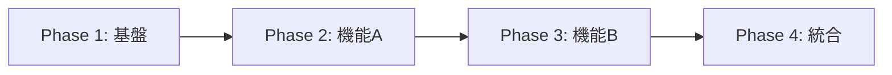

# Phase終了時レビュー＆ウォークスルーテンプレート

## Phase単体レビュー（各Phase終了時に実施）

### Phase情報
- **Phase名**: Phase [番号] - [名称]
- **開始日**: YYYY-MM-DD
- **終了日**: YYYY-MM-DD
- **レビュー実施日**: YYYY-MM-DD
- **参加者**: [レビュアー名]

### 1. 完了タスクチェック

#### 実装状況
- [ ] すべてのタスクが完了している
- [ ] すべてのテストが通っている
- [ ] カバレッジが目標値を達成している（目標: ____%）

#### TDD遵守確認
- [ ] すべてのタスクでRed-Green-Refactorサイクルを実施
- [ ] テストファーストが守られている
- [ ] 適切な粒度でコミットされている

### 2. 成果物レビュー

#### コード品質
- [ ] 命名規則が統一されている
- [ ] 適切にモジュール化されている
- [ ] 重複コードがない
- [ ] 複雑度が基準値以下（循環的複雑度 < 10）

#### ドキュメント
- [ ] 実装内容がドキュメント化されている
- [ ] APIドキュメントが更新されている
- [ ] READMEが最新状態

### 3. 要件との整合性

#### トレーサビリティ
- [ ] すべての要件が実装されている
- [ ] 実装が要件を超えていない（スコープクリープなし）
- [ ] 要件変更が適切に管理されている

### 4. 技術的負債の確認

| 項目 | 内容 | 優先度 | 対応予定 |
|------|------|--------|----------|
| | | 🔥高/⚠️中/📝低 | |

### 5. Phase評価

#### 良かった点
- 
- 
- 

#### 改善点
- 
- 
- 

#### 次Phaseへの申し送り
- 
- 
- 

---

## 全Phaseウォークスルー（全Phase完了後に実施）

### 実施情報
- **実施日**: YYYY-MM-DD
- **参加者**: [全体レビュアー]
- **対象Phases**: Phase 1〜[最終Phase番号]

### 1. 全体整合性チェック

#### アーキテクチャ整合性
- [ ] 設計通りのアーキテクチャになっている
- [ ] 各Phaseの実装が一貫している
- [ ] インターフェースが統一されている

#### データフロー確認
- [ ] Phase間のデータ連携が正しい
- [ ] エラーハンドリングが統一されている
- [ ] トランザクション境界が適切

### 2. 非機能要件の確認

#### パフォーマンス
- [ ] 応答時間が要件を満たしている
- [ ] メモリ使用量が適切
- [ ] スケーラビリティが考慮されている

#### セキュリティ
- [ ] 認証・認可が適切に実装されている
- [ ] 入力検証が実施されている
- [ ] セキュリティベストプラクティスに準拠

### 3. Phase間の依存関係



#### 依存関係の健全性
- [ ] 循環依存がない
- [ ] 疎結合が保たれている
- [ ] インターフェースが明確

### 4. リファクタリング計画

#### 即座に対応すべき項目（Critical）
| 対象 | 理由 | 見積もり |
|------|------|----------|
| | | |

#### 次スプリントで対応（High）
| 対象 | 理由 | 見積もり |
|------|------|----------|
| | | |

#### 将来的に対応（Medium/Low）
| 対象 | 理由 | 見積もり |
|------|------|----------|
| | | |

### 5. 総合評価

#### プロジェクト全体の品質
- **コード品質**: ⭐⭐⭐⭐⭐（5段階）
- **テスト品質**: ⭐⭐⭐⭐⭐（5段階）
- **ドキュメント**: ⭐⭐⭐⭐⭐（5段階）
- **保守性**: ⭐⭐⭐⭐⭐（5段階）

#### 成功要因
1. 
2. 
3. 

#### 学んだこと
1. 
2. 
3. 

#### 今後のプロジェクトへの提言
1. 
2. 
3. 

---

## リファクタリング実施チェックリスト

### 事前準備
- [ ] 現在のテストがすべて通っている
- [ ] リファクタリング対象を明確化
- [ ] 影響範囲を特定

### 実施中
- [ ] 小さなステップで進めている
- [ ] 各ステップでテストを実行
- [ ] コミットを細かく実施

### 実施後
- [ ] すべてのテストが通っている
- [ ] パフォーマンスが劣化していない
- [ ] ドキュメントを更新

---

## レビュー結果の活用

### アクションアイテム管理
```markdown
## アクションアイテム
- [ ] [担当者] [内容] [期限]
- [ ] [担当者] [内容] [期限]
- [ ] [担当者] [内容] [期限]
```

### 次回レビューでの確認事項
- 前回のアクションアイテムの完了確認
- 改善効果の測定
- 新たな課題の確認

---
*継続的な改善のために、レビューは形式的にならず、実質的な価値を生むように実施すること*