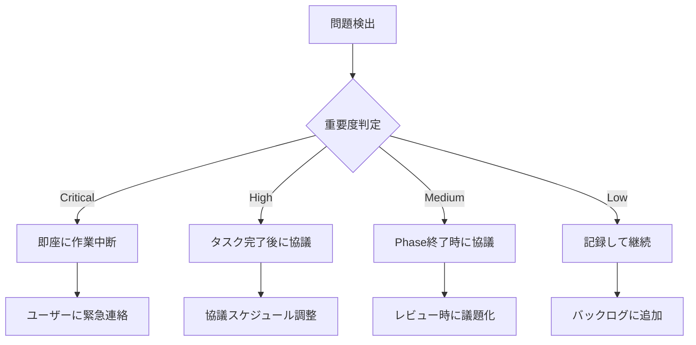

# 仕様問題フィードバックメカニズム

## 概要
タスク実行中に発見された仕様の不整合や問題を、迅速にユーザーと協議し、フィードバックするためのプロセスです。

## 仕様問題の分類

### 🔴 Critical（即座に対応が必要）
- セキュリティに関わる仕様の欠陥
- データ整合性を破壊する可能性
- 基本機能が動作しない設計上の問題

### 🟠 High（早急な協議が必要）
- パフォーマンスに重大な影響
- ユーザビリティの深刻な問題
- 実装困難な仕様

### 🟡 Medium（次回ミーティングで協議）
- 機能の使い勝手の問題
- 非効率な処理フロー
- 将来的な拡張性の懸念

### 🟢 Low（記録して後日検討）
- 軽微な改善提案
- 代替案の提示
- 最適化の機会

## フィードバックプロセス

### 1. 問題の検出と記録

```markdown
## 仕様問題レポート #[番号]

**検出日時**: YYYY-MM-DD HH:MM
**検出者**: [Builder/Planner]
**該当Phase**: Phase [番号]
**該当タスク**: [タスク名]
**重要度**: 🔴Critical / 🟠High / 🟡Medium / 🟢Low

### 問題の詳細
[具体的な問題の説明]

### 影響範囲
- 影響を受ける機能: [リスト]
- 影響を受けるユーザー: [説明]
- 技術的影響: [説明]

### 現在の仕様
[問題のある現在の仕様内容]

### 推奨される解決策
[Builderからの技術的な提案]

### 代替案
1. [代替案1]
2. [代替案2]

### 緊急度
- [ ] 作業を中断して協議が必要
- [ ] 作業は継続可能だが早急な決定が必要
- [ ] 次回の定期ミーティングで協議
```

### 2. エスカレーションフロー



### 3. ユーザー協議テンプレート

```markdown
## 仕様協議アジェンダ

**日時**: YYYY-MM-DD HH:MM
**参加者**: [ユーザー名], [開発者名]
**議題**: 仕様問題レポート #[番号]

### 1. 問題の説明（5分）
- 技術的な観点からの問題説明
- デモや図解での説明

### 2. 影響分析（10分）
- ビジネスへの影響
- 開発スケジュールへの影響
- 他機能への影響

### 3. 解決策の検討（15分）
- 推奨案の詳細説明
- 代替案の比較検討
- リスクとメリットの評価

### 4. 意思決定（10分）
- [ ] 推奨案を採用
- [ ] 代替案[番号]を採用
- [ ] 現仕様を維持（理由：　　）
- [ ] 追加検討が必要

### 5. 次のステップ（5分）
- アクションアイテム
- スケジュール調整
- 影響を受ける他タスクの確認
```

### 4. 仕様変更管理

#### 変更記録フォーマット
```markdown
## 仕様変更記録 #[番号]

**決定日**: YYYY-MM-DD
**変更理由**: 仕様問題レポート #[番号]への対応
**決定者**: [ユーザー名]

### 変更前
[元の仕様]

### 変更後
[新しい仕様]

### 影響を受ける成果物
- [ ] 要件定義書の更新
- [ ] 設計書の更新
- [ ] テストケースの更新
- [ ] 実装済みコードの修正

### 変更に伴うタスク
- [ ] [タスク1] - 担当: [名前] - 期限: [日付]
- [ ] [タスク2] - 担当: [名前] - 期限: [日付]
```

## 継続的改善

### 問題パターンの分析
月次で仕様問題を分析し、以下を特定：
- よく発生する問題のパターン
- 問題が発生しやすいPhase
- 改善すべきプロセス

### プロセス改善
```markdown
## 月次仕様問題分析

**対象期間**: YYYY-MM
**問題件数**:
- Critical: [件数]
- High: [件数]
- Medium: [件数]
- Low: [件数]

### 主な問題カテゴリ
1. [カテゴリ]: [件数]件
2. [カテゴリ]: [件数]件

### 改善アクション
- [ ] [改善内容]
- [ ] [改善内容]
```

## コミュニケーションガイドライン

### Builderからの報告時
- 技術的な詳細は最小限に
- ビジネスへの影響を中心に説明
- 視覚的な説明（図、デモ）を活用

### ユーザーとの協議時
- 専門用語を避ける
- 選択肢を明確に提示
- 決定事項を必ず文書化

### フォローアップ
- 決定事項の実装状況を定期報告
- 新たな問題が発生したら即座に共有
- 完了後に振り返りを実施

---

## クイックリファレンス

### 問題発見時のアクション
1. **重要度を判定**（Critical/High/Medium/Low）
2. **問題レポートを作成**
3. **適切なエスカレーション**を実施
4. **協議・決定**を文書化
5. **変更を実装**し、影響を管理

### よくある仕様問題
- パフォーマンス要件の非現実性
- セキュリティ要件の不足
- エラーハンドリングの未定義
- 画面遷移の不整合
- データ検証ルールの矛盾

---
*優れたソフトウェアは、技術とビジネスの継続的な対話から生まれる*
