# 🚀 Claude Friends Templates

🌐 **[日本語版](README_ja.md)** | **English**

> **Transform your solo development into a powerful AI-powered team experience**

## 💡 What if you had AI teammates who never sleep?

Imagine having a **Project Planner** who organizes your ideas and a **Code Builder** who implements them flawlessly. That's **Claude Friends** - your AI development team in a box.

### ✨ See the Magic in Action

<!-- Placeholder for quickstart GIF/video - see docs/QUICKSTART_MEDIA.md for guidelines -->

```bash
# Morning: Your AI Planner organizes the day
$ /agent:planner
"Let's tackle the authentication system today. I've broken it down into 3 phases..."

# Planning a new feature? Planner automatically switches to design mode
"I want to add user notifications"
"Switching to Feature Design Mode. Let me create a detailed spec with diagrams..."

# Seamless handoff to your AI Builder  
$ /agent:builder
"Got it! Starting with the login API. I'll follow the plan and implement JWT..."

# Hit an error? Builder automatically switches to debug mode
"TypeError: Cannot read property 'id' of undefined"
"Entering Debug Mode. Let me analyze this error and trace its root cause..."

# Your code gets written, tested, debugged, and reviewed automatically
```

## 🎯 Why Developers Love Claude Friends

### 📉 **Significant Cost Reduction**
Our prompt caching technology helps you use AI throughout the day while managing costs effectively.

### 🧠 **AI with Advanced Memory**
No more "what was I working on?" - Your AI team maintains comprehensive project memory.

### 🔍 **Rapid Problem Analysis**
AI-Friendly Logger V2 (powered by [Vibe Logger](https://github.com/fladdict/vibe-logger) concepts) turns cryptic errors into clear solutions efficiently.

### 🎭 **Smart Agents with Special Modes**
- **Planner**: Strategic thinking + automatic Feature Design Mode with Mermaid diagrams
  - Design synchronization and drift detection
  - ADR (Architecture Decision Record) management
- **Builder**: Coding expert + automatic Debug Mode and Code Review Mode + strict TDD enforcement
  - Red-Green-Refactor cycle with visual status tracking
  - Error pattern learning and recognition
  - Automated test generation and quality gates
- Just 4 simple commands, but infinite possibilities!

## 📊 Development Flow Overview

```mermaid
graph LR
    A[Requirements<br/>📋] --> B[Design<br/>🎨]
    B --> C[Task Generation<br/>📝]
    C --> D[Implementation<br/>🔨]

    subgraph "Planner Agent"
        A
        B
        C
    end

    subgraph "Builder Agent"
        D
    end

    D --> E{Phase<br/>Review}
    E -->|Pass| F[Next Phase]
    E -->|Issues| G[Refactoring]
    G --> D
```



### Key Process Features:
- **3-Phase Development**: Requirements → Design → Tasks
- **Strict TDD**: Every task follows Red-Green-Refactor cycle
- **Phase Reviews**: Quality gates at each milestone
- **Feedback Loop**: Immediate specification issue escalation

## 🚀 Quick Start

### Starting a New Project
For detailed instructions, see the [📚 Getting Started Guide](docs/GETTING_STARTED.md).

```bash
# 1. Clone the template
mkdir my-project && cd my-project
git clone https://github.com/yourusername/claude-friends-templates.git .

# 2. Start with Claude Code
/agent:planner
"I want to start a new project. Please begin with requirements definition."
```

That's it! The Planner agent will guide you through the entire setup process interactively.

### Project Flow


After completing each phase, just ask "What should I do next?" and Planner will guide you appropriately.

## 🏃‍♂️ Quick Start (5 minutes to your first AI-powered development)

### 1. Get the Template
```bash
# Clone the template
git clone https://github.com/[YOUR-USERNAME]/claude-friends-templates.git
cd claude-friends-templates

# Copy to your project
cp -r . ../my-awesome-project/ && cd ../my-awesome-project/

# Run the setup script for automatic configuration (NEW!)
./setup.sh
# The script will:
# - Ask for your project name and description
# - Let you choose English or Japanese as default
# - Update CLAUDE.md automatically
# - Initialize git repository
# - Set up proper permissions

# Or manually (if you prefer):
# For Japanese users
# mv README_ja.md README.md        # Use Japanese version as main
# mv CLAUDE_ja.md CLAUDE.md        # Use Japanese version as main
# Remove template's git history
# rm -rf .git && git init
```

### 2. Tell AI About Your Project (30 seconds)
Edit the first 2 lines in `CLAUDE.md`:
```markdown
# [Project Name]                 ← Replace with: My Todo App
## Project Overview
[Write a concise description...] ← Replace with: A simple todo list application
```

(Don't worry about the rest of CLAUDE.md - it contains useful settings that help the AI understand your project better)

### 3. Start Planning with AI Planner
```bash
# In Claude Code, start the Planner agent:
/agent:planner

# Tell what you want:
"I want to start a new project. Please begin with requirements definition."

# Planner will guide you:
"Welcome to your new project! I'm the Planner and I'll guide you through.
Let's start with the requirements definition phase.

Please tell me about your project:
1. What do you want to build?
2. Who will use it?
3. When do you need it?"
```

### 4. Follow the 3-Phase Development Flow

#### 📋 Phase 1: Requirements Definition
The Planner will:
- Ask clarifying questions
- Fill out requirements.md for you
- Define success criteria
- Identify risks and constraints

#### 🎨 Phase 2: Technical Design
After requirements are complete:
```bash
/agent:planner
"Requirements are done. Let's create the technical design."
```
The Planner will:
- Create architecture diagrams with Mermaid
- Design components and interfaces
- Define data models
- Document technical decisions

#### 🔨 Phase 3: Task Generation & Implementation
After design is complete:
```bash
/agent:planner
"Design is ready. Please generate implementation tasks with TDD."
```
The Planner will:
- Break down work into phases (MVP → Advanced)
- Create tasks with Red-Green-Refactor cycles
- Ensure traceability to requirements/design
- Add review checkpoints

### 5. Start Building with TDD
```bash
# When planning is done, switch to Builder:
/agent:builder

# Builder will start implementing:
"Alright, I've reviewed the requirements. Let's start with the first task!"
```

### That's It! 🎉
Your AI team is now working for you. The Planner organized everything, and the Builder is implementing it with TDD best practices.

### Want Something Different?
- **Need it simpler?** Tell Planner: "Make it as simple as possible"
- **Want more features?** Tell Planner: "I'd like to add user authentication"
- **Different approach?** Tell Planner: "Should we use a different architecture?"
- **Not sure what you need?** Just ask Planner: "What would you recommend?"

The AI agents are here to help - just have a conversation!

### Next Steps
- Keep chatting naturally - agents understand context
- Use `/project:focus` when you get distracted  
- Use `/project:daily` for quick retrospectives
- Read the [full guide](.claude/claude-friends-guide.md) when ready

> 💡 **Language versions**: This template includes both English and Japanese versions of documentation files (*_ja suffix for Japanese). Choose the version that suits your needs.

## 🎪 Choose Your Starting Template

### 🌟 **Claude Friends Multi-Agent System** *(Now Available!)*
Perfect for complex projects that need both planning and execution.
- **Smart AI Agents with Special Modes**:
  - Planner: Planning + Feature Design (with Mermaid diagrams)
  - Builder: Coding + Debug Mode + Code Review
- **Just 4 Commands**: `/agent:planner`, `/agent:builder`, `/project:focus`, `/project:daily`
- **Automatic Mode Switching**: Agents adapt to your current needs
- **Intelligent Handoffs**: Smooth transitions with mode recommendations

**[→ Learn More](README_TEMPLATE.md#claude-friends)** | **[→ User Guide](.claude/claude-friends-guide.md)**

### 📦 **Classic Memory Bank Template** *(Available Now)*
The foundation for AI-powered development.
- Hierarchical knowledge management
- Significant cost savings with cache optimization (based on Anthropic's prompt caching)
- Ready for immediate use

**[→ Full Documentation](README_TEMPLATE.md)**

## 🎯 Built for Real Development Challenges

### What This Template Helps You Do:
- **Plan Better**: AI Planner creates detailed specs with Mermaid diagrams automatically
- **Code Faster**: AI Builder handles implementation with mandatory TDD (test-first approach)
- **Debug Instantly**: Builder's Debug Mode analyzes errors and finds root causes automatically
- **Review Automatically**: Builder's Code Review Mode ensures quality without manual effort
- **Remember Everything**: Memory Bank and handoff system maintain perfect project context

## 🚀 Enhanced Features (NEW!)

### 🔴🟢✅ Test-Driven Development (TDD) Integration
- **Strict TDD Workflow**: Red-Green-Refactor cycle with task status tracking
- **Visual Status Indicators**: 
  - 🔴 Not Implemented (Red phase)
  - 🟢 Minimally Implemented (Green phase)  
  - ✅ Refactored (Refactor phase)
  - ⚠️ Blocked (After 3 failed attempts)
- **TDD Commands**: `/tdd:start` to begin cycle, `/tdd:status` to check progress
- **Automated Test Generation**: Templates and mock support for faster testing

### 🎯 Enhanced Design Synchronization
- **Design-First Development**: All implementations align with design specs
- **Bidirectional Sync**: Design ↔ Implementation feedback loop
- **Design Drift Detection**: Automatic checks for design-code divergence
- **ADR System**: Architecture Decision Records for tracking design choices

### 🔍 AI-Powered Error Pattern Library
- **Smart Error Recognition**: Learns from past debugging sessions
- **Pattern Matching**: Instantly identifies similar errors from history
- **Root Cause Analysis**: AI suggests likely causes and solutions
- **Searchable Debug History**: Quick access to past solutions

### 🧪 Integrated Test Framework
- **Test Templates**: Pre-built templates for common test scenarios
- **Mock Generation**: Automatic mock creation for dependencies
- **Coverage Tracking**: Real-time test coverage monitoring
- **Quality Gates**: Enforces 80%+ coverage, complexity limits

### ⚡ Optimized Agent Coordination
- **Smart Handoffs**: Context compression for efficient agent switching
- **Parallel Task Analysis**: Identifies tasks that can run concurrently
- **Shared Memory Bank**: Synchronized knowledge between agents
- **Performance Monitoring**: Track agent efficiency and bottlenecks

### 📝 AI-Friendly Comments (NEW!)
- **Smart Commenting**: Comments that explain "Why" not "What"
- **AI Comprehension**: Optimized for AI understanding and debugging
- **Business Logic Documentation**: Clear explanation of rules and constraints
- **Performance Notes**: Document optimization decisions for future reference

## 🛠 What's Inside

```
Your AI-Powered Workspace:
├── 🧠 Memory Bank/          # Your project's perfect memory
├── 🤖 AI Agents/           # Your tireless teammates
├── 🛡️ Security/            # Automatic safety checks
├── 📊 AI Logger/           # Debugging on steroids
└── 🎯 Custom Commands/      # Your productivity shortcuts
```

## 📚 Documentation That Actually Helps

- **[Quick Start Guide](README_TEMPLATE.md)** - Get started with clear, step-by-step instructions
- **[Claude Friends User Guide](.claude/claude-friends-guide.md)** - Master the AI agent system
- **[Document Structure](DOCUMENT_STRUCTURE.md)** - Find information quickly with our organized docs
- **[Migration Guide](MIGRATION_GUIDE.md)** - Upgrade existing projects smoothly
- **[Best Practices](BEST_PRACTICES.md)** - Learn proven development patterns
- **[Architecture Overview](ARCHITECTURE.md)** - Understand the system design
- **[TDD Guide](.claude/builder/tdd-cycle.md)** - Master Test-Driven Development
- **[Design Sync Guide](.claude/shared/design-sync.md)** - Keep design and code aligned

## 🤝 Join the Community

A growing community of developers exploring the future of AI-powered development.

### Get Involved
- 🌟 Star us on GitHub to stay updated
- 🐛 Report issues and share feedback
- 🔧 Contribute improvements and ideas
- 💬 Share your experience

## 🚀 Try It Out!

Want to see Claude Friends in action? 

### 📂 Working Examples (NEW!)
Explore our **[examples/](examples/)** directory for complete, working code:
- **[Todo App](examples/todo-app/)** - Full implementation with tests showing the complete workflow
  - Requirements → Design → TDD Implementation
  - See actual test files and task tracking
  - Learn by examining real code

### 📚 Conceptual Projects
Check out our **[Sample Projects](SAMPLE_PROJECTS.md)** for more project ideas:
- 📝 Markdown-driven task manager
- 🌱 Digital pet ecosystem
- 🎮 Roguelike game
- ...and more!

## 🚦 Ready to Start?

### 🛡️ Safe Environment (Recommended)
Open in VS Code or GitHub Codespaces and select "Reopen in Container" for a secure sandbox environment where you can experiment safely.

### Standard Setup
Don't just code. **Orchestrate**.

**[→ Get Your AI Team Now](README_TEMPLATE.md)**

## 📄 License

This project is licensed under the MIT License - see the [LICENSE](LICENSE) file for details.

---

<p align="center">
  <strong>Claude Friends</strong> - Because the best developers work smarter, not harder.
</p>

<p align="center">
  <sub>Built with ❤️ for developers who dare to dream bigger</sub>
</p>