# 🚀 Claude Friends Templates

[](https://opensource.org/licenses/MIT)
[](https://www.python.org/downloads/)
[-green.svg)](memo/2025-09-30/task-6-4-1-final-quality-report.md)
[](memo/2025-09-30/task-6-4-1-final-quality-report.md)
[-brightgreen.svg)](memo/2025-09-30/task-6-4-1-final-quality-report.md)
[](SECURITY.md)
[](ARCHITECTURE.md)

🌐 **[日本語版](README_ja.md)** | **English**

> **Transform your solo development into a powerful AI-powered team experience**

## 💡 What if you had always-on AI development partners?

Imagine having a **Project Planner** who organizes your ideas and a **Code Builder** who implements them with production-ready quality. That's **Claude Friends** - your AI development team in a box.

### ✨ Experience Next-Level DX

<!-- Placeholder for quickstart GIF/video - see docs/QUICKSTART_MEDIA.md for guidelines -->

```bash
# Morning: Your AI Planner organizes the day
$ /agent:planner
"Let's tackle the authentication system today. I've broken it down into 3 phases..."

# Planning a new feature? Planner automatically switches to design mode
"I want to add user notifications"
"Switching to Feature Design Mode. Let me create a detailed spec with diagrams..."

# Seamless handoff to your AI Builder
$ /agent:builder
"Got it! Starting with the login API. I'll follow the plan and implement JWT..."

# Hit an error? Builder automatically switches to debug mode
"TypeError: Cannot read property 'id' of undefined"
"Entering Debug Mode. Let me analyze this error and trace its root cause..."

# Your code gets written, tested, debugged, and reviewed automatically
```

## 🎯 Why Developers Love Claude Friends

### 📈 **Boost Productivity & Reduce Friction**
Save 8+ hours weekly with our developer-first approach that eliminates common inefficiencies.

### 📉 **Significant Cost Reduction**
Our prompt caching technology helps you use AI throughout the day while managing costs effectively.

### ⚡ **Real-World Proven Results**
Production-ready performance from live environments:
- **Developer Experience First**: Hook response < 100ms (p95: 86.368ms)
- **Zero-Compromise Security**: 100% dangerous command blocking
- **Efficient Resource Usage**: Only 3-5MB peak memory
- **Scale-Ready**: 10+ parallel processes without issues
- **Production Quality**: 95/100 TDD compliance score

**Latest Quality Metrics (September 2025)**:
- **Test Success Rate**: 98.3% (295/300 tests passing)
- **Code Quality**: Average complexity B (8.9), All files rated A for maintainability
- **Architecture**: Zero circular dependencies, 100% modular design (23 independent scripts)
- **Performance**: Handover generation 350-450ms, All operations < 500ms
- **Security**: Zero high-risk vulnerabilities, All Medium issues resolved

### 🧠 **AI with Advanced Memory**
No more "what was I working on?" - Your AI team maintains comprehensive project memory.

### 🔍 **Rapid Problem Analysis**
AI-Friendly Logger V2 (powered by [Vibe Logger](https://github.com/fladdict/vibe-logger) concepts) turns cryptic errors into clear solutions efficiently.

### 🎭 **Smart Agents with Special Modes**
- **Planner**: Strategic thinking + automatic Feature Design Mode with Mermaid diagrams
  - Design synchronization and drift detection
  - ADR (Architecture Decision Record) management
- **Builder**: Coding expert + automatic Debug Mode and Code Review Mode + strict TDD enforcement
  - Red-Green-Refactor cycle with visual status tracking
  - Error pattern learning and recognition
  - Automated test generation and quality gates
- Just 4 simple commands, but infinite possibilities!

## 🚀 Phase 2 Enhanced Capabilities (NEW!)

### 🧠 **Memory Bank Advanced System (Sprint 2.1)**
- **Intelligent Rotation**: Automatic processing when notes exceed 500 lines
  - Smart importance analysis preserves critical content
  - Automated archive with JSON indexing for fast retrieval
  - Performance: 1000-line files processed in < 1 second
- **Modular Architecture**: 83% code reduction with 5 specialized modules
  - config.sh (settings), utils.sh (utilities), analysis.sh (content analysis)
  - archive.sh (archive management), rotation.sh (execution logic)
- **Enhanced Features**: Color logging, resource management, batch processing
- **Configuration**: Customize thresholds via `.claude/settings.json`

```bash
# Automatic rotation on agent switch when notes > 450 lines
/agent:planner  # Auto-rotates if needed before switching
```

### ⚡ **Parallel Subagent Execution (Sprint 2.2)**
- **Concurrent Processing**: Up to 4 parallel subagents with queue management
- **Intelligent Resource Control**: Semaphore-based worker allocation
- **Robust Error Handling**: Timeout processing and automatic recovery
- **Thread-Safe Operations**: Flock-based task queuing with unique IDs

```bash
# Example: Code review, testing, and linting run in parallel
enqueue_task "echo 'Reviewing code'"
enqueue_task "echo 'Running tests'"
enqueue_task "echo 'Linting code'"
execute_parallel 3  # Runs all 3 tasks simultaneously
```

### 🔴🟢✅ **TDD Design Check (Sprint 2.3)**
- **Strict TDD Enforcement**: t-wada style Test-Driven Development monitoring
- **Test-First Validation**: Prevents implementation without corresponding tests
- **Design Compliance**: Automatic verification of design specification adherence
- **Visual Progress Tracking**: Red-Green-Refactor cycle with status indicators
  - 🔴 Not Implemented (Red phase)
  - 🟢 Minimally Implemented (Green phase)
  - ✅ Refactored (Refactor phase)

```bash
# TDD checker automatically validates on file edits
# Warns if source files lack corresponding test files
# Integration with PostToolUse hooks for real-time checking
```

### 📊 **Monitoring & Alerts System (Sprint 2.4)**
- **Prometheus-Style Metrics**: Standardized metric collection and aggregation
- **Real-Time Performance Tracking**: Hook execution time and error rate monitoring
- **Memory Bank Capacity Monitoring**: Automatic threshold alerts
- **Intelligent Alert System**: Error rate thresholds with automated notifications

```bash
# Performance metrics automatically collected
hook_execution_total{hook="agent-switch",status="success"} 45
hook_response_time_seconds{hook="auto-format"} 0.086
memory_bank_lines_total{agent="planner"} 350
```

### 🔧 **Integration & Performance Results**
- **End-to-End Testing**: 33/34 comprehensive integration tests passing (97% success rate)
- **Performance Benchmarks**: All Phase 2 features maintain < 100ms response times
- **Code Quality**: 58% reduction in cyclomatic complexity, 66% reduction in average function length
- **Reliability**: Enhanced error recovery with automatic state restoration

### 📋 **Usage Examples**

**Memory Bank Rotation Example:**
```bash
# When your notes.md grows beyond 500 lines
# Automatic: Important content preserved, rest archived for optimal DX
# Manual: bash .claude/scripts/notes-maintenance.sh
```

**Parallel Processing Example:**
```bash
# Execute multiple code quality checks simultaneously
source .claude/hooks/parallel/parallel-executor.sh
enqueue_task "npm run lint"
enqueue_task "npm test"
enqueue_task "npm run type-check"
execute_parallel 3  # All run concurrently
```

**TDD Compliance Example:**
```javascript
// src/calculator.js - Implementation without test triggers warning
function add(a, b) { return a + b; }

// tests/calculator.test.js - Corresponding test required
test('adds two numbers', () => {
    expect(add(1, 2)).toBe(3);
});
```

**Monitoring Dashboard Example:**
```bash
# View real-time metrics
cat .claude/logs/metrics.txt
# hook_execution_total{hook="tdd-check",status="success"} 15
# hook_response_time_seconds{hook="parallel-exec"} 0.145
```

## 📊 Development Flow Overview

```mermaid
graph LR
    A[Requirements<br/>📋] --> B[Design<br/>🎨]
    B --> C[Task Generation<br/>📝]
    C --> D[Implementation<br/>🔨]

    subgraph "Planner Agent"
        A
        B
        C
    end

    subgraph "Builder Agent"
        D
    end

    D --> E{Phase<br/>Review}
    E -->|Pass| F[Next Phase]
    E -->|Issues| G[Refactoring]
    G --> D
```



### Key Process Features:
- **3-Phase Development**: Requirements → Design → Tasks
- **Strict TDD**: Every task follows Red-Green-Refactor cycle
- **Phase Reviews**: Quality gates at each milestone
- **Feedback Loop**: Immediate specification issue escalation

## 🎓 Gradual Learning Path - Start Simple, Grow Naturally

### 🥚 **Beginner Mode (Day 1)** - Just 2 Commands
```bash
# Start with minimal configuration
cp .claude/settings-minimal.json .claude/settings.json

# That's it! Just use these two:
/agent:planner  # For planning and design
/agent:builder  # For implementation
```
**✨ You get**: Agent switching, auto-handover, security blocking - developer-first essentials!

### 🐣 **Intermediate (Week 2-4)** - Explore Convenience Features
- Experience automatic Memory Bank rotation
- Try AI-powered error analysis when debugging
- Keep using the same 2 commands, but notice the enhanced DX happening behind the scenes

### 🦅 **Advanced (Month 2+)** - Unlock Full Power (If Needed)
```bash
# Ready for everything?
cp .claude/settings-full.json .claude/settings.json
```
- Parallel execution (for large projects)
- TDD enforcement (for team quality)
- Metrics monitoring (for production)

**📚 New to Claude Friends?** Start with our **[Getting Started Guide](GETTING_STARTED.md)** - it shows you exactly what to use and what to ignore!

## 🚀 Quick Start

## 🏃‍♂️ Quick Start (5 minutes to your first AI-powered development)

### Prerequisites
- **Required**: Claude Code v1.0+, Git, Bash
- **Optional**: Bats (for running developer tests)
- **📝 Note**: **Bats is NOT required for general use**. All features work perfectly without Bats. See [Test System Guide](.claude/tests/README.md) for details.

### 1. Get the Template & Setup
```bash
# Clone and setup your project
mkdir my-project && cd my-project
git clone https://github.com/yourusername/claude-friends-templates.git .

# Run the setup script for automatic configuration (NEW!)
./setup.sh
# The script will:
# - Ask for your project name and description
# - Choose English or Japanese as default
# - Update CLAUDE.md automatically
# - Initialize git repository
# - Set up proper permissions

# Or manually if you prefer:
# rm -rf .git && git init
# For Japanese: mv README_ja.md README.md && mv CLAUDE_ja.md CLAUDE.md
```

### 2. Tell AI About Your Project (30 seconds)
Edit the first 2 lines in `CLAUDE.md`:
```markdown
# [Project Name]                 ← Replace with: My Todo App
## Project Overview
[Write a concise description...] ← Replace with: A simple todo list application
```

(Don't worry about the rest of CLAUDE.md - it contains useful settings that help the AI understand your project better)

### 3. Start Development with Agent-First Methodology

#### ⭐ Recommended: Agent-First Development Flow
```bash
# Start with Agent First - it ensures proper methodology:
/agent:first

# Agent First will guide you through:
# ✅ Requirements Definition → Design → Tasks → Implementation
# ✅ Quality gates at each stage
# ✅ Automatic progression to the right specialist agent
```

**Why Agent First?** It prevents jumping straight to implementation without proper planning.

#### Alternative: Direct Agent Access (if requirements/design ready)
```bash
# For planning and design work
/agent:planner
"I have complete requirements. Let's create the technical design."

# For implementation work (only after planning)
/agent:builder
"Let's implement the user authentication system."
```

### 4. Development Flow

#### Project Development Phases


**Phase 1: Requirements** - Planner asks questions and creates requirements.md
**Phase 2: Design** - Planner creates architecture with Mermaid diagrams
**Phase 3: Tasks** - Planner generates TDD tasks with Red-Green-Refactor
**Phase 4: Build** - Builder implements with strict TDD practices

```bash
# When ready to implement:
/agent:builder
"Let's start with the first task!"
```

### That's It! 🎉

Your AI team is ready. Just chat naturally - they understand context!

**Quick Tips:**
- `/project:focus` - Get back on track when distracted
- `/project:daily` - Quick retrospectives
- Ask "What would you recommend?" when unsure

### 🔗 Hooks System Quick Start

Enable developer experience automation features (optional but recommended):

```bash
# Test the hooks system
.claude/scripts/test-hooks.sh

# Check performance metrics
.claude/tests/performance/comprehensive-performance-test.sh

# Verify security features
.claude/scripts/test-security.sh
```

The hooks system includes:
- Automatic agent switching with `/agent:planner` or `/agent:builder`
- Security blocking for dangerous commands
- Automatic code formatting
- TDD progress tracking
- Session summaries

> 💡 **Language versions**: This template includes both English and Japanese versions of documentation files (*_ja suffix for Japanese). Choose the version that suits your needs.

## 🎪 Choose Your Starting Template

### 🌟 **Claude Friends Multi-Agent System** *(Now Available!)*
Perfect for complex projects that need both planning and execution.
- **Smart AI Agents with Special Modes**:
  - Planner: Planning + Feature Design (with Mermaid diagrams)
  - Builder: Coding + Debug Mode + Code Review
- **Just 5 Commands**: `/agent:first` (start here!), `/agent:planner`, `/agent:builder`, `/project:focus`, `/project:daily`
- **Automatic Mode Switching**: Agents adapt to your current needs
- **Intelligent Handoffs**: Smooth transitions with mode recommendations

**[→ Learn More](README_TEMPLATE.md#claude-friends)** | **[→ User Guide](.claude/claude-friends-guide.md)**

### 📦 **Classic Memory Bank Template** *(Available Now)*
The foundation for AI-powered development.
- Hierarchical knowledge management
- Significant cost savings with cache optimization (based on Anthropic's prompt caching)
- Ready for immediate use

**[→ Full Documentation](README_TEMPLATE.md)**

## 🎯 Built for Real Development Challenges

### What This Template Helps You Do:
- **Plan Better**: AI Planner creates detailed specs with Mermaid diagrams automatically
- **Code Faster**: AI Builder handles implementation with mandatory TDD (test-first approach)
- **Debug Instantly**: Builder's Debug Mode analyzes errors and finds root causes automatically
- **Review Automatically**: Builder's Code Review Mode ensures reliable implementation without manual effort
- **Remember Everything**: Memory Bank and handoff system maintain comprehensive project context

## 🚀 Enhanced Features (NEW!)

### 🌟 Agent-First Development System (v2.4.0)
- **Methodology Enforcement**: Ensures proper development flow (Requirements → Design → Tasks → Implementation)
- **Quality Gates**: Validates completion at each stage before progression
- **Stage Guard**: `.claude/scripts/stage-guard.sh` checks requirements, design, and task completeness
- **Automatic Routing**: Dispatcher automatically routes to the appropriate agent based on project state
- **Entry Point**: `/agent:first` - Your development methodology guide

### 🔒 Enhanced Security System (v2.4.0)
- **Expanded Protection**: Now blocks 10+ categories of dangerous commands
- **100% Detection Rate**: All dangerous commands in security tests are blocked
- **New Patterns**: Global config changes, process termination, firewall manipulation
- **Continuous Monitoring**: Real-time command execution monitoring and logging
- **Security Audit**: `python3 .claude/scripts/security-audit.py` for comprehensive scans

### 🔧 Code Infrastructure (v2.4.0)
- **Shared Utilities Library**: `.claude/scripts/shared-utils.sh` reduces code duplication
- **Standardized Logging**: Unified log functions across all scripts
- **Common Operations**: File operations, process management, agent utilities
- **Example Implementation**: `activity-logger-refactored.sh` demonstrates 30% code reduction

### 🔴🟢✅ Test-Driven Development (TDD) Integration
- **Strict TDD Workflow**: Red-Green-Refactor cycle with task status tracking
- **Visual Status Indicators**:
  - 🔴 Not Implemented (Red phase)
  - 🟢 Minimally Implemented (Green phase)
  - ✅ Refactored (Refactor phase)
  - ⚠️ Blocked (After 3 failed attempts)
- **TDD Commands**: `/tdd:start` to begin cycle, `/tdd:status` to check progress
- **Automated Test Generation**: Templates and mock support for faster testing

### 🎯 Enhanced Design Synchronization
- **Design-First Development**: All implementations align with design specs
- **Bidirectional Sync**: Design ↔ Implementation feedback loop
- **Design Drift Detection**: Automatic checks for design-code divergence
- **ADR System**: Architecture Decision Records for tracking design choices

### 🔍 AI-Powered Error Pattern Library
- **Smart Error Recognition**: Learns from past debugging sessions
- **Pattern Matching**: Instantly identifies similar errors from history
- **Root Cause Analysis**: AI suggests likely causes and solutions
- **Searchable Debug History**: Quick access to past solutions

### 🧪 Integrated Test Framework
- **Test Templates**: Pre-built templates for common test scenarios
- **Mock Generation**: Automatic mock creation for dependencies
- **Coverage Tracking**: Real-time test coverage monitoring
- **Quality Gates**: Enforces 80%+ coverage, complexity limits

### ⚡ Optimized Agent Coordination
- **Smart Handoffs**: Context compression for efficient agent switching
- **Parallel Task Analysis**: Identifies tasks that can run concurrently
- **Shared Memory Bank**: Synchronized knowledge between agents
- **Performance Monitoring**: Track agent efficiency and bottlenecks

### 📝 AI-Friendly Comments (NEW!)
- **Smart Commenting**: Comments that explain "Why" not "What"
- **AI Comprehension**: Optimized for AI understanding and debugging
- **Business Logic Documentation**: Clear explanation of rules and constraints
- **Performance Notes**: Document optimization decisions for future reference

### 📦 Notes Management System (NEW!)
- **Automatic Rotation**: Prevents notes.md from growing too large (500+ lines)
- **Smart Summarization**: Extracts important decisions and tasks during rotation
- **Index Generation**: Auto-generated table of contents for all notes and archives
- **Flexible Configuration**: Customize thresholds and extraction patterns
- **One-Command Maintenance**: `bash .claude/scripts/notes-maintenance.sh` handles everything
- **🔄 Auto-Rotation on Agent Switch**: Automatically rotates when notes exceed 450 lines during `/agent:` commands
- **Full Documentation**: [Notes Management Guide](.claude/scripts/NOTES-MANAGEMENT-README.md)

## 🔗 Enhanced Hooks System

Advanced automation for development workflow optimization:

### Core Features
- **Automatic agent switching**: Seamless transitions between Planner and Builder agents
- **Automatic handover generation**: Context preservation during agent switches
- **Automatic Memory Bank rotation**: Prevents notes.md files from growing too large (450+ lines)
- **TDD Progress Tracking**: Automatic monitoring of Red-Green-Refactor cycles
- **Security Enforcement**: 100% dangerous command detection and blocking
- **Performance Monitoring**: Real-time response time tracking and bottleneck analysis

### Hooks Configuration
The system uses `.claude/settings.json` for hook configuration:
- **UserPromptSubmit**: Triggers on `/agent:` commands for agent switching
- **PostToolUse**: Activates after file edits for formatting and TDD checks
- **Stop**: Executes on session end for summary generation

### Testing & Verification
```bash
# Test all hooks features
.claude/scripts/test-hooks.sh

# Verify specific components
.claude/tests/performance/comprehensive-performance-test.sh
```

## 🛠 What's Inside

```
Your AI-Powered Workspace:
├── 🧠 Memory Bank/          # Your project's perfect memory
├── 🤖 AI Agents/           # Your tireless teammates
├── 🛡️ Security/            # Automatic safety checks
├── 📊 AI Logger/           # Debugging on steroids
└── 🎯 Custom Commands/      # Your productivity shortcuts
```

## ⚙️ Configuration Files

This project uses several configuration files to maintain code quality and consistency:

### `.editorconfig`
Ensures consistent coding styles across different editors and IDEs:
- **Python files**: 4-space indentation (PEP 8 compliant)
- **YAML/JSON files**: 2-space indentation
- **Line endings**: Unix-style LF for cross-platform compatibility
- **Encoding**: UTF-8 for all text files
- **Max line length**: 88 characters (Black/Ruff default)

**Purpose**: Prevents whitespace and indentation issues when multiple developers work on the same project.

### `pyproject.toml`
Modern Python project configuration (PEP 518/621):
- **Project metadata**: Name, version, description, authors
- **Build system**: setuptools configuration for package building
- **Dependencies**: Optional dependency groups (dev, test, quality)
- **Tool configurations**:
  - **Ruff**: Fast Python linter and formatter (replaces flake8, isort)
  - **MyPy**: Static type checker with strict mode enabled
  - **Pytest**: Test runner configuration with markers and coverage
  - **Coverage**: 90% minimum coverage requirement

**Purpose**: Centralizes all Python tooling configuration in a single standardized file.

### `.gitignore`
Specifies files and directories Git should ignore:
- **Python artifacts**: `__pycache__/`, `*.pyc`, `*.pyo`, virtual environments
- **IDE files**: `.vscode/`, `.idea/`, editor swap files
- **Build outputs**: `dist/`, `build/`, `*.egg-info/`
- **Coverage reports**: `htmlcov/`, `.coverage`
- **Security scans**: `.claude/security/scan-results/`
- **Temporary files**: Test artifacts, debug files, logs

**Purpose**: Keeps the repository clean by excluding generated files and sensitive information.

### Usage

These configuration files work automatically with supported tools:

```bash
# EditorConfig: Supported natively by PyCharm, VS Code, etc.
# No additional setup required

# Ruff: Lint and format code
ruff check .                    # Check for issues
ruff format .                   # Format code

# MyPy: Type checking
mypy .claude/scripts/           # Check type annotations

# Pytest: Run tests with coverage
pytest --cov=.claude/scripts --cov-report=html
```

For more details, see:
- **[Best Practices Guide](BEST_PRACTICES.md)** - Coding standards and quality metrics
- **[Contributing Guide](CONTRIBUTING.md)** - Development workflow and tools

## 📚 Documentation That Actually Helps

- **[Quick Start Guide](README_TEMPLATE.md)** - Get started with clear, step-by-step instructions
- **[Claude Friends User Guide](.claude/claude-friends-guide.md)** - Master the AI agent system
- **[Document Structure](DOCUMENT_STRUCTURE.md)** - Find information quickly with our organized docs
- **[Migration Guide](MIGRATION_GUIDE.md)** - Upgrade existing projects smoothly
- **[Best Practices](BEST_PRACTICES.md)** - Learn proven development patterns
- **[Architecture Overview](ARCHITECTURE.md)** - Understand the system design
- **[TDD Guide](.claude/builder/tdd-cycle.md)** - Master Test-Driven Development
- **[Design Sync Guide](.claude/shared/design-sync.md)** - Keep design and code aligned

### 🔧 Troubleshooting Hooks

Having issues with the hooks system? Check these resources:
- **Common issues**: Hooks not triggering, permission errors
- **Debug commands**: `.claude/scripts/test-hooks.sh --debug`
- **Log locations**: `~/.claude/activity.log`, `~/.claude/security.log`
- **Full guide**: [Hooks Troubleshooting Guide](.claude/hooks-README.md)

## 🎉 Version 1.0.0 Release

The Hooks System Enhancement (Phase 1) is now complete with:
- ✅ Automatic agent switching
- ✅ Intelligent handover generation
- ✅ Memory Bank auto-rotation
- ✅ TDD progress tracking
- ✅ Security enforcement
- ✅ Performance monitoring

## 🤝 Join the Community

A growing community of developers exploring the future of AI-powered development.

### Get Involved
- 🌟 Star us on GitHub to stay updated
- 🐛 Report issues and share feedback
- 🔧 Contribute improvements and ideas
- 💬 Share your experience

## 🚀 Try It Out!

Want to see Claude Friends in action?

### 📂 Working Examples (NEW!)
Explore our **[examples/](examples/)** directory for complete, working code:
- **[Todo App](examples/todo-app/)** - Full implementation with tests showing the complete workflow
  - Requirements → Design → TDD Implementation
  - See actual test files and task tracking
  - Learn by examining real code

### 📚 Conceptual Projects
Check out our **[Sample Projects](SAMPLE_PROJECTS.md)** for more project ideas:
- 📝 Markdown-driven task manager
- 🌱 Digital pet ecosystem
- 🎮 Roguelike game
- ...and more!

## 🚦 Ready to Start?

### 🛡️ Safe Environment (Recommended)
Open in VS Code or GitHub Codespaces and select "Reopen in Container" for a secure sandbox environment where you can experiment safely.

### Standard Setup
Don't just code. **Orchestrate**.

**[→ Get Your AI Team Now](README_TEMPLATE.md)**

## 📄 License

This project is licensed under the MIT License - see the [LICENSE](LICENSE) file for details.

---

<p align="center">
  <strong>Claude Friends</strong> - Because the best developers work smarter, not harder.
</p>

<p align="center">
  <sub>Built with ❤️ for developers focused on creating better experiences</sub>
</p>
