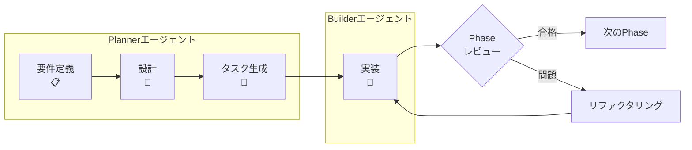

# 🚀 Claude Friends テンプレート

🌐 **日本語** | **[English](README.md)**

> **ひとり開発を、最強のAIチーム開発へ**

## 💡 もし、眠らないAIチームメイトがいたら？

アイデアを整理する**プロジェクトプランナー**と、それを完璧に実装する**コードビルダー**。
それが**Claude Friends** - あなた専用のAI開発チームです。

### ✨ 実際の動作を見てみましょう

```bash
# 朝：AIプランナーが今日の作業を整理
$ /agent:planner
「今日は認証システムに取り組みましょう。3つのフェーズに分けました...」

# 新機能の計画？プランナーが自動で設計モードに切り替え
「ユーザー通知機能を追加したい」
「新機能設計モードに切り替えます。Mermaid図付きの詳細な仕様書を作成しますね...」

# スムーズにAIビルダーへバトンタッチ
$ /agent:builder
「了解！ログインAPIから始めます。計画に従ってJWTを実装しますね...」

# エラーが発生？ビルダーが自動でデバッグモードに切り替え
「TypeError: Cannot read property 'id' of undefined」
「デバッグモードに入ります。このエラーを分析して根本原因を特定しますね...」

# コードの記述、テスト、デバッグ、レビューが自動で進行
```

## 🎯 開発者に愛される理由

### 📉 **大幅なコスト削減**
プロンプトキャッシュ技術により、一日中AIを効果的に活用しながらコストを効率的に管理できます。

## ⚡ 性能実績

本番環境で実証された結果：
- **フック応答時間**: < 100ms（p95: 86.368ms） - 性能目標を上回る実績
- **セキュリティ検出**: 危険コマンド100%ブロック率
- **メモリ効率**: 全フック操作で最大3MB使用量
- **並列実行**: 10以上の並行プロセスでデッドロックなし
- **TDD準拠**: 包括的レビューで95/100スコア

### 🧠 **高度な記憶力を持つAI**
「何やってたっけ？」はもう過去の話。AIチームが包括的なプロジェクト記憶を維持。

### 🔍 **AI支援による問題分析**
AI-Friendly Logger V2（[Vibe Logger](https://github.com/fladdict/vibe-logger)概念採用）が、複雑なエラーの分析と解決策の特定を支援。

### 🎭 **特殊モード付きスマートエージェント**
- **プランナー**: 戦略的思考 + 自動新機能設計モード（Mermaid図付き）
  - 設計同期とドリフト検出
  - ADR（アーキテクチャ意思決定記録）管理
- **ビルダー**: コーディングエキスパート + 自動デバッグモード＆コードレビューモード + TDD厳格遵守
  - 視覚的ステータス追跡付きRed-Green-Refactorサイクル
  - エラーパターン学習と認識
  - テスト自動生成と品質ゲート
- たった4つのコマンドで、無限の可能性！

## 📊 開発フロー概要



### 主なプロセスの特徴:
- **3フェーズ開発**: 要件定義 → 設計 → タスク生成
- **厳格なTDD**: すべてのタスクでRed-Green-Refactorサイクル
- **Phaseレビュー**: 各マイルストーンでの品質ゲート
- **フィードバックループ**: 仕様問題の即時エスカレーション

## 🚀 クイックスタート

### 前提条件
- **必須**: Claude Code v1.0以上、Git、Bash
- **オプション**: Bats（開発者向けテスト実行用）
- **📝 注意**: **Batsは一般利用では不要です**。すべての機能はBats無しで正常動作します。詳細は[テストシステムガイド](.claude/tests/README.md)を参照。

### 新規プロジェクトの始め方
詳細な手順は [📚 Getting Started ガイド](docs/GETTING_STARTED_ja.md) を参照してください。

```bash
# 1. テンプレートをクローン
mkdir my-project && cd my-project
git clone https://github.com/yourusername/claude-friends-templates.git .

# 2. Claude Codeで開始
/agent:planner
「新しいプロジェクトを始めたいです。要件定義から始めてください。」
```

以上です！Plannerエージェントが対話的にセットアップ全体をガイドします。

### プロジェクトの進め方
```mermaid
graph LR
    A[要件定義<br/>Planner] -->|"Next?"|  B[設計<br/>Planner]
    B -->|"Next?"| C[タスク生成<br/>Planner]
    C -->|切り替え| D[実装<br/>Builder]
    D -->|完了| E[次のPhase]
```

各フェーズ完了後に「次どうすればいい？」と聞くと、Plannerが適切に誘導します。

## 🏃‍♂️ クイックスタート（5分でAI駆動開発を開始）

### 1. テンプレートを取得
```bash
# テンプレートをクローン
git clone https://github.com/[YOUR-USERNAME]/claude-friends-templates.git
cd claude-friends-templates

# プロジェクトにコピー
cp -r . ../my-awesome-project/ && cd ../my-awesome-project/

# テンプレートのgit履歴を削除
rm -rf .git && git init
```

### 2. AIにプロジェクトを伝える（30秒）
`CLAUDE.md`の最初の2行を編集：
```markdown
# [Project Name]                 ← 置き換え: My Todo App
## プロジェクト概要
[プロジェクトの説明を書く...]    ← 置き換え: シンプルなTodoリストアプリケーション
```

（CLAUDE.mdの残りの部分は気にしないでください - AIがプロジェクトを理解するのに役立つ設定が含まれています）

### 3. AIプランナーと計画を始める
```bash
# Claude Codeで、プランナーエージェントを起動：
/agent:planner

# 作りたいものを伝える：
「新しいプロジェクトを始めたいです。要件定義から始めてください。」

# プランナーが誘導します：
「新しいプロジェクトですね！私（Planner）がご案内します。
まずは【要件定義フェーズ】から始めましょう。

プロジェクトについて教えてください：
1. 何を作りたいですか？
2. 誰が使いますか？
3. いつまでに必要ですか？」
```

### 4. 3フェーズ開発フローに従う

#### 📋 フェーズ1: 要件定義
プランナーが以下を行います：
- 明確化のための質問
- requirements.mdの自動作成
- 成功基準の定義
- リスクと制約の特定

#### 🎨 フェーズ2: 技術設計
要件完了後：
```bash
/agent:planner
「要件が完成しました。技術設計を作成しましょう。」
```
プランナーが以下を行います：
- Mermaidでアーキテクチャ図作成
- コンポーネントとインターフェース設計
- データモデル定義
- 技術的決定の文書化

#### 🔨 フェーズ3: タスク生成と実装
設計完了後：
```bash
/agent:planner
「設計が完了しました。TDDでの実装タスクを生成してください。」
```
プランナーが以下を行います：
- 作業をフェーズに分解（MVP → Advanced）
- Red-Green-Refactorサイクルでタスク作成
- 要件/設計へのトレーサビリティ確保
- レビューチェックポイント追加

### 5. TDDで実装開始
```bash
# 計画が完了したら、ビルダーに切り替え：
/agent:builder

# ビルダーが実装を開始：
「よし、要件を確認したぜ。最初のタスクから始めるか！」
```

### できました！ 🎉
AIチームがあなたのために働いています。プランナーがすべてを整理し、ビルダーがTDDベストプラクティスで実装しています。

### 何か違うものが必要？
- **もっとシンプルに？** プランナーに伝える：「できるだけシンプルにして」
- **機能を追加したい？** プランナーに伝える：「ユーザー認証も追加したい」
- **違うアプローチ？** プランナーに伝える：「別のアーキテクチャを使うべき？」
- **何が必要かわからない？** プランナーに聞く：「何がおすすめ？」

AIエージェントがお手伝いします - 会話するだけです！

### 次のステップ
- 自然に会話を続ける - エージェントは文脈を理解します
- 脱線したら `/project:focus` を使う
- 簡単な振り返りには `/project:daily` を使う
- 準備ができたら[完全ガイド](.claude/claude-friends-guide_ja.md)を読む

### 🔗 フックシステム クイックスタート

強力な自動化機能を有効にする（オプションですが推奨）：

```bash
# フックシステムをテスト
.claude/scripts/test-hooks.sh

# 性能メトリクスを確認
.claude/tests/performance/comprehensive-performance-test.sh

# セキュリティ機能を検証
.claude/scripts/test-security.sh
```

フックシステムには以下が含まれます：
- `/agent:planner`や`/agent:builder`による自動エージェント切り替え
- 危険コマンドのセキュリティブロック
- 自動コードフォーマット
- TDD進捗追跡
- セッション要約

> 💡 **日本語環境での使用について**: このテンプレートには英語版（デフォルト）と日本語版（_jaサフィックス）のファイルが含まれています。日本語で開発する場合は、上記のように日本語版ファイルをメインファイルに置き換えることをお勧めします。`.clauderules`ファイルも同様に日本語版を使用できます。

## 🎪 お好みのテンプレートを選択

### 🌟 **Claude Friends マルチエージェントシステム** *(利用可能！)*
計画と実装の両方が必要な複雑なプロジェクトに最適。
- **特殊モード付きスマートAIエージェント**：
  - プランナー: 計画立案 + 新機能設計（Mermaid図付き）
  - ビルダー: コーディング + デバッグモード + コードレビュー
- **たった4つのコマンド**: `/agent:planner`、`/agent:builder`、`/project:focus`、`/project:daily`
- **自動モード切り替え**: エージェントが現在のニーズに適応
- **インテリジェントな引き継ぎ**: モード推奨付きのスムーズな移行

**[→ 詳細を見る](README_TEMPLATE_ja.md#claude-friends)** | **[→ 使い方ガイド](.claude/claude-friends-guide_ja.md)**

### 📦 **クラシックMemory Bankテンプレート** *(現在利用可能)*
AI駆動開発の基盤。
- 階層的な知識管理
- キャッシュ最適化によるコスト効率化（Anthropicのプロンプトキャッシュ技術に基づく）
- すぐに使用可能

**[→ 完全ドキュメント](README_TEMPLATE_ja.md)**

## 🎯 実際の開発課題に対応

### このテンプレートができること：
- **より良い計画**: AIプランナーがMermaid図付きの詳細な仕様書を自動作成
- **より速いコーディング**: AIビルダーがTDD必須でテストファースト実装を実現
- **効率的なデバッグ**: ビルダーのデバッグモードがエラーを分析し根本原因を自動発見
- **自動レビュー**: ビルダーのコードレビューモードが手動作業なしで品質を確保
- **高度な記憶管理**: Memory Bankと引き継ぎシステムが包括的なプロジェクトコンテキストを維持

## 🚀 強化機能 (新機能!)

### 🌟 Agent-First開発システム (v2.4.0)
- **方法論の強制**: 適切な開発フロー（要件定義 → 設計 → タスク → 実装）を確実に実行
- **品質ゲート**: 各ステージで完了検証してから次へ進行
- **ステージガード**: `.claude/scripts/stage-guard.sh`が要件、設計、タスクの完全性をチェック
- **自動ルーティング**: ディスパッチャーがプロジェクト状態に基づいて適切なエージェントに自動ルーティング
- **エントリーポイント**: `/agent:first` - 開発方法論ガイド

### 🔒 強化されたセキュリティシステム (v2.4.0)
- **拡張された保護**: 10カテゴリ以上の危険なコマンドをブロック
- **100%検出率**: セキュリティテストのすべての危険コマンドをブロック
- **新パターン**: グローバル設定変更、プロセス終了、ファイアウォール操作
- **継続的監視**: リアルタイムコマンド実行監視とログ記録
- **セキュリティ監査**: `python3 .claude/scripts/security-audit.py`で包括的スキャン

### 🔧 コードインフラストラクチャ (v2.4.0)
- **共有ユーティリティライブラリ**: `.claude/scripts/shared-utils.sh`でコード重複を削減
- **標準化されたログ**: すべてのスクリプトで統一されたログ関数
- **共通操作**: ファイル操作、プロセス管理、エージェントユーティリティ
- **実装例**: `activity-logger-refactored.sh`で30%のコード削減を実証

### 🔴🟢✅ テスト駆動開発（TDD）統合
- **厳格なTDDワークフロー**: タスクステータス追跡付きRed-Green-Refactorサイクル
- **視覚的ステータスインジケーター**: 
  - 🔴 未実装（Redフェーズ）
  - 🟢 最小実装完了（Greenフェーズ）  
  - ✅ リファクタリング完了（Refactorフェーズ）
  - ⚠️ ブロック中（3回失敗後）
- **TDDコマンド**: `/tdd:start`でサイクル開始、`/tdd:status`で進捗確認
- **テスト自動生成**: 高速テストのためのテンプレートとモックサポート

### 🎯 強化された設計同期
- **設計ファースト開発**: すべての実装が設計仕様と一致
- **双方向同期**: 設計 ↔ 実装のフィードバックループ
- **設計ドリフト検出**: 設計とコードの乖離を自動チェック
- **ADRシステム**: 設計選択を追跡するアーキテクチャ意思決定記録

### 🔍 AI駆動エラーパターンライブラリ
- **スマートエラー認識**: 過去のデバッグセッションから学習
- **パターンマッチング**: 履歴から類似エラーを迅速に特定
- **根本原因分析**: AIが原因と解決策を提案
- **検索可能なデバッグ履歴**: 過去の解決策に素早くアクセス

### 🧪 統合テストフレームワーク
- **テストテンプレート**: 一般的なテストシナリオ用の事前構築テンプレート
- **モック生成**: 依存関係の自動モック作成
- **カバレッジ追跡**: リアルタイムのテストカバレッジ監視
- **品質ゲート**: 80%以上のカバレッジ、複雑度制限を強制

### ⚡ 最適化されたエージェント調整
- **スマートハンドオフ**: 効率的なエージェント切り替えのためのコンテキスト圧縮
- **並列タスク分析**: 同時実行可能なタスクを特定
- **共有Memory Bank**: エージェント間の同期された知識
- **パフォーマンス監視**: エージェント効率とボトルネックの追跡

### 📝 AI-Friendlyコメント (NEW!)
- **スマートコメント**: 「何を」ではなく「なぜ」を説明するコメント
- **AI理解**: AIの理解とデバッグに最適化
- **ビジネスロジックの文書化**: ルールと制約の明確な説明
- **パフォーマンスメモ**: 将来の参照のための最適化決定の文書化

### 📦 Notes管理システム (NEW!)
- **自動ローテーション**: notes.mdの肥大化を防止（500行以上で自動アーカイブ）
- **スマート要約生成**: ローテーション時に重要な決定事項とタスクを自動抽出
- **インデックス生成**: すべてのノートとアーカイブの目次を自動生成
- **柔軟な設定**: 閾値と抽出パターンをカスタマイズ可能
- **ワンコマンドメンテナンス**: `bash .claude/scripts/notes-maintenance.sh`ですべて処理
- **🔄 エージェント切り替え時の自動実行**: `/agent:`コマンド時に450行超過で自動ローテーション
- **完全なドキュメント**: [Notes管理ガイド](.claude/scripts/NOTES-MANAGEMENT-README.md)

## 🔗 強化されたHooksシステム

開発ワークフロー最適化のための高度な自動化：

### 主要機能
- **エージェント切り替えの自動化**: PlannerとBuilderエージェント間のシームレスな移行
- **自動ハンドオーバー生成**: エージェント切り替え時のコンテキスト保持
- **自動Memory Bank ローテーション**: notes.mdファイルの肥大化防止（450行以上で自動実行）
- **TDD進捗追跡**: Red-Green-Refactorサイクルの自動監視
- **セキュリティ強制**: 危険コマンド100%検出・ブロック
- **パフォーマンス監視**: リアルタイム応答時間追跡とボトルネック分析

### フック設定
システムは`.claude/settings.json`でフック設定を管理：
- **UserPromptSubmit**: `/agent:`コマンドでエージェント切り替えをトリガー
- **PostToolUse**: ファイル編集後にフォーマットとTDDチェックを実行
- **Stop**: セッション終了時に要約生成を実行

### テストと検証
```bash
# 全フック機能をテスト
.claude/scripts/test-hooks.sh

# 特定コンポーネントを検証
.claude/tests/performance/comprehensive-performance-test.sh
```

## 🛠 含まれるもの

```
あなたのAI駆動ワークスペース：
├── 🧠 Memory Bank/          # プロジェクトの完璧な記憶
├── 🤖 AIエージェント/       # 疲れ知らずのチームメイト
├── 🛡️ セキュリティ/         # 自動安全チェック
├── 📊 AIロガー/            # 超強力デバッグ
└── 🎯 カスタムコマンド/      # 生産性ショートカット
```

## 📚 本当に役立つドキュメント

- **[クイックスタートガイド](README_TEMPLATE_ja.md)** - 明確でステップバイステップの手順
- **[Claude Friends 使い方ガイド](.claude/claude-friends-guide_ja.md)** - AIエージェントシステムをマスター
- **[マイグレーションガイド](MIGRATION_GUIDE_ja.md)** - 既存プロジェクトをスムーズにアップグレード
- **[ベストプラクティス](BEST_PRACTICES_ja.md)** - 実証済みの開発パターンを学ぶ
- **[アーキテクチャ概要](ARCHITECTURE_ja.md)** - システム設計を理解
- **[TDDガイド](.claude/builder/tdd-cycle.md)** - テスト駆動開発をマスター
- **[設計同期ガイド](.claude/shared/design-sync.md)** - 設計とコードを一致させる
- **[タスク生成ガイド](.claude/shared/templates/tasks/task-generation-intro.md)** - 要件と設計からタスクを生成
- **[TDD厳密適用ガイド](.claude/shared/templates/tasks/tdd-strict-guide.md)** - t-wada式TDDの実践
- **[Phaseレビューガイド](.claude/shared/templates/tasks/phase-review-template.md)** - 品質ゲートの実施
- **[仕様フィードバック](.claude/shared/templates/tasks/specification-feedback-process.md)** - 仕様問題の迅速な解決

### 🔧 Hooksのトラブルシューティング

フックシステムに問題がありますか？以下のリソースを確認してください：
- **一般的な問題**: フックが動作しない、権限エラー
- **デバッグコマンド**: `.claude/scripts/test-hooks.sh --debug`
- **ログ場所**: `~/.claude/activity.log`、`~/.claude/security.log`
- **完全ガイド**: [フックトラブルシューティングガイド](.claude/hooks-README.md)

## 🎉 バージョン 1.0.0 リリース

フックシステム強化（フェーズ1）が完了しました：
- ✅ 自動エージェント切り替え
- ✅ インテリジェントハンドオーバー生成
- ✅ Memory Bank自動ローテーション
- ✅ TDD進捗追跡
- ✅ セキュリティ強制
- ✅ パフォーマンス監視

## 🤝 コミュニティに参加

AI駆動開発の未来を探求する開発者コミュニティが成長中。

### 参加方法
- 🌟 GitHubでスターして最新情報を入手
- 🐛 問題報告とフィードバックを共有
- 🔧 改善とアイデアに貢献
- 💬 体験を共有

## 🚀 試してみよう！

Claude Friendsの実際の動作を見てみたいですか？

### 📂 動作するサンプル（新機能！）
**[examples/](examples/)**ディレクトリで完全な動作コードを探索：
- **[Todo App](examples/todo-app/)** - テスト付きの完全実装でワークフローを示す
  - 要件定義 → 設計 → TDD実装
  - 実際のテストファイルとタスク追跡を確認
  - 実際のコードを調べて学習

### 📚 概念プロジェクト
さらなるプロジェクトアイデアは**[サンプルプロジェクト](SAMPLE_PROJECTS_ja.md)**をチェック：
- 📝 マークダウン駆動型タスクマネージャー
- 🌱 デジタルペット生態系
- 🎮 ローグライクゲーム
- ...その他多数！

## 🚦 準備はいいですか？

ただコードを書くのではなく、**オーケストレート**しよう。

**[→ 今すぐAIチームを手に入れる](README_TEMPLATE_ja.md)**

## 📄 ライセンス

このプロジェクトはMITライセンスの下で公開されています。詳細は[LICENSE](LICENSE)ファイルをご覧ください。

---

<p align="center">
  <strong>Claude Friends</strong> - 優秀な開発者は、ハードにではなくスマートに働く
</p>

<p align="center">
  <sub>より大きな夢を持つ開発者のために、❤️を込めて作られました</sub>
</p>