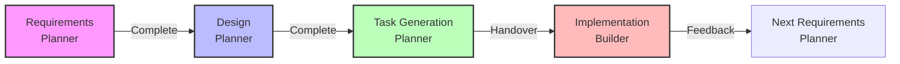

# 🚀 Getting Started - Project Setup Guide

This guide explains how to start a new project using claude-friends-templates.

## 📋 Quick Start (5 minutes to begin)

### 1. Initialize Your Project
```bash
# Create a new project directory
mkdir my-awesome-project
cd my-awesome-project

# Clone the template
git clone https://github.com/yourusername/claude-friends-templates.git .

# Initialize Git (remove template history)
rm -rf .git
git init
git add .
git commit -m "feat: initialize project with claude-friends-templates"
```

### 2. Configure Project-Specific Settings
```bash
# Set project name (update CLAUDE.md and README.md)
sed -i 's/\[Project Name\]/My Awesome Project/g' CLAUDE.md README.md

# Verify .gitignore
cat .gitignore  # Ensure .ccache/ is included
```

### 3. Start with the Planner Agent
```bash
# Launch Claude Code and execute:
/agent:planner
```

## 🎯 How to Progress Your First Project

### Step 1: Begin with Requirements Definition

Tell the Planner agent:

```
"I want to start a new project. I'd like to create [project overview]. Please start with requirements definition."
```

Planner will automatically:
1. Ask questions to organize requirements
2. Create `docs/requirements/index.md`
3. Guide you to the next step

### Step 2: Responding to "What should I do next?"

After completing each phase, when you ask the Planner "What should I do next?":

#### After Requirements Definition
```
"Requirements definition complete! 🎉
Next is the design phase.

We'll create:
1. Architecture design (system diagrams)
2. API design (endpoint definitions)
3. Data model design (ER diagrams, etc.)

I'll (Planner) continue with the design phase."
```

#### After Design
```
"Design complete! 🎨
Next is the task generation phase.

I'll create implementation tasks based on t-wada style TDD:
- Phase 1: MVP (minimum viable product)
- Phase 2: Feature expansion
- Phase 3: Advanced features

I'll (Planner) continue with task generation."
```

#### After Task Generation
```
"Task generation complete! 📋
Next is the implementation phase.

Now it's time for the Builder agent:
/agent:builder

Builder will follow the tasks I created,
implementing with strict TDD.
Handover details are in handover.md."
```

### Step 3: Implementation Phase

The Builder agent will:
1. Check Planner's handover.md
2. Start with Phase 1 tasks
3. Implement using strict TDD cycle

## 📁 Understanding Project Structure

```
my-awesome-project/
├── .claude/           # AI development support system
│   ├── agents/       # Agent management
│   ├── planner/      # Planner workspace
│   ├── builder/      # Builder workspace
│   └── shared/       # Shared resources
├── docs/             # Project documentation
│   ├── requirements/ # Requirements specification
│   ├── design/       # Design documents
│   ├── tasks/        # Task management
│   └── adr/          # Architecture Decision Records
├── src/              # Source code
├── tests/            # Test code
├── CLAUDE.md         # Project configuration
└── README.md         # Project description
```

## 🔄 Basic Development Cycle



## 💡 Frequently Asked Questions

### Q: Where should I start?
A: Start with `/agent:planner` for requirements definition.

### Q: What should I create in each phase?
A: 
- **Requirements**: Project purpose, features, non-functional requirements
- **Design**: Architecture, API, data models (with Mermaid diagrams)
- **Tasks**: Phase-divided TDD tasks
- **Implementation**: Code creation with Red-Green-Refactor cycle

### Q: When should I switch agents?
A: 
- **Planner → Builder**: After task generation
- **Builder → Planner**: After phase completion, when adding new features

### Q: Is TDD mandatory?
A: Yes. This template is designed with strict TDD in mind.

## 🎯 Tips for Success

1. **Start small**: Expand gradually from MVP
2. **Documentation first**: Write detailed designs
3. **Regular reviews**: Always review at phase completion
4. **Leverage agents**: Keep roles clearly separated

## 📚 Next Steps

- Refer to [project example](../examples/todo-app/README.md)
- Review [development rules](development-rules.md)
- Read the [TDD guide](../.claude/builder/tdd-cycle.md)

---
*If you have any questions about this guide, ask the Planner agent!*