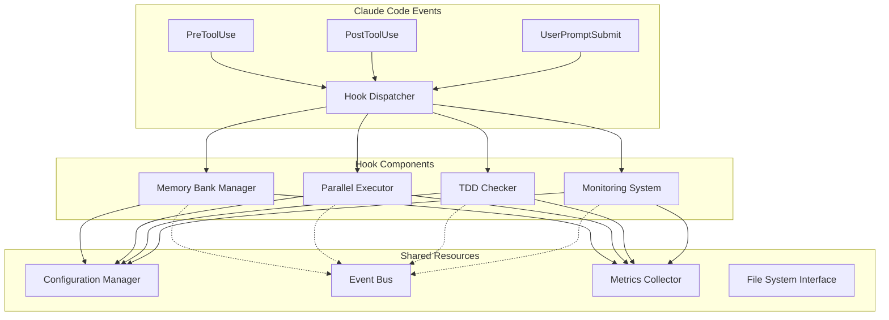

# Hook System Specification Document

🌐 **English** | **[日本語](HOOK_SPECIFICATION_ja.md)**

## Overview

This document defines the technical specifications for the Phase 2 Enhanced Hook System implemented in Sprint 2.1-2.4. The hook system provides modular, extensible automation capabilities for Memory Bank management, parallel execution, TDD enforcement, and monitoring.

## Table of Contents

- [Architecture Overview](#architecture-overview)
- [Hook Component Specifications](#hook-component-specifications)
- [Configuration Management](#configuration-management)
- [Integration Patterns](#integration-patterns)
- [API Specifications](#api-specifications)
- [Best Practices](#best-practices)
- [Testing Framework](#testing-framework)
- [Troubleshooting](#troubleshooting)

## Architecture Overview

### Design Principles

#### 1. Modular Architecture
- **Single Responsibility**: Each hook handles one specific concern
- **Loose Coupling**: Hooks operate independently with minimal interdependencies
- **High Cohesion**: Related functionality grouped within hook boundaries

#### 2. Configuration-Driven Operation
- **Centralized Configuration**: Single `settings-phase2.json` file
- **Environment-Specific Overrides**: Support for dev/staging/production variants
- **Runtime Configuration**: Dynamic parameter adjustment without restarts

#### 3. Event-Driven Design
- **Hook Triggers**: Respond to Claude Code tool events
- **Async Processing**: Non-blocking execution for performance
- **Error Isolation**: Failed hooks don't affect system operation

### System Architecture



### Component Overview

| Component | Purpose | Location | Dependencies |
|-----------|---------|----------|--------------|
| Memory Bank Manager | Automatic notes rotation and archiving | `.claude/hooks/memory/` | `lib/analysis.sh` |
| Parallel Executor | Task queue and worker management | `.claude/hooks/parallel/` | `semaphore`, `jq` |
| TDD Checker | Test-first enforcement and compliance | `.claude/hooks/tdd/` | `grep`, `find` |
| Monitoring System | Metrics collection and alerting | `.claude/hooks/monitoring/` | `bc`, `date` |

## Hook Component Specifications

### Memory Bank Manager

#### Purpose
Intelligent rotation of Memory Bank files based on content importance and file size thresholds.

#### Implementation Files
- **Main Script**: `.claude/hooks/memory/notes-rotator.sh`
- **Analysis Library**: `.claude/hooks/memory/lib/analysis.sh`
- **Configuration**: `settings-phase2.json` → `memory_bank` section

#### Core Functions

##### `rotate_notes_if_needed(file_path, context)`
```bash
# Parameters:
# - file_path: Path to notes file to check
# - context: Context identifier (planner/builder)
#
# Returns:
# - 0: Success (rotation performed or not needed)
# - 1: Error occurred
#
# Side Effects:
# - Creates archive file if rotation triggered
# - Updates index files
# - Generates importance summary
```

##### `analyze_content_importance(file_path)`
```bash
# Located in: lib/analysis.sh
# Parameters:
# - file_path: File to analyze
#
# Returns:
# - Integer importance score (1-10)
#
# Algorithm:
# - Keyword frequency analysis
# - Recent activity weighting
# - Content complexity evaluation
```

#### Configuration Schema

```json
{
  "memory_bank": {
    "max_lines_per_file": 1000,
    "importance_threshold": 7,
    "archive": {
      "enabled": true,
      "retention_days": 90,
      "compression": true,
      "archive_path": "./memo/archive/"
    },
    "categorization": {
      "auto_categorize": true,
      "categories": [
        "analysis", "design", "implementation",
        "testing", "documentation", "requirements", "architecture"
      ]
    }
  }
}
```

#### Event Triggers
- **UserPromptSubmit**: Check for agent switch commands (`/agent:planner`, `/agent:builder`)
- **PostToolUse**: Monitor file modifications for size tracking

### Parallel Executor

#### Purpose
Manage concurrent task execution with queue management and worker pools.

#### Implementation Files
- **Main Script**: `.claude/hooks/parallel/parallel-executor.sh`
- **Configuration**: `settings-phase2.json` → `parallel_execution` section

#### Core Functions

##### `enqueue_task(command, priority)`
```bash
# Parameters:
# - command: Shell command to execute
# - priority: Priority level (urgent/high/normal/low)
#
# Returns:
# - 0: Task queued successfully
# - 1: Queue full or error
#
# Side Effects:
# - Creates task file in queue directory
# - Updates queue statistics
```

##### `execute_parallel(max_workers)`
```bash
# Parameters:
# - max_workers: Maximum concurrent workers
#
# Returns:
# - 0: All tasks completed successfully
# - 1: Some tasks failed
#
# Algorithm:
# - Semaphore-based worker limiting
# - Priority-based task selection
# - Timeout management per task
```

#### Configuration Schema

```json
{
  "parallel_execution": {
    "max_workers": 4,
    "queue_management": {
      "max_queue_size": 100,
      "priority_levels": ["urgent", "high", "normal", "low"],
      "timeout_per_task_seconds": 300
    },
    "worker_pools": {
      "tdd_checks": {
        "max_workers": 2,
        "timeout_seconds": 120
      },
      "memory_operations": {
        "max_workers": 2,
        "timeout_seconds": 60
      }
    }
  }
}
```

#### Semaphore Management
- **Location**: `/tmp/sem_parallel_exec_*`
- **Cleanup**: Automatic on normal termination, manual cleanup on crash
- **Algorithm**: POSIX semaphore emulation using filesystem locks

### TDD Checker

#### Purpose
Enforce test-driven development practices with configurable strictness levels.

#### Implementation Files
- **Main Script**: `.claude/hooks/tdd/tdd-checker.sh`
- **Configuration**: `settings-phase2.json` → `tdd_checks` section

#### Core Functions

##### `perform_tdd_check(file_path)`
```bash
# Parameters:
# - file_path: Source file to validate
#
# Returns:
# - 0: TDD compliance verified
# - 1: No test found (warning)
# - 2: TDD violation (error)
#
# Checks:
# - Test file existence
# - Test coverage adequacy
# - Design document compliance
```

##### `check_design_compliance(source_file, design_file)`
```bash
# Parameters:
# - source_file: Implementation file
# - design_file: Design specification
#
# Returns:
# - 0: Implementation matches design
# - 1: Minor deviations detected
# - 2: Major compliance issues
```

#### Configuration Schema

```json
{
  "tdd_checks": {
    "enforcement_level": "strict",
    "design_compliance": {
      "check_enabled": true,
      "require_tests_first": true,
      "require_design_doc": true,
      "allowed_deviation_percentage": 10
    },
    "red_green_refactor": {
      "enforce_cycle": true,
      "require_failing_test": true,
      "require_passing_test": true,
      "refactor_threshold_lines": 50
    },
    "quality_gates": {
      "minimum_test_coverage": 80,
      "maximum_complexity": 10,
      "require_documentation": true
    }
  }
}
```

#### Enforcement Levels
- **strict**: Block execution on violations
- **recommended**: Issue warnings, log violations
- **off**: Disabled (bypass mode)

### Monitoring System

#### Purpose
Collect metrics, analyze performance, and trigger alerts based on configurable thresholds.

#### Implementation Files
- **Metrics Collector**: `.claude/hooks/monitoring/metrics-collector.sh`
- **Alert System**: `.claude/hooks/monitoring/alert-system.sh`
- **Configuration**: `settings-phase2.json` → `monitoring` section

#### Core Functions

##### `collect_metrics(hook_name, duration, status)`
```bash
# Parameters:
# - hook_name: Name of the hook generating metrics
# - duration: Execution time in seconds
# - status: success/warning/error
#
# Returns:
# - 0: Metrics recorded successfully
# - 1: Storage error
#
# Format: Prometheus-compatible metrics
```

##### `check_error_rate(hook_name, threshold)`
```bash
# Parameters:
# - hook_name: Hook to analyze
# - threshold: Error rate threshold (percentage)
#
# Returns:
# - 0: Error rate within threshold
# - 1: Threshold exceeded
```

#### Configuration Schema

```json
{
  "monitoring": {
    "real_time": {
      "enabled": true,
      "update_interval_seconds": 30
    },
    "thresholds": {
      "error_rate": {
        "warning": 0.05,
        "critical": 0.1
      },
      "response_time_ms": {
        "warning": 500,
        "critical": 1000
      },
      "memory_usage_mb": {
        "warning": 512,
        "critical": 1024
      }
    },
    "alerts": {
      "enabled": true,
      "channels": ["console", "file"],
      "rate_limiting": {
        "enabled": true,
        "max_alerts_per_minute": 10
      }
    }
  }
}
```

#### Metrics Format
```
# HELP hook_execution_duration_seconds Time spent executing hooks
# TYPE hook_execution_duration_seconds histogram
hook_execution_duration_seconds{hook="memory_bank",status="success"} 0.234

# HELP hook_execution_total Total number of hook executions
# TYPE hook_execution_total counter
hook_execution_total{hook="memory_bank",status="success"} 15
```

## Configuration Management

### Configuration Hierarchy

1. **Default Configuration**: Built-in defaults in each component
2. **Global Configuration**: `settings-phase2.json` at project root
3. **Environment Overrides**: Environment-specific files
4. **Runtime Parameters**: Command-line arguments and environment variables

### Configuration Loading Algorithm

```bash
load_configuration() {
    local config_file="${CLAUDE_PROJECT_DIR}/.claude/settings-phase2.json"
    local component="$1"

    # Load defaults
    source "${HOOKS_BASE_DIR}/config/defaults.conf"

    # Load global configuration
    if [[ -f "$config_file" ]]; then
        local config=$(jq -r ".phase2.${component}" "$config_file" 2>/dev/null)
        if [[ "$config" != "null" ]]; then
            merge_config "$config"
        fi
    fi

    # Apply environment overrides
    apply_env_overrides "$component"
}
```

### Configuration Validation

Each component validates its configuration on startup:

```bash
validate_config() {
    local component="$1"
    local errors=0

    # Required fields check
    check_required_fields "$component" || ((errors++))

    # Type validation
    validate_types "$component" || ((errors++))

    # Range validation
    validate_ranges "$component" || ((errors++))

    # Cross-dependency validation
    validate_dependencies "$component" || ((errors++))

    return $errors
}
```

## Integration Patterns

### Event Bus Pattern

Components communicate through a lightweight event bus:

```bash
# Publishing events
publish_event() {
    local event_type="$1"
    local event_data="$2"
    local timestamp=$(date -Iseconds)

    echo "{\"type\":\"$event_type\",\"data\":$event_data,\"timestamp\":\"$timestamp\"}" \
        >> "${CLAUDE_PROJECT_DIR}/.claude/events.jsonl"
}

# Subscribing to events
subscribe_to_events() {
    local subscriber="$1"
    local filter="$2"

    tail -f "${CLAUDE_PROJECT_DIR}/.claude/events.jsonl" | \
    while IFS= read -r line; do
        if echo "$line" | jq -e "$filter" >/dev/null 2>&1; then
            handle_event "$subscriber" "$line"
        fi
    done &
}
```

### Resource Sharing Pattern

Shared resources like locks and caches:

```bash
# Acquiring shared locks
acquire_lock() {
    local resource="$1"
    local timeout="${2:-30}"
    local lockfile="/tmp/claude_lock_${resource}"

    local count=0
    while ! (set -C; echo $$ > "$lockfile") 2>/dev/null; do
        if [[ $count -ge $timeout ]]; then
            return 1
        fi
        sleep 1
        ((count++))
    done

    trap "rm -f '$lockfile'" EXIT
    return 0
}
```

### Error Propagation Pattern

Standardized error handling across components:

```bash
handle_error() {
    local component="$1"
    local error_code="$2"
    local error_message="$3"
    local context="$4"

    # Log error with structured format
    log_error "$component" "$error_code" "$error_message" "$context"

    # Publish error event
    publish_event "error" "{\"component\":\"$component\",\"code\":$error_code,\"message\":\"$error_message\"}"

    # Trigger alerts if configured
    if should_alert "$error_code"; then
        trigger_alert "$component" "$error_message"
    fi

    return "$error_code"
}
```

## API Specifications

### Hook Interface Standard

All hooks must implement the following interface:

```bash
#!/bin/bash
# Hook Standard Interface v2.5

# Required functions
hook_init() {
    # Initialize hook, load configuration, validate environment
    return 0  # Success
}

hook_execute() {
    local event="$1"
    local context="$2"
    # Main hook logic
    return 0  # Success
}

hook_cleanup() {
    # Cleanup resources, save state, release locks
    return 0  # Success
}

hook_health_check() {
    # Return health status
    echo "healthy"  # healthy/degraded/unhealthy
    return 0
}

# Optional functions
hook_get_metrics() {
    # Return Prometheus-format metrics
    cat "$METRICS_FILE"
}

hook_get_config() {
    # Return current configuration as JSON
    jq '.' "$CONFIG_FILE"
}
```

### Event Context Format

Events passed to hooks follow this structure:

```json
{
  "event_type": "PostToolUse",
  "tool_name": "Edit",
  "timestamp": "2025-09-17T10:30:00Z",
  "context": {
    "file_paths": ["/path/to/file.py"],
    "working_directory": "/project/root",
    "user": "developer",
    "session_id": "uuid-session-id"
  },
  "metadata": {
    "file_sizes": [1024],
    "line_counts": [50],
    "extensions": ["py"]
  }
}
```

### Configuration API

Components can query and update configuration:

```bash
# Get configuration value
get_config_value() {
    local path="$1"
    local default="$2"

    jq -r "$path // \"$default\"" "$CONFIG_FILE"
}

# Set configuration value
set_config_value() {
    local path="$1"
    local value="$2"

    jq "$path = $value" "$CONFIG_FILE" > "${CONFIG_FILE}.tmp" && \
    mv "${CONFIG_FILE}.tmp" "$CONFIG_FILE"
}

# Reload configuration
reload_config() {
    local component="$1"

    validate_config "$component" && \
    load_configuration "$component" && \
    publish_event "config_reloaded" "{\"component\":\"$component\"}"
}
```

## Best Practices

### Performance Optimization

#### 1. Efficient File Operations
```bash
# Good: Use single read operations
content=$(cat "$file")
process_content "$content"

# Avoid: Multiple file reads
while IFS= read -r line; do
    process_line "$line"
done < "$file"
```

#### 2. Lazy Loading
```bash
# Load configuration only when needed
load_heavy_config() {
    if [[ -z "$HEAVY_CONFIG_LOADED" ]]; then
        source "$HEAVY_CONFIG_FILE"
        HEAVY_CONFIG_LOADED=1
    fi
}
```

#### 3. Caching Strategies
```bash
# Cache expensive operations
get_cached_result() {
    local cache_key="$1"
    local cache_file="/tmp/cache_${cache_key}"
    local cache_ttl=300  # 5 minutes

    if [[ -f "$cache_file" && $(($(date +%s) - $(stat -f %m "$cache_file"))) -lt $cache_ttl ]]; then
        cat "$cache_file"
        return 0
    fi

    # Expensive operation
    local result=$(expensive_operation)
    echo "$result" > "$cache_file"
    echo "$result"
}
```

### Error Handling

#### 1. Defensive Programming
```bash
safe_operation() {
    local file="$1"

    # Validate inputs
    [[ -n "$file" ]] || return 1
    [[ -f "$file" ]] || return 2
    [[ -r "$file" ]] || return 3

    # Perform operation with error checking
    if ! result=$(process_file "$file" 2>&1); then
        log_error "safe_operation" "3" "Failed to process file: $result" "$file"
        return 3
    fi

    echo "$result"
}
```

#### 2. Graceful Degradation
```bash
primary_operation() {
    if ! primary_service_available; then
        log_warning "primary_operation" "Service unavailable, falling back to secondary"
        secondary_operation "$@"
        return $?
    fi

    perform_primary_operation "$@"
}
```

### Testing Patterns

#### 1. Mock External Dependencies
```bash
# In tests
mock_external_service() {
    EXTERNAL_SERVICE_URL="http://localhost:$MOCK_PORT"
    export EXTERNAL_SERVICE_URL
}

# In production code
call_external_service() {
    local url="${EXTERNAL_SERVICE_URL:-https://api.example.com}"
    curl -s "$url/endpoint"
}
```

#### 2. Test Configuration Isolation
```bash
setup_test_config() {
    export CLAUDE_PROJECT_DIR="/tmp/test_project_$$"
    mkdir -p "$CLAUDE_PROJECT_DIR/.claude"

    cat > "$CLAUDE_PROJECT_DIR/.claude/settings-phase2.json" << 'EOF'
{
  "phase2": {
    "memory_bank": {
      "max_lines_per_file": 100
    }
  }
}
EOF
}
```

## Testing Framework

### Test Structure

Tests are organized using the BATS (Bash Automated Testing System) framework:

```
.claude/tests/
├── unit/               # Unit tests for individual functions
│   ├── memory/
│   ├── parallel/
│   ├── tdd/
│   └── monitoring/
├── integration/        # Integration tests between components
├── e2e/               # End-to-end scenario tests
└── fixtures/          # Test data and mock files
```

### Test Execution

```bash
# Run all tests
bats .claude/tests/

# Run specific test suite
bats .claude/tests/unit/memory/

# Run with verbose output
bats -v .claude/tests/

# Generate coverage report
bats --coverage .claude/tests/
```

### Test Examples

#### Unit Test Example
```bash
#!/usr/bin/env bats

load '../test_helper'

setup() {
    setup_test_environment
    source "$HOOKS_BASE_DIR/memory/lib/analysis.sh"
}

teardown() {
    cleanup_test_environment
}

@test "analyze_content_importance should return score between 1-10" {
    echo "Important content with keywords" > "$TEST_FILE"

    run analyze_content_importance "$TEST_FILE"

    [ "$status" -eq 0 ]
    [ "$output" -ge 1 ]
    [ "$output" -le 10 ]
}
```

#### Integration Test Example
```bash
@test "Memory Bank rotation triggers parallel cleanup" {
    # Setup large notes file
    create_large_notes_file 600  # Lines exceeding threshold

    # Mock parallel executor
    function enqueue_task() {
        echo "$1" >> "$PARALLEL_QUEUE"
    }
    export -f enqueue_task

    run rotate_notes_if_needed "$NOTES_FILE" "planner"

    [ "$status" -eq 0 ]
    [ -f "$PARALLEL_QUEUE" ]
    grep -q "cleanup_old_archives" "$PARALLEL_QUEUE"
}
```

## Troubleshooting

### Common Issues

#### 1. Configuration Loading Failures

**Symptoms**: Hooks use default values instead of configured values

**Diagnosis**:
```bash
# Check configuration file syntax
jq '.' .claude/settings-phase2.json

# Verify configuration loading
DEBUG=1 bash .claude/hooks/memory/notes-rotator.sh
```

**Solutions**:
- Validate JSON syntax with `jq`
- Check file permissions (`644` minimum)
- Verify configuration path in environment variables

#### 2. Semaphore Lock Conflicts

**Symptoms**: Parallel executor hangs or reports "Resource busy"

**Diagnosis**:
```bash
# Check for stale semaphore files
ls -la /tmp/sem_parallel_exec_*

# Check for competing processes
ps aux | grep parallel-executor
```

**Solutions**:
```bash
# Clean up stale locks
rm -f /tmp/sem_parallel_exec_*

# Kill competing processes
pkill -f parallel-executor
```

#### 3. Memory Bank Rotation Issues

**Symptoms**: Files grow beyond limits without rotation

**Diagnosis**:
```bash
# Check file permissions
ls -la .claude/planner/notes.md

# Test rotation function directly
bash -x .claude/hooks/memory/notes-rotator.sh .claude/planner/notes.md planner
```

**Solutions**:
- Ensure write permissions to `.claude/archive/`
- Check disk space availability
- Verify `importance_threshold` configuration

#### 4. TDD Checker False Positives

**Symptoms**: Valid test files not detected

**Diagnosis**:
```bash
# Check test file patterns
TDD_DEBUG=1 bash .claude/hooks/tdd/tdd-checker.sh src/example.js

# Verify search patterns
find . -name "*test*" -type f
```

**Solutions**:
- Update test file patterns in configuration
- Check file naming conventions
- Adjust enforcement level to `recommended`

### Debug Mode Activation

Enable debug output for troubleshooting:

```bash
# Global debug mode
export PHASE2_DEBUG=1

# Component-specific debug
export MEMORY_BANK_DEBUG=1
export PARALLEL_DEBUG=1
export TDD_DEBUG=1
export MONITORING_DEBUG=1

# Enable verbose logging
export HOOKS_VERBOSE=1
```

### Log Analysis

Analyze hook execution logs:

```bash
# View recent hook activity
tail -f .claude/logs/hooks.log

# Analyze error patterns
grep "ERROR" .claude/logs/hooks.log | tail -20

# Check performance metrics
grep "hook_execution_duration" .claude/logs/metrics.txt | \
  awk '{sum+=$2; count++} END {print "Average:", sum/count, "ms"}'
```

### Health Checks

Verify system health:

```bash
# Check all components
.claude/scripts/health-check.sh

# Individual component health
bash .claude/hooks/memory/notes-rotator.sh --health-check
bash .claude/hooks/parallel/parallel-executor.sh --health-check
bash .claude/hooks/tdd/tdd-checker.sh --health-check
bash .claude/hooks/monitoring/metrics-collector.sh --health-check
```

## Migration and Upgrade

### Version Compatibility

| Version | Memory Bank | Parallel | TDD | Monitoring | Breaking Changes |
|---------|-------------|----------|-----|------------|------------------|
| 2.1.0   | ✓          | -        | -   | -          | Initial release |
| 2.2.0   | ✓          | ✓        | -   | -          | None |
| 2.3.0   | ✓          | ✓        | ✓   | -          | TDD config format |
| 2.4.0   | ✓          | ✓        | ✓   | ✓          | None |
| 2.5.0   | ✓          | ✓        | ✓   | ✓          | Configuration schema |

### Upgrade Procedures

#### From 2.4.x to 2.5.x
```bash
# 1. Backup current configuration
cp .claude/settings-phase2.json .claude/settings-phase2.json.backup

# 2. Update configuration schema
jq '.phase2.monitoring.alerts.channels = ["console", "file"]' \
   .claude/settings-phase2.json > .claude/settings-phase2.json.new

# 3. Validate new configuration
jq '.' .claude/settings-phase2.json.new

# 4. Apply changes
mv .claude/settings-phase2.json.new .claude/settings-phase2.json

# 5. Test hooks
.claude/scripts/test-hooks.sh
```

### Rollback Procedures

If issues occur after upgrade:

```bash
# 1. Stop all hook processes
pkill -f "claude/hooks"

# 2. Restore backup configuration
cp .claude/settings-phase2.json.backup .claude/settings-phase2.json

# 3. Clean up any new files
rm -rf .claude/logs/phase2-*

# 4. Restart with previous version
.claude/scripts/restart-hooks.sh
```

## Performance Benchmarks

### Baseline Performance Metrics

| Operation | Target Time | Memory Usage | Notes |
|-----------|-------------|--------------|-------|
| Memory Bank rotation | < 2 seconds | < 50MB | For 1000-line files |
| Parallel task queue | < 500ms | < 20MB | Per task addition |
| TDD compliance check | < 1 second | < 10MB | Per source file |
| Metrics collection | < 100ms | < 5MB | Per data point |

### Performance Testing

```bash
# Benchmark memory operations
time bash .claude/hooks/memory/notes-rotator.sh large_file.md planner

# Benchmark parallel execution
time bash .claude/hooks/parallel/parallel-executor.sh 4

# Memory usage monitoring
valgrind --tool=massif bash .claude/hooks/tdd/tdd-checker.sh src/file.js
```

## Contributing Guidelines

### Code Standards

1. **Shell Script Standards**
   - Use `#!/bin/bash` shebang
   - Enable strict mode: `set -euo pipefail`
   - Follow Google Shell Style Guide
   - Include function documentation

2. **Configuration Management**
   - All configuration via JSON files
   - Provide sensible defaults
   - Document all configuration options

3. **Error Handling**
   - Return appropriate exit codes
   - Log errors with context
   - Implement graceful degradation

4. **Testing Requirements**
   - Unit tests for all functions
   - Integration tests for workflows
   - Performance tests for critical paths

### Submission Process

1. Fork the repository
2. Create feature branch: `feature/hook-enhancement`
3. Implement changes with tests
4. Run full test suite: `.claude/scripts/test-all.sh`
5. Submit pull request with documentation updates

---

## References

- [Claude Code Hook System](https://docs.anthropic.com/claude-code)
- [BATS Testing Framework](https://github.com/bats-core/bats-core)
- [JSON Schema Validation](https://json-schema.org/)
- [Prometheus Metrics Format](https://prometheus.io/docs/instrumenting/exposition_formats/)

---

*Last Updated: 2025-09-17*
*Version: 2.5.3*
*Specification Revision: 1.0*