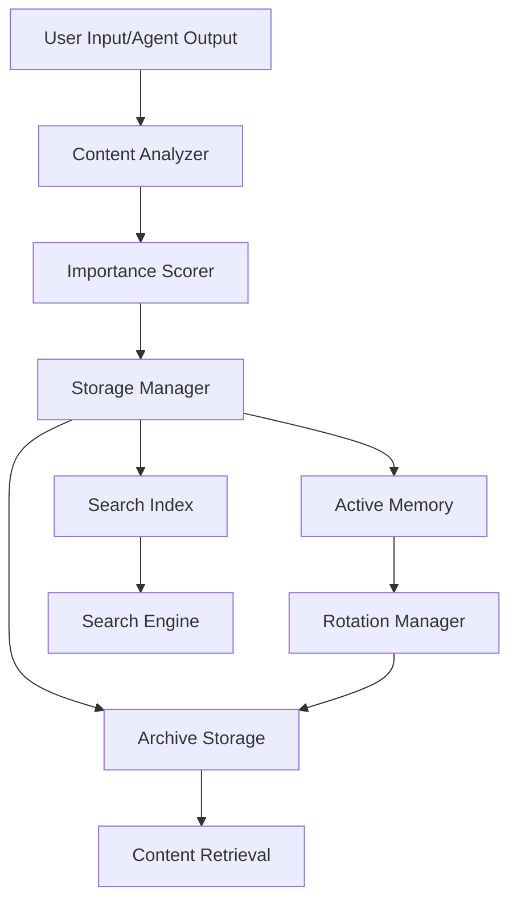

# Memory Bank仕様文書

**バージョン**: 1.0.0  
**作成日**: 2025年9月17日  
**対象**: claude-friends-templates Memory Bank System  
**準拠標準**: 2025年Intelligent Memory Management Standards

## 概要

この文書は、claude-friends-templatesプロジェクトのMemory Bankシステムにおける重要度スコアリング、ローテーション、インデックス管理の詳細仕様を定義します。

## Memory Bankアーキテクチャ

### システム構成



### ディレクトリ構造

```
.claude/memory/
├── active/                    # アクティブメモリファイル
│   ├── planning/               # 計画関連メモリ
│   ├── implementation/         # 実装関連メモリ
│   ├── sync/                   # 同期関連メモリ
│   └── shared/                 # 共有メモリ
├── archive/                   # アーカイブストレージ
│   ├── by_date/                # 日付別アーカイブ
│   ├── by_importance/          # 重要度別アーカイブ
│   └── by_topic/               # トピック別アーカイブ
├── indexes/                   # 検索インデックス
│   ├── content_index.json      # コンテンツインデックス
│   ├── keyword_index.json      # キーワードインデックス
│   ├── importance_index.json   # 重要度インデックス
│   └── temporal_index.json     # 時系列インデックス
├── metadata/                  # メタデータ管理
│   ├── file_metadata.json      # ファイルメタデータ
│   ├── rotation_history.json   # ローテーション履歴
│   └── analytics.json          # 分析結果
└── config/                    # 設定ファイル
    ├── rotation_config.json    # ローテーション設定
    ├── scoring_config.json     # スコアリング設定
    └── index_config.json       # インデックス設定
```

## 重要度スコアリング仕様

### スコアリングアルゴリズム

**ファイル**: `.claude/hooks/memory/lib/analysis.sh`

#### 基本スコア計算式

```
総合スコア = (
    コンテンツスコア * 0.4 +
    時間スコア * 0.2 +
    アクセススコア * 0.2 +
    関連性スコア * 0.15 +
    ユーザースコア * 0.05
) * 全体調整係数
```

#### スコアリング設定

**ファイル**: `.claude/memory/config/scoring_config.json`

```json
{
  "scoring_algorithm": {
    "version": "2.0",
    "weights": {
      "content_quality": 0.4,
      "temporal_relevance": 0.2,
      "access_frequency": 0.2,
      "relationship_density": 0.15,
      "user_rating": 0.05
    },
    "normalization": {
      "enabled": true,
      "method": "min_max",
      "range": [0.0, 10.0]
    }
  },
  "content_analysis": {
    "text_quality_metrics": {
      "length_score": {
        "min_chars": 50,
        "optimal_chars": 1000,
        "max_chars": 10000,
        "weight": 0.3
      },
      "structure_score": {
        "has_headers": 2.0,
        "has_lists": 1.5,
        "has_code_blocks": 2.5,
        "has_links": 1.2,
        "weight": 0.3
      },
      "keyword_density": {
        "important_keywords": ["TODO", "FIXME", "NOTE", "WARNING", "ERROR"],
        "boost_factor": 1.5,
        "weight": 0.2
      },
      "uniqueness_score": {
        "duplicate_penalty": 0.5,
        "similarity_threshold": 0.8,
        "weight": 0.2
      }
    },
    "semantic_analysis": {
      "enabled": true,
      "topic_modeling": {
        "enabled": false,
        "min_topics": 3,
        "max_topics": 10
      },
      "sentiment_analysis": {
        "enabled": false,
        "positive_boost": 1.1,
        "negative_penalty": 0.9
      }
    }
  },
  "temporal_analysis": {
    "recency_scoring": {
      "decay_function": "exponential",
      "half_life_days": 7,
      "min_score": 0.1
    },
    "modification_tracking": {
      "recent_edit_boost": 1.3,
      "edit_frequency_weight": 0.2
    },
    "seasonal_patterns": {
      "enabled": false,
      "weekly_pattern": true,
      "monthly_pattern": false
    }
  },
  "access_patterns": {
    "frequency_scoring": {
      "window_days": 30,
      "log_scaling": true,
      "access_weight": 1.0
    },
    "user_behavior": {
      "view_duration_weight": 0.3,
      "edit_action_weight": 0.7,
      "share_action_weight": 0.5
    }
  },
  "relationship_analysis": {
    "link_analysis": {
      "internal_links_weight": 0.6,
      "external_links_weight": 0.4,
      "bidirectional_boost": 1.2
    },
    "dependency_tracking": {
      "file_dependencies": true,
      "content_references": true,
      "tag_relationships": true
    }
  },
  "thresholds": {
    "high_importance": 8.0,
    "medium_importance": 5.0,
    "low_importance": 2.0,
    "archive_threshold": 1.0
  }
}
```

### スコア計算アルゴリズム

#### 1. コンテンツ品質スコア

```bash
# テキスト長スコア計算
calculate_length_score() {
    local char_count="$1"
    local min_chars=50
    local optimal_chars=1000
    local max_chars=10000
    
    if [[ $char_count -lt $min_chars ]]; then
        echo "scale=2; $char_count / $min_chars * 0.5" | bc
    elif [[ $char_count -le $optimal_chars ]]; then
        echo "scale=2; 0.5 + ($char_count - $min_chars) / ($optimal_chars - $min_chars) * 0.5" | bc
    elif [[ $char_count -le $max_chars ]]; then
        echo "scale=2; 1.0 - ($char_count - $optimal_chars) / ($max_chars - $optimal_chars) * 0.3" | bc
    else
        echo "0.7"
    fi
}

# 構造スコア計算
calculate_structure_score() {
    local file_path="$1"
    local score=0
    
    # ヘッダーの存在を確認
    if grep -q "^#" "$file_path"; then
        score=$(echo "$score + 2.0" | bc)
    fi
    
    # リストの存在を確認
    if grep -q "^[*-]" "$file_path"; then
        score=$(echo "$score + 1.5" | bc)
    fi
    
    # コードブロックの存在を確認
    if grep -q "\`\`\`" "$file_path"; then
        score=$(echo "$score + 2.5" | bc)
    fi
    
    # リンクの存在を確認
    if grep -q "\[.*\](.*)"> "$file_path"; then
        score=$(echo "$score + 1.2" | bc)
    fi
    
    # 最大値で正規化
    echo "scale=2; if ($score > 10) 10 else $score" | bc
}
```

#### 2. 時間関連スコア

```bash
# 時間減衰スコア
calculate_temporal_score() {
    local file_path="$1"
    local current_time=$(date +%s)
    local file_mtime=$(stat -c %Y "$file_path" 2>/dev/null || echo 0)
    local age_days=$(echo "($current_time - $file_mtime) / 86400" | bc)
    local half_life=7
    
    # 指数減衰関数
    echo "scale=4; e(-0.693147 * $age_days / $half_life)" | bc -l
}

# 編集頻度スコア
calculate_edit_frequency_score() {
    local file_path="$1"
    local metadata_file=".claude/memory/metadata/file_metadata.json"
    
    if [[ -f "$metadata_file" ]]; then
        local edit_count
        edit_count=$(jq -r ".files[\"$file_path\"].edit_count // 0" "$metadata_file")
        echo "scale=2; l($edit_count + 1) / l(10)" | bc -l
    else
        echo "0.5"
    fi
}
```

#### 3. アクセスパターンスコア

```bash
# アクセス頻度スコア
calculate_access_score() {
    local file_path="$1"
    local metadata_file=".claude/memory/metadata/file_metadata.json"
    local window_days=30
    
    if [[ -f "$metadata_file" ]]; then
        local access_count
        access_count=$(jq -r ".files[\"$file_path\"].access_count_30d // 0" "$metadata_file")
        
        # 対数スケーリング
        if [[ $access_count -eq 0 ]]; then
            echo "0.1"
        else
            echo "scale=2; l($access_count) / l(10)" | bc -l
        fi
    else
        echo "0.5"
    fi
}
```

#### 4. 関連性スコア

```bash
# リンク関連スコア
calculate_relationship_score() {
    local file_path="$1"
    local internal_links=0
    local external_links=0
    local backlinks=0
    
    # 内部リンクをカウント
    internal_links=$(grep -o "\[.*\]([^http].*)"> "$file_path" | wc -l)
    
    # 外部リンクをカウント
    external_links=$(grep -o "\[.*\](http.*)"> "$file_path" | wc -l)
    
    # 被リンク数を計算（簡易版）
    local file_name
    file_name=$(basename "$file_path")
    backlinks=$(find .claude/memory -name "*.md" -exec grep -l "$file_name" {} \; | wc -l)
    
    # スコア計算
    local score
    score=$(echo "scale=2; ($internal_links * 0.6 + $external_links * 0.4 + $backlinks * 1.2) / 10" | bc)
    
    # 最大値制限
    echo "scale=2; if ($score > 10) 10 else $score" | bc
}
```

## ローテーション仕様

### ローテーション設定

**ファイル**: `.claude/memory/config/rotation_config.json`

```json
{
  "rotation_policy": {
    "enabled": true,
    "triggers": {
      "size_based": {
        "enabled": true,
        "max_file_size_mb": 10,
        "max_directory_size_mb": 100,
        "check_interval_hours": 6
      },
      "time_based": {
        "enabled": true,
        "max_age_days": 30,
        "cleanup_interval_hours": 24
      },
      "importance_based": {
        "enabled": true,
        "min_importance_threshold": 2.0,
        "evaluation_interval_hours": 12
      },
      "manual_trigger": {
        "enabled": true,
        "command": ".claude/scripts/rotate-notes.sh"
      }
    }
  },
  "rotation_strategy": {
    "preservation_rules": {
      "high_importance_files": {
        "threshold": 8.0,
        "preserve_indefinitely": true,
        "max_preserve_count": 100
      },
      "recent_files": {
        "preserve_days": 7,
        "ignore_importance": false
      },
      "user_bookmarked": {
        "preserve_always": true,
        "bookmark_file": ".claude/memory/bookmarks.json"
      }
    },
    "archival_rules": {
      "medium_importance": {
        "threshold_min": 2.0,
        "threshold_max": 7.9,
        "archive_after_days": 30,
        "compress": true
      },
      "low_importance": {
        "threshold_max": 1.9,
        "archive_after_days": 7,
        "compress": true,
        "delete_after_archive_days": 90
      }
    }
  },
  "backup_policy": {
    "backup_before_rotation": true,
    "backup_directory": ".claude/memory/backups",
    "backup_retention_days": 30,
    "backup_compression": true
  },
  "notification_settings": {
    "log_rotations": true,
    "alert_on_large_rotations": {
      "enabled": true,
      "threshold_files": 10,
      "threshold_size_mb": 50
    }
  }
}
```

### ローテーションアルゴリズム

**ファイル**: `.claude/hooks/memory/lib/rotation.sh`

```bash
#!/bin/bash
# Memory Bank Rotation Algorithm

perform_memory_rotation() {
    local rotation_type="$1"  # size_based|time_based|importance_based|manual
    local dry_run="${2:-false}"
    
    log_info "Starting memory rotation: $rotation_type"
    
    # ファイルリストを取得
    local files_to_analyze
    files_to_analyze=$(find .claude/memory/active -name "*.md" -type f)
    
    local rotation_candidates=()
    local preservation_list=()
    local archive_list=()
    
    # 各ファイルを分析
    while IFS= read -r file_path; do
        if [[ -z "$file_path" ]]; then
            continue
        fi
        
        local importance_score
        importance_score=$(calculate_importance_score "$file_path")
        
        local file_age_days
        file_age_days=$(get_file_age_days "$file_path")
        
        local file_size_mb
        file_size_mb=$(get_file_size_mb "$file_path")
        
        # ローテーション判定
        if should_preserve_file "$file_path" "$importance_score" "$file_age_days"; then
            preservation_list+=("$file_path")
        elif should_archive_file "$file_path" "$importance_score" "$file_age_days" "$file_size_mb"; then
            archive_list+=("$file_path")
            rotation_candidates+=("$file_path")
        fi
        
    done <<< "$files_to_analyze"
    
    # ローテーション実行
    if [[ "$dry_run" != "true" ]]; then
        execute_rotation "${rotation_candidates[@]}"
    fi
    
    # 結果レポート
    generate_rotation_report "$rotation_type" "${preservation_list[@]}" "${archive_list[@]}"
}

# ファイル保存判定
should_preserve_file() {
    local file_path="$1"
    local importance_score="$2"
    local file_age_days="$3"
    
    # 高重要度ファイル
    if (( $(echo "$importance_score >= 8.0" | bc -l) )); then
        return 0
    fi
    
    # 最近のファイル
    if [[ $file_age_days -le 7 ]]; then
        return 0
    fi
    
    # ブックマークされたファイル
    if is_bookmarked_file "$file_path"; then
        return 0
    fi
    
    return 1
}

# ファイルアーカイブ判定
should_archive_file() {
    local file_path="$1"
    local importance_score="$2"
    local file_age_days="$3"
    local file_size_mb="$4"
    
    # サイズベーストリガー
    if (( $(echo "$file_size_mb > 10" | bc -l) )); then
        return 0
    fi
    
    # 重要度ベーストリガー
    if (( $(echo "$importance_score < 2.0" | bc -l) )) && [[ $file_age_days -gt 7 ]]; then
        return 0
    fi
    
    # 時間ベーストリガー
    if [[ $file_age_days -gt 30 ]] && (( $(echo "$importance_score < 5.0" | bc -l) )); then
        return 0
    fi
    
    return 1
}
```

## インデックス管理仕様

### インデックス構造

#### コンテンツインデックス

**ファイル**: `.claude/memory/indexes/content_index.json`

```json
{
  "@schema": "https://claude-friends.dev/schemas/content-index/v1.0.0",
  "version": "1.0.0",
  "last_updated": "2025-09-17T12:34:56.789Z",
  "index_statistics": {
    "total_files": 156,
    "total_size_mb": 45.2,
    "last_rotation": "2025-09-16T02:00:00.000Z",
    "index_size_mb": 2.1
  },
  "files": {
    "planning/project_overview.md": {
      "file_id": "file_001",
      "path": ".claude/memory/active/planning/project_overview.md",
      "size_bytes": 15420,
      "created_at": "2025-09-15T10:30:00.000Z",
      "modified_at": "2025-09-17T11:45:00.000Z",
      "importance_score": 8.7,
      "content_hash": "sha256:abc123...",
      "keywords": ["project", "overview", "architecture", "goals"],
      "topics": ["planning", "architecture", "project_management"],
      "links": {
        "internal": [
          "implementation/core_system.md",
          "shared/glossary.md"
        ],
        "external": [
          "https://github.com/example/repo"
        ]
      },
      "metadata": {
        "agent_created": "planner",
        "session_id": "session_12345",
        "tags": ["important", "reference"],
        "language": "ja",
        "word_count": 2340
      }
    }
  }
}
```

#### キーワードインデックス

**ファイル**: `.claude/memory/indexes/keyword_index.json`

```json
{
  "@schema": "https://claude-friends.dev/schemas/keyword-index/v1.0.0",
  "version": "1.0.0",
  "last_updated": "2025-09-17T12:34:56.789Z",
  "keywords": {
    "architecture": {
      "frequency": 45,
      "importance_weight": 1.5,
      "files": [
        {
          "file_id": "file_001",
          "path": "planning/project_overview.md",
          "score": 8.7,
          "occurrences": 8,
          "context_snippets": [
            "system architecture overview",
            "microservices architecture pattern"
          ]
        }
      ]
    },
    "performance": {
      "frequency": 23,
      "importance_weight": 1.3,
      "files": [
        {
          "file_id": "file_015",
          "path": "implementation/optimization.md",
          "score": 6.4,
          "occurrences": 12,
          "context_snippets": [
            "performance optimization strategies",
            "benchmark performance results"
          ]
        }
      ]
    }
  },
  "stop_words": ["the", "a", "an", "and", "or", "but", "in", "on", "at", "to"],
  "keyword_extraction": {
    "min_frequency": 2,
    "max_keywords_per_file": 20,
    "weight_boost_keywords": ["TODO", "FIXME", "NOTE", "WARNING", "ERROR"]
  }
}
```

#### 重要度インデックス

**ファイル**: `.claude/memory/indexes/importance_index.json`

```json
{
  "@schema": "https://claude-friends.dev/schemas/importance-index/v1.0.0",
  "version": "1.0.0",
  "last_updated": "2025-09-17T12:34:56.789Z",
  "importance_buckets": {
    "critical": {
      "range": [9.0, 10.0],
      "count": 5,
      "files": [
        {
          "file_id": "file_001",
          "path": "planning/project_overview.md",
          "score": 9.2,
          "reasons": ["high_access_frequency", "many_internal_links", "recent_updates"]
        }
      ]
    },
    "high": {
      "range": [7.0, 8.9],
      "count": 12,
      "files": []
    },
    "medium": {
      "range": [4.0, 6.9],
      "count": 34,
      "files": []
    },
    "low": {
      "range": [1.0, 3.9],
      "count": 78,
      "files": []
    },
    "minimal": {
      "range": [0.0, 0.9],
      "count": 27,
      "files": []
    }
  },
  "trends": {
    "score_distribution": {
      "mean": 4.2,
      "median": 3.8,
      "std_dev": 2.1
    },
    "temporal_trends": {
      "rising_importance": 15,
      "declining_importance": 8,
      "stable_importance": 133
    }
  }
}
```

### インデックス更新アルゴリズム

**ファイル**: `.claude/scripts/update-index.sh`

```bash
#!/bin/bash
# Memory Bank Index Update Algorithm

update_memory_indexes() {
    local update_type="$1"  # full|incremental|selective
    local target_files="$2" # specific files for selective update
    
    log_info "Starting index update: $update_type"
    
    case "$update_type" in
        "full")
            update_full_indexes
            ;;
        "incremental")
            update_incremental_indexes
            ;;
        "selective")
            update_selective_indexes "$target_files"
            ;;
        *)
            log_error "Unknown update type: $update_type"
            return 1
            ;;
    esac
    
    # インデックス整合性チェック
    validate_index_consistency
    
    # インデックス最適化
    optimize_indexes
    
    log_info "Index update completed: $update_type"
}

# フルインデックス更新
update_full_indexes() {
    local temp_dir=".claude/temp/index_update_$(date +%s)"
    mkdir -p "$temp_dir"
    
    # 既存インデックスをバックアップ
    backup_existing_indexes "$temp_dir"
    
    # 全ファイルをスキャン
    local all_files
    all_files=$(find .claude/memory/active -name "*.md" -type f)
    
    # コンテンツインデックスを構築
    build_content_index "$all_files"
    
    # キーワードインデックスを構築
    build_keyword_index "$all_files"
    
    # 重要度インデックスを構築
    build_importance_index "$all_files"
    
    # 時系列インデックスを構築
    build_temporal_index "$all_files"
    
    # 一時ディレクトリをクリーンアップ
    rm -rf "$temp_dir"
}

# コンテンツインデックス構築
build_content_index() {
    local files="$1"
    local index_file=".claude/memory/indexes/content_index.json"
    
    # インデックスヘッダーを初期化
    jq -n '{
        "@schema": "https://claude-friends.dev/schemas/content-index/v1.0.0",
        "version": "1.0.0",
        "last_updated": now | strftime("%Y-%m-%dT%H:%M:%S.%fZ"),
        "index_statistics": {
            "total_files": 0,
            "total_size_mb": 0,
            "last_rotation": null,
            "index_size_mb": 0
        },
        "files": {}
    }' > "$index_file"
    
    local file_count=0
    local total_size=0
    
    # 各ファイルを処理
    while IFS= read -r file_path; do
        if [[ -z "$file_path" ]]; then
            continue
        fi
        
        process_file_for_content_index "$file_path" "$index_file"
        file_count=$((file_count + 1))
        
        local file_size
        file_size=$(stat -c%s "$file_path" 2>/dev/null || echo 0)
        total_size=$((total_size + file_size))
        
    done <<< "$files"
    
    # 統計情報を更新
    local total_size_mb
    total_size_mb=$(echo "scale=2; $total_size / 1048576" | bc)
    
    jq --arg file_count "$file_count" \
       --arg total_size_mb "$total_size_mb" \
       '.index_statistics.total_files = ($file_count | tonumber) |
        .index_statistics.total_size_mb = ($total_size_mb | tonumber)' \
       "$index_file" > "${index_file}.tmp" && mv "${index_file}.tmp" "$index_file"
}
```

## 検索機能仕様

### 検索API

**ファイル**: `.claude/scripts/memory-search.sh`

```bash
#!/bin/bash
# Memory Bank Search Engine

# メイン検索関数
search_memory_bank() {
    local query="$1"
    local search_type="${2:-content}"  # content|keyword|importance|recent
    local limit="${3:-10}"
    local format="${4:-json}"          # json|markdown|summary
    
    case "$search_type" in
        "content")
            search_by_content "$query" "$limit" "$format"
            ;;
        "keyword")
            search_by_keywords "$query" "$limit" "$format"
            ;;
        "importance")
            search_by_importance "$query" "$limit" "$format"
            ;;
        "recent")
            search_by_recency "$query" "$limit" "$format"
            ;;
        "semantic")
            search_semantic "$query" "$limit" "$format"
            ;;
        *)
            log_error "Unknown search type: $search_type"
            return 1
            ;;
    esac
}

# コンテンツ検索
search_by_content() {
    local query="$1"
    local limit="$2"
    local format="$3"
    
    local results_file=".claude/temp/search_results_$(date +%s).json"
    
    # grepでコンテンツ検索
    grep -r -i -n "$query" .claude/memory/active/ --include="*.md" | \
    while IFS=':' read -r file_path line_num content; do
        # ファイル情報を取得
        local importance_score
        importance_score=$(get_file_importance_score "$file_path")
        
        local file_size
        file_size=$(stat -c%s "$file_path" 2>/dev/null || echo 0)
        
        # 結果をJSON形式で追加
        jq -n \
            --arg file_path "$file_path" \
            --arg line_num "$line_num" \
            --arg content "$content" \
            --arg importance "$importance_score" \
            --arg size "$file_size" \
            '{
                "file_path": $file_path,
                "line_number": ($line_num | tonumber),
                "content_snippet": $content,
                "importance_score": ($importance | tonumber),
                "file_size": ($size | tonumber),
                "match_type": "content"
            }' >> "$results_file"
    done
    
    # 結果を重要度順でソートして返す
    format_search_results "$results_file" "$limit" "$format"
    
    rm -f "$results_file"
}
```

## パフォーマンス最適化

### インデックス最適化

1. **大量ファイル処理**: 並列処理でインデックシング速度向上
2. **キャッシュ機能**: 頻繁なアクセス結果をキャッシュ
3. **差分更新**: 変更されたファイルのみ再インデックシング
4. **コンパクション**: 定期的なインデックス最適化

### ストレージ最適化

1. **圧縮**: アーカイブファイルの自動圧縮
2. **重複排除**: 同一コンテンツの重複排除
3. **フラグメンテーション減少**: ファイル結合と分割

## モニタリングとメトリクス

### メトリクス収集

```json
{
  "memory_bank_metrics": {
    "storage_metrics": {
      "total_files": "gauge",
      "total_size_mb": "gauge",
      "active_files": "gauge",
      "archived_files": "gauge",
      "compression_ratio": "gauge"
    },
    "access_metrics": {
      "search_requests_per_hour": "counter",
      "average_search_time_ms": "histogram",
      "cache_hit_ratio": "gauge",
      "index_update_frequency": "counter"
    },
    "quality_metrics": {
      "average_importance_score": "gauge",
      "score_distribution": "histogram",
      "rotation_efficiency": "gauge",
      "duplicate_ratio": "gauge"
    }
  }
}
```

### アラート設定

1. **ストレージ容量警告**: 80%を超過時
2. **インデックシングエラー**: 連続失敗時
3. **検索パフォーマンス低下**: 平均応答時間が闾値超過
4. **データ整合性エラー**: インデックスと実ファイルの不一致

---

**最終更新**: 2025年9月17日  
**担当者**: Architecture Designer Agent  
**レビュー**: Phase 2.6.3 実装完了
