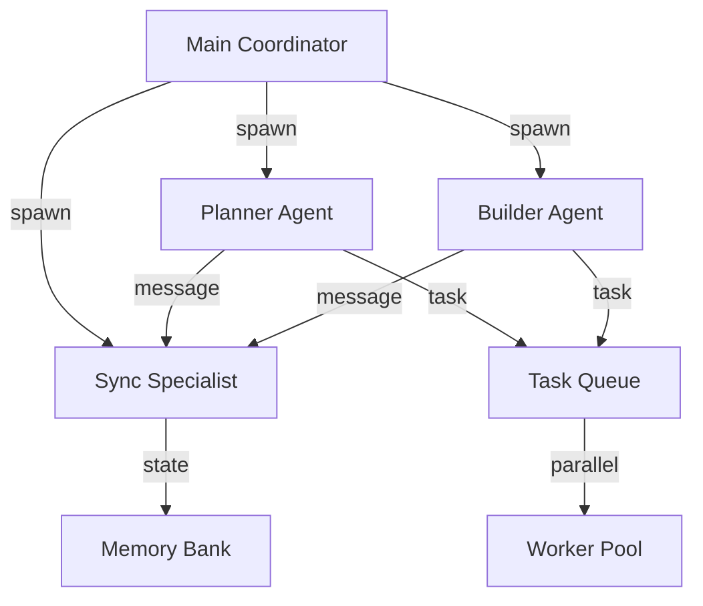

# Subagent設定仕様定義

**バージョン**: 1.0.0
**作成日**: 2025年9月17日
**対象**: claude-friends-templates Subagent System
**準拠標準**: 2025年Multi-Agent Architecture Standards

## 概要

この文書は、claude-friends-templatesプロジェクトのSubagentシステムにおける並列実行、エージェント間通信、設定パラメータの詳細仕様を定義します。

## Subagentアーキテクチャ

### 基本構成



### エージェントタイプ

1. **Main Coordinator**: メインコーディネーター
2. **Planner Agent**: 戦略的計画エージェント
3. **Builder Agent**: 実装特化エージェント
4. **Sync Specialist**: 同期・調整スペシャリスト

## 設定ファイル仕様

### メイン設定ファイル

**ファイル**: `.claude/sync-specialist/config.json`

```json
{
  "@schema": "https://claude-friends.dev/schemas/subagent-config/v1.0.0",
  "version": "1.0.0",
  "coordinator": {
    "max_concurrent_agents": 4,
    "agent_timeout_seconds": 300,
    "restart_policy": "on_failure",
    "health_check_interval": 30
  },
  "agents": {
    "planner": {
      "enabled": true,
      "instances": {
        "min": 1,
        "max": 2,
        "auto_scale": true
      },
      "resources": {
        "memory_limit_mb": 512,
        "cpu_limit_percent": 25
      },
      "communication": {
        "message_queue_size": 100,
        "response_timeout_seconds": 60
      }
    },
    "builder": {
      "enabled": true,
      "instances": {
        "min": 1,
        "max": 3,
        "auto_scale": true
      },
      "resources": {
        "memory_limit_mb": 1024,
        "cpu_limit_percent": 50
      },
      "communication": {
        "message_queue_size": 50,
        "response_timeout_seconds": 120
      }
    },
    "sync_specialist": {
      "enabled": true,
      "instances": {
        "min": 1,
        "max": 1,
        "auto_scale": false
      },
      "resources": {
        "memory_limit_mb": 256,
        "cpu_limit_percent": 15
      },
      "communication": {
        "message_queue_size": 200,
        "response_timeout_seconds": 30
      }
    }
  },
  "parallel_execution": {
    "enabled": true,
    "max_workers": 4,
    "task_queue_size": 100,
    "load_balancing": "round_robin",
    "priority_levels": 5
  },
  "communication": {
    "protocol": "json_rpc",
    "transport": "local_socket",
    "encryption": "none",
    "message_format": "structured_json",
    "heartbeat_interval": 10
  },
  "monitoring": {
    "metrics_enabled": true,
    "log_level": "info",
    "performance_tracking": true,
    "health_checks": true
  }
}
```

### エージェント個別設定

#### Planner Agent設定

**ファイル**: `.claude/agents/planner/config.json`

```json
{
  "agent_type": "planner",
  "personality": {
    "style": "analytical",
    "verbosity": "detailed",
    "creativity_level": 0.7
  },
  "capabilities": {
    "task_breakdown": true,
    "requirement_analysis": true,
    "design_planning": true,
    "architecture_review": true
  },
  "execution_context": {
    "working_directory": ".claude/agents/planner",
    "temp_directory": ".claude/temp/planner",
    "output_directory": ".claude/memory/planning"
  },
  "memory_config": {
    "context_window_size": 8000,
    "memory_retention_hours": 168,
    "priority_scoring": true
  },
  "tools": {
    "file_operations": true,
    "code_analysis": true,
    "documentation_generation": true,
    "architecture_diagramming": false
  }
}
```

#### Builder Agent設定

**ファイル**: `.claude/agents/builder/config.json`

```json
{
  "agent_type": "builder",
  "personality": {
    "style": "pragmatic",
    "verbosity": "concise",
    "creativity_level": 0.4
  },
  "capabilities": {
    "code_generation": true,
    "refactoring": true,
    "testing": true,
    "debugging": true
  },
  "execution_context": {
    "working_directory": ".claude/agents/builder",
    "temp_directory": ".claude/temp/builder",
    "output_directory": ".claude/memory/implementation"
  },
  "memory_config": {
    "context_window_size": 6000,
    "memory_retention_hours": 72,
    "priority_scoring": true
  },
  "tools": {
    "file_operations": true,
    "code_execution": true,
    "test_runner": true,
    "git_operations": true
  }
}
```

#### Sync Specialist設定

**ファイル**: `.claude/sync-specialist/config.json`

```json
{
  "agent_type": "sync_specialist",
  "personality": {
    "style": "coordinating",
    "verbosity": "minimal",
    "creativity_level": 0.2
  },
  "capabilities": {
    "state_synchronization": true,
    "conflict_resolution": true,
    "memory_management": true,
    "agent_coordination": true
  },
  "execution_context": {
    "working_directory": ".claude/sync-specialist",
    "temp_directory": ".claude/temp/sync",
    "output_directory": ".claude/memory/sync"
  },
  "memory_config": {
    "context_window_size": 4000,
    "memory_retention_hours": 24,
    "priority_scoring": false
  },
  "synchronization": {
    "sync_interval_seconds": 30,
    "conflict_detection": true,
    "auto_resolution": true,
    "backup_before_sync": true
  }
}
```

## 並列実行仕様

### Task Queue管理

**ファイル**: `.claude/hooks/parallel/parallel-executor.sh`

#### タスク定義

```json
{
  "task": {
    "id": "task_12345",
    "type": "code_generation|analysis|testing|documentation",
    "priority": 1,
    "agent_type": "planner|builder|sync_specialist",
    "dependencies": ["task_12344"],
    "estimated_duration_seconds": 120,
    "payload": {
      "command": "string",
      "arguments": ["string"],
      "working_directory": "string",
      "input_files": ["string"],
      "output_files": ["string"]
    },
    "constraints": {
      "max_memory_mb": 512,
      "max_cpu_percent": 25,
      "timeout_seconds": 300
    }
  }
}
```

#### ワーカープール設定

```json
{
  "worker_pool": {
    "size": 4,
    "scaling": {
      "auto_scale": true,
      "min_workers": 2,
      "max_workers": 8,
      "scale_up_threshold": 0.8,
      "scale_down_threshold": 0.3
    },
    "resource_management": {
      "memory_per_worker_mb": 512,
      "cpu_per_worker_percent": 25,
      "max_concurrent_tasks_per_worker": 2
    },
    "health_monitoring": {
      "health_check_interval": 30,
      "failure_threshold": 3,
      "recovery_timeout": 60
    }
  }
}
```

### ロードバランシング

#### アルゴリズム

1. **Round Robin**: タスクを順番に割り当て
2. **Least Connections**: 最少タスク数のワーカーに割り当て
3. **Resource Based**: CPU/メモリ使用率ベース
4. **Priority Based**: タスク優先度ベース

#### 設定例

```json
{
  "load_balancing": {
    "algorithm": "resource_based",
    "weights": {
      "cpu_weight": 0.6,
      "memory_weight": 0.3,
      "task_count_weight": 0.1
    },
    "rebalancing": {
      "enabled": true,
      "interval_seconds": 60,
      "threshold_percent": 20
    }
  }
}
```

## エージェント間通信仕様

### メッセージプロトコル

#### 基本メッセージ形式

```json
{
  "@type": "AgentMessage",
  "@version": "1.0",
  "message_id": "msg_12345",
  "correlation_id": "session_67890",
  "timestamp": "2025-09-17T12:34:56.789Z",
  "sender": {
    "agent_type": "planner",
    "agent_id": "planner_001",
    "instance_id": "inst_abc123"
  },
  "recipient": {
    "agent_type": "builder",
    "agent_id": "builder_001",
    "instance_id": "inst_def456"
  },
  "message_type": "request|response|notification|heartbeat",
  "payload": {
    "action": "string",
    "data": {},
    "context": {}
  },
  "routing": {
    "priority": 1,
    "ttl_seconds": 300,
    "retry_count": 0,
    "max_retries": 3
  }
}
```

#### メッセージタイプ

1. **Task Assignment**: タスク割り当て
2. **State Update**: 状態更新通知
3. **Memory Sync**: メモリ同期
4. **Health Check**: ヘルスチェック
5. **Error Report**: エラー報告
6. **Resource Request**: リソース要求

### 通信チャネル

#### Local Socket通信

```json
{
  "transport": {
    "type": "local_socket",
    "socket_path": ".claude/sockets/agent_comm.sock",
    "permissions": "0600",
    "buffer_size": 8192,
    "connection_pool": {
      "max_connections": 10,
      "idle_timeout": 300,
      "keep_alive": true
    }
  }
}
```

#### Message Queue通信

```json
{
  "message_queue": {
    "type": "in_memory",
    "queues": {
      "high_priority": {
        "max_size": 50,
        "timeout_seconds": 10
      },
      "normal_priority": {
        "max_size": 100,
        "timeout_seconds": 60
      },
      "low_priority": {
        "max_size": 200,
        "timeout_seconds": 300
      }
    },
    "delivery_guarantees": "at_least_once"
  }
}
```

## 状態管理仕様

### エージェント状態

**ファイル**: `.claude/agents/active.json`

```json
{
  "current_session": {
    "session_id": "session_12345",
    "started_at": "2025-09-17T12:00:00.000Z",
    "last_activity": "2025-09-17T12:34:56.789Z",
    "current_agent": "planner",
    "previous_agent": "none"
  },
  "agent_instances": {
    "planner": {
      "instance_id": "planner_001",
      "status": "active|idle|busy|error",
      "pid": 12345,
      "started_at": "2025-09-17T12:00:00.000Z",
      "last_heartbeat": "2025-09-17T12:34:50.000Z",
      "current_task": "task_12345",
      "resource_usage": {
        "memory_mb": 256,
        "cpu_percent": 15
      }
    },
    "builder": {
      "instance_id": "builder_001",
      "status": "idle",
      "pid": 12346,
      "started_at": "2025-09-17T12:00:00.000Z",
      "last_heartbeat": "2025-09-17T12:34:50.000Z",
      "current_task": null,
      "resource_usage": {
        "memory_mb": 128,
        "cpu_percent": 5
      }
    }
  },
  "coordination_state": {
    "active_tasks": 2,
    "queued_tasks": 5,
    "completed_tasks": 23,
    "failed_tasks": 1
  }
}
```

### 同期機能

#### 同期イベント

1. **Agent Switch**: エージェント切り替え時
2. **Task Complete**: タスク完了時
3. **Memory Update**: メモリ更新時
4. **Error Recovery**: エラー復旧時
5. **Resource Change**: リソース変更時

#### 競合状態解決

```json
{
  "conflict_resolution": {
    "strategy": "last_writer_wins|timestamp_based|priority_based",
    "timeout_seconds": 30,
    "max_retries": 3,
    "fallback_action": "manual_intervention"
  }
}
```

## セキュリティ要件

### アクセス制御

```json
{
  "access_control": {
    "agent_authentication": {
      "enabled": true,
      "method": "shared_secret",
      "secret_rotation_hours": 24
    },
    "resource_permissions": {
      "file_system": {
        "allowed_paths": [".claude/*", "docs/*", "tests/*"],
        "read_only_paths": ["README.md", "LICENSE"],
        "forbidden_paths": ["/.ssh/*", "/etc/*"]
      },
      "network_access": {
        "allowed": false,
        "exceptions": []
      }
    },
    "audit_logging": {
      "enabled": true,
      "log_file": ".claude/logs/security_audit.log",
      "events": ["agent_start", "agent_stop", "file_access", "command_execution"]
    }
  }
}
```

### 入力検証

1. **コマンドインジェクション対策**
2. **ファイルパス検証**
3. **リソース制限強制**
4. **メッセージサイズ制限**

## モニタリング仕様

### メトリクス収集

```json
{
  "metrics": {
    "system_metrics": {
      "cpu_usage_percent": "gauge",
      "memory_usage_mb": "gauge",
      "disk_io_rate": "counter",
      "network_io_rate": "counter"
    },
    "agent_metrics": {
      "active_agents": "gauge",
      "tasks_completed": "counter",
      "tasks_failed": "counter",
      "average_task_duration": "histogram",
      "message_queue_depth": "gauge"
    },
    "business_metrics": {
      "agent_switches": "counter",
      "memory_rotations": "counter",
      "error_recovery_count": "counter",
      "user_satisfaction_score": "gauge"
    }
  },
  "collection": {
    "interval_seconds": 30,
    "retention_days": 30,
    "aggregation_levels": ["1m", "5m", "1h", "1d"]
  }
}
```

### アラート設定

```json
{
  "alerts": {
    "agent_failure": {
      "condition": "agent_status == 'error' for 60s",
      "severity": "critical",
      "actions": ["restart_agent", "notify_admin"]
    },
    "high_memory_usage": {
      "condition": "memory_usage_mb > 1024 for 300s",
      "severity": "warning",
      "actions": ["log_warning", "scale_down_if_possible"]
    },
    "task_queue_overflow": {
      "condition": "task_queue_size > 80 for 120s",
      "severity": "medium",
      "actions": ["scale_up_workers", "log_info"]
    }
  }
}
```

## エラーハンドリング

### エラーカテゴリ

1. **Agent Startup Errors**: エージェント起動エラー
2. **Communication Errors**: 通信エラー
3. **Resource Limit Errors**: リソース制限エラー
4. **Task Execution Errors**: タスク実行エラー
5. **Synchronization Errors**: 同期エラー

### 復旧戦略

```json
{
  "recovery_strategies": {
    "agent_restart": {
      "max_attempts": 3,
      "backoff_seconds": [5, 15, 45],
      "preserve_state": true
    },
    "graceful_degradation": {
      "fallback_to_single_agent": true,
      "disable_parallel_execution": true,
      "reduce_functionality": false
    },
    "state_recovery": {
      "backup_interval_minutes": 15,
      "rollback_generations": 5,
      "consistency_check": true
    }
  }
}
```

## パフォーマンス要件

### レスポンス時間

- **エージェント起動**: 5秒以内
- **メッセージ送信**: 100ms以内
- **タスク割り当て**: 1秒以内
- **状態同期**: 5秒以内

### スケーラビリティ

- **最大エージェント数**: 10個
- **最大同時タスク数**: 20個
- **メッセージスループット**: 1000msg/s

### リソース効率

- **CPU使用率**: 60%以下
- **メモリ使用率**: 70%以下
- **ファイルディスクリプタ数**: 100以下

## テスト仕様

### 統合テスト

```bash
# Subagentシステムテスト
.claude/scripts/test-hooks.sh --subagent-system

# 並列実行テスト
.claude/scripts/test-hooks.sh --parallel-execution

# エージェント通信テスト
.claude/scripts/test-hooks.sh --agent-communication
```

### 負荷テスト

```bash
# 高負荷テスト
.claude/scripts/test-hooks.sh --load-test --concurrent-agents=5 --tasks=50

# ストレステスト
.claude/scripts/test-hooks.sh --stress-test --duration=300s
```

---

**最終更新**: 2025年9月17日
**担当者**: Architecture Designer Agent
**レビュー**: Phase 2.6.3 実装完了
